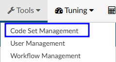

+++
title = 'Code Set Management'
weight = 60
+++

Code sets are commonly used groups of codes that can be saved for ease of use and productivity. Codes
sets can be saved by topic to provide a quick code assignment. Managers can create code sets to push out to coders and/or users can create their own.

> [!note] Coding Standard Changes / Expirations
Code sets need to be regularly reviewed and updated by administrators to account for changes and expirations
in the ICD/CPT coding standards.

## Create a Code Set

1. Click on {}+Add{} in the Active Code Set navigation menu on the left hand side of the screen
2. Name the code set so it is clear what codes it contains
3. Select if code set should be shared. Check with management for the organization's policy on code sets
4. Choose what patient type this code set is relevant to
5. Add codes into the “Add codes" box.
6. Click "Save Code Sets" when completed

