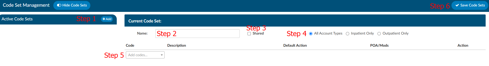

+++
title = 'Code Set Management'
weight = 60
+++

Code sets are groups of codes that users can save that they commonly use or are difficult to code. Codes
sets can be saved by topic to provide a quick code assignment. Code sets can be created at a
management level to push out to coders and/or users can create their own.

> [!caution] Coding Standard Changes / Expirations
Code sets need to be regularly reviewed and updated by administrators to account for changes and expirations
in the ICD/CPT coding standards.

## How to Create a Code Set

1. Click on the “+ Add” button in the navigation menu called “Active Code Sets”
2. Type in the name of your code set. Name it something meaningful so you remember what codes it contains.
3. Select if you would like to share your code set. Check with your manager to see if this is an option at your organization.
4. Choose what patient type this code set is relevant to. For example, if it contains PCS codes you would commonly choose inpatient and for CPT you would commonly select outpatient.
5. Add codes into the “Add codes" box.
6. Click "Save Code Sets" when completed.

