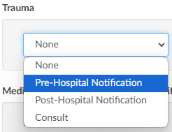
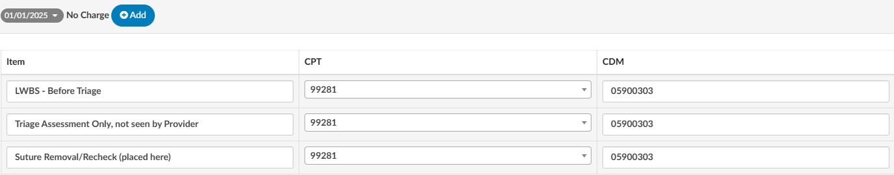
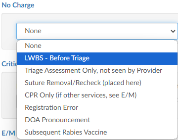
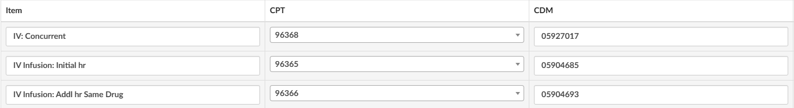
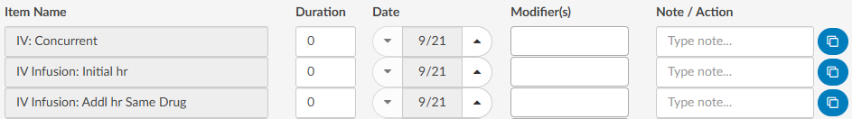

+++
title = 'ER E/M Configuration Page'
weight = 110
+++

>[!Note] 
> The organization must have [ER E/M Module](http://localhost:1313/fusion-cac-web-docs/general-user-guide/account-screen/account-viewers/add-on-modules-and-viewers/#er-em-module) enabled to use this feature. If this is not currently enabled, please contact your account representative for more information.

Once the E/M Configuration has been enabled, the initial setup must be completed by the Dolbey Team. After this setup is finalized, your organization can make any desired changes directly or contact the SME Team (smeteam@dolbey.com) for additional support.

The configuration page allows for customization of the E/M Level Matrix and other related components. If the organization has Facility Mapping, the E/M Configuration can be copied across different facilities.

When Facility Mapping is available, the facility can be selected in the top right corner. Once a facility is selected, the levels associated with that facility will be displayed. {}Copy{} will also appear at the top of the Levels section to easily duplicate settings accross facilites.

Clicking {}Copy{} opens a dialog box to choose a destination facility to copy the current levels to. Facilities available for copying will be listed in a dropdown menu.

This option will overwrite and copy the current levels that are onscreen to the facility that is selected.

>[!Note] 
>If an organization has only one facility, the copy options will be hidden.

## E/M Matrix

The table below illustrates how the E/M Matrix will appear to end users. 
Text displayed in this table can be customized to tailor the information shown to end users.

The E/M Level matrix features horizontal columns that display the levels across the top. 

Below each level are the defining criteria organized into several topics, each with a list of relevant items. By default, these categories include: 

- Mode of Arrival
- Disposition
- Testing
- Medication
- Behavioral
- Procedures
- Other Criteria

Topics are fully configurable based on the specific needs of each facility. 

The E/M Matrix configuration allows organizations to customize the content within each field under the respective E/M Level, 
enabling facilites to tailor the listed items for each code to meet specific requirements.

To make changes to the default options, click the grey numbers to open the matrix configuration.

After expanding the topic, users will see each E/M Level along with its corresponding codes. Next to each level is {}+Add{}. Clicking this button allows for the addition of a new level item. 

To remove any criteria selections, under each topic and level, simply click on the X button next to the criteria. 

To change or udpate the verbiage of the criteria selection, place the cursor into the level item field and change the text. 

### Configuring Charging Options and CDM

Below the E/M Level matrix configuration is a section for “Other”. The "Other" section allows for the addition of charging components attached to the facility's charge master. To make changes to the default, click on the grey number to open the charge and CDM configuration.

The Effective Date field specifies the date when the CDM Table and its associated new charge(s) will take effect. This feature allows updates to the CDM Table to be scheduled, ensuring that future changes are staged and ready for the Coding Team when needed.

#### Updating the CDM

###### Copy and Paste

Click on the green “Edit CDM Table” button to the right of the effective date.

CDM columns can be copy and pasted directly into the "Edit CDM Table" window from an Excel spreadsheet.

Best practice is to paste in the column for the CDM code, then the description, and finally the CPT code. This step is
extremely important because any assigned CDM code will need to be sent in the outbound interface. Therefore, the CDM table in Fusion CAC needs to match whatever system is downstream

After the information has been correctly updated, click {}Ok{} to continue.

###### Manually

CDM codes can be updated manually by clicking {}+Add CDM Manually{}.

This will create a new row with free text fields to add the CDM code, the description, and the CPT code. 

Once the CDM table is populated, categories can be edited within the "Option" section. The default options are:

- Trauma
- No charges
- Medication quantity
- Medication time/modifier
- Additional charges

Like the E/M Level matrix, these categories can be customized to best fit the facility's needs.

To edit an option, click the gray date tab to open the options and make changes. If certain options are not relevant, remove items under those sections simply by clicking on the **RED.X**. Once emptied, the section will no longer for your users. 

#### Options: Trauma

Expanding the trauma section will display several items by default. Each item has a CDM attached per E/M level, including critical care. Ensure that the CDM underneath each of the levels corresponds to what the CDM table indicates.

For end users, this will appear as a dropdown menu in the [E&M Coding viewer](https://dolbeysystems.github.io/fusion-cac-web-docs/general-user-guide/account-screen/account-viewers/add-on-modules-and-viewers/#er-em-module). Based on the matrix and their selection, the system will automatically populate the corresponding CDM code associated  with the assigned level.

> [!caution] Update With CDM
If your CDM changes, this table needs to be updated as well.

##### Options: No Charge

Clicking on the gray date next to **No Charge** will exapnd the section. The "Item" field will be the verbiage that corresponds to the CPT code in the CPT column to the right of the Item column. 

For end users, this will appear as a dropdown menu in the [E&M Coding viewer](https://dolbeysystems.github.io/fusion-cac-web-docs/general-user-guide/account-screen/account-viewers/add-on-modules-and-viewers/#er-em-module). The user will choose the item and the outbound interface
will contain both the CPT code and the corresponding CDM code listed in this table.

#### Options: Medication Quantity & Medication Time/Modifier

Click on the gray date next to **Medication Quantity** to expand the section. Item names, for which Dolbey provides default descriptions, can be listed here. These items will align with their corresponding CPT and CDM codes.

The medication sections are not about the medication, but rather the way the medication was administered. This allows organizations to charge for any injections, infusions, IV pushes, immunizations, and hydration. The medication administration quantity allows facilities to define how many
of each occurred on a particular date, if the ER visit occurred over more than one day, and other modifiers as needed.

Medication Time/Modifier includes the ability to indicate that multiples of an item exist on the account. If there are different drugs involved, the user can copy the individual lines and add in the durations of each medication along with the date and modifier if the modifiers, if appropriate.

To the end-user, this will be a table where they can pick all the medication administrations to apply and provide dates and modifiers in the [E&M Coding viewer](https://dolbeysystems.github.io/fusion-cac-web-docs/general-user-guide/account-screen/account-viewers/add-on-modules-and-viewers/#er-em-module). There is also a section end users to enter a note to keep everything in line so that they can indicate which medications they have already charged for. This helps the end user stay organized while providing information in the event of an audit.

Some organizations like to have Medication Quantity and Medication Time/Modifier. Other organizations choose to relocate all of the items within the Medication Quantity to the Medication Time/Modifier section so that all medications are within the same section.

#### Options: Additional Charges

Addtional Charges is often a list of items commonly charged in the ER. The default list includes:

- Voiding Cystogram
- Insert Foley (Simple)
- Change Cystostomy (Simple)
- Temporary External Pacing
  
This list can be modified to best the needs of the organization.

 

Items listed in this section will align with their corresponding CPT and CDM codes.

To the end-user this displays as a table where they can quickly add a quantity, date, and modifier as applicable.

