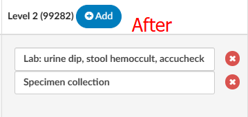

+++
title = 'ER E/M Configuration Page'
weight = 110
+++

>[!Note] The organization must have ER E/M Configuration enabled to use this feature. If this is not currently enabled, please contact your account representative for more information.

Once the E/M Configuration has been enabled, the initial setup must be completed by the Dolbey Team. After this setup is finalized, your organization can make any desired changes directly or contact the SME Team at smeteam@dolbey.com for additional support.

Below is a reference guide to assist with setting up or modifying the configuration as needed.

The ER E/M Configuration can be found within the Tools menu. If enabled, it will be seen beneath Validation Management. 

When you click on the ER E/M Configuration, a page will open and should appear similar to the image below.

The configuration page allows you to set up the E/M Level Matrix and other related components. If a user has Facility Mapping, the E/M Configuration can be copied across different facilities.

When Facility Mapping is available, a new option will appear in the top-right corner of the screen, enabling you to select a facility. Once a facility is selected, the levels associated with that facility will be displayed. A Copy button will also appear at the top of the Levels section.

Clicking the Copy button opens a dialog box where you can choose a destination facility to copy the current levels to. Facilities available for copying will be listed in a dropdown menu. For example, if you are working in Dolbey South – Cincinnati, selecting the Copy button will allow you to pick another facility to replicate the levels.

This option will overwrite and copy the current levels that are onscreen to the facility that is selected.

>[!Note] If an organization does not have Facility Mapping, and only has one facility, the copy options will be hiden.

## Configuring the E/M Matrix

The table below illustrates how the E/M Matrix will appear to end users. 
You can customize the text displayed in this table to tailor the information shown to end users.

The E/M Level matrix features horizontal columns that display the levels across the top. Below each level are the criteria that define it,
organized into several categories. By default, these categories include the topics listed below; however, the topics are fully configurable
based on the specific needs of each facility. 

1. Mode of Arrival
2. Disposition
3. Testing
4. Medication
5. Behavioral
6. Procedures
7. Other Criteria

Each topic under the levels includes a list of items relevant to that topic and its corresponding level. 
The E/M Matrix configuration allows you to customize the content within each field under the respective E/M Level, 
enabling your facility to tailor the listed items for each code to meet its specific requirements.

To make changes to the default options, can click on of the grey numbers to open the matrix configuration.

After opening the number, you will see each E/M Level along with its corresponding codes. Under the Level Topic section,
you will find a "+Add" button next to each level. Clicking this button allows you to add a new criteria selection. An open
text field will appear where you can enter your facility's criteria. 

To remove any criteria selections, under each topic and level, simply click on the X button next to the criteria. 

To change or udpate the verbiage of the criteria selection, place the cursor into the level item field and change the text. 

## Configuring Charging Options and CDM

Below the E/M Matrix configuration you will see a section for “Other”. The other section allows you add
in charging components attached to a charge master. To make changes to the default, you can click on
the grey number to open the charge and CDM configuration.

The effective date field the date on which the CDM table in the new charges once you open up the table
will take effect. This way, if you have a new updated CDM table or if you were trying to plan for the
future you can stage when these tables are available to the Coding Team.

## Updating the CDM

Click on the green “Edit CDM Table”button to the right of the effective date.

By clicking the button it will open up the edit CDM table this is asking for you to paste from your Excel
spreadsheet.

Best practice is to paste in the CDM column, then the description, then the CPT code. This step is
extremely important because any assigned CDM will need to be sent in the outbound interface,
therefore, your CDM table needs to match whatever is going to be downstream from Dolbey.

Once you paste it in the information, click on the update button to ensure the preview looks correct. If
so, click on the OK button to continue.

Once you’ve dropped in the CDM table you can now edit the categories within the option section. There
are a few different default options:

- Trauma
- No charges
- Medication quantity
- Medication time/modifier
- Additional charges

To edit any of these options you can click on the gray date next to each of these options to open them.
Some of these options may not pertain to you. If so, you can remove all the options underneath the
sections and that section will be removed from the E/M coding page for your users.

## Trauma Section

When you open the trauma section, you will have an item name. Some data will be defaulted here. Each
of these items have a CDM attached per E/M level, including critical care. Ensure that the CDM
underneath each of the levels corresponds to what your CDM table indicates.

For your end users this will be a drop-down menu. For example, when the user
selects **Pre-Hospital Notification**, they do not have to select the E/M level. Based
upon the matrix and what they selected, it will drop in the associated CDM code
based upon the level they have assigned.

> [!caution]
If your CDM changes, you will need to update this table as well.

## No Charge Section

Once you have reviewed the Trauma section you can then click on the gray date next to no charge. This
option is set up a little bit differently. The item field will be the verbiage that you want to correspond to
the CPT code to the right.

For your end users, this box will drop-down. The user will choose the item and in the outbound interface
we will drop in both the CPT code and the corresponding CDM code that you have listed in this table.

## Medication Quantity

Once you have reviewed the No Charge section you can then click on the gray date next to Medication
Quantity. Within this section you can list the item name in which we had provided a default description,
these items will match to corresponding CPT and CDM code

The medication quantity as well as the medication time modifier is not about the medication. rather the
way the medication was administered. This allows you to charge for any injections, infusions, IV pushes,
immunizations, and hydration. The medication administration quantity allows you to define how many
of each occurred on a particular date, if the ER visit occurred over more than one day, and other
modifiers which can be added as needed.

To the end-user this looks like a table where they can pick all the medication administrations to apply
and provide dates and modifiers. There is a section for the end users to enter a note to keep everything
in line so that they can indicate which medications they have already charged for. This helps the end-
user keep their thought process together, and also provides information in the event that there is an
audit.

## Medication Time/Modifier

Medication administration time/modifier is very similar to the medication administration quantity. The
only difference is that you are able to indicate that there are, for example, multiple infusions. If there
are different drugs involved you can copy the individual lines so that you can add in the durations of
each medication along with the date and modifier if the modifiers are different.

Some organizations like to have medication administration quantity and medication administration
time/modifier, however, other organizations will relocate all of the items within the medication
administration to the medication administration time/modifier section so that all medications are within
the same section.

Within this section, you can list the item name in which we provided a default description, these items
will match to corresponding CPT and CDM codes.

To the end-user, this looks like a table where they can pick all the medication administrations to apply
and provide date and modifiers. There is also a section for the end users to enter a note to keep
everything in line so that they can indicate which medications that they have already charged for. This
helps the end-user keep their thought process together, but also provides information if there is an
audit. There is also a copy button to the left of the note that allows the end user to copy if there are
more than one medication that needs to be considered.

## Additional Charges

This allows you to enter in some of the things that are common to be charged for within the ER. We
have indicated that there are four common ones however, you can add as many as you like by clicking
on the plus add button. You can also remove any default items if you do not charge for these by
selecting the delete button next to the defaults provided.

Within the section you can list the item name in which we had provided a default description, these
items will match to corresponding CPT and CDM codes.

To the end-user this looks like a table where they can quickly add a quantity, date, and modifier if any of
the default charges are applicable.

