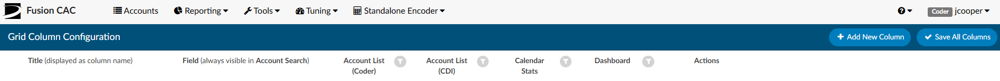
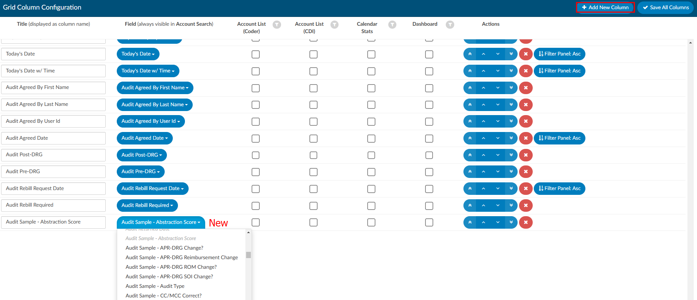
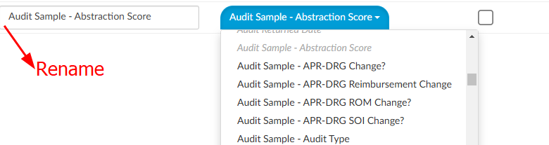
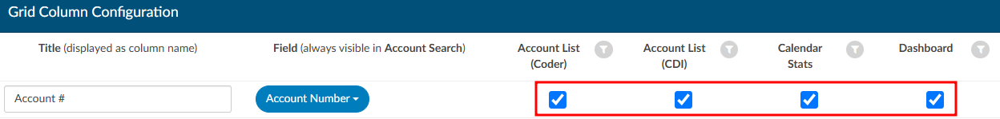
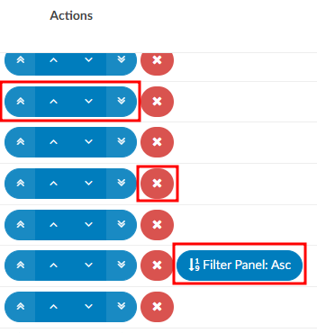
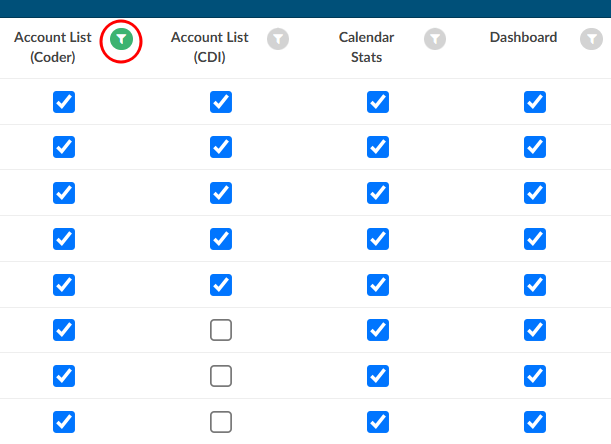

+++
title = 'Grid Column Configuration'
weight = 120
+++

The "Grid Column Configuration" tool is an administrative tool used to identify the columns to be displayed
in Account List, Account Search, Calendar Stats, and Dashboard pages. You can also identify which
columns you want to display for each of the default user roles including: Coders (incl Physician Coder, Single Path, and Auditor) and CDI.

All columns added in Grid Column Configuration will appear in Account Search, and selected columns can be
made visible in the other three pages.

> [!note] Default Column Ordering
Ordering can be changed by each user, but the choices here serve as the initial default order for new users.

Each user can rearrange the column order on specific pages per their preference. Changes are saved automatically on the Account List page, while on Account Search, Calendar Stats, and Dashboard, users can save their adjustments manually.

## Add/Remove Column

To add a column, click “+ Add New Column” in the top right of the screen. You will then be navigated to
the bottom of the screen where a new column was added. 

First, select the field you wish to add from the drop down options. Any field name that is italicized and grayed out have already been used as a column. Once you have selected the field, type in a friendly name in the **Title** text box which is to the left of the **Column** field. Here, you will type in the friendly name you wish to give to the field. This name will be what the end users see instead of the field name, which may not always be a friendly name. 

To the right of the fields, you’ll find four checkboxes. These allow you to specify on which pages (Account List, Calendar Stats, and Dashboard) the columns will be visible.

There are a few actions that can be taken for each column. They can be moved up or down the list of columns by using the arrows in the "Actions" column. If a column is no longer needed, it can be deleted. For some date columns you can set it to be filtered in ascending or descending order at the time of adding the column in Grid Column Configuration. 

Clicking on the "Filter" button will quickly show what columns are being used for which pages in the application.

