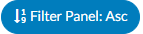

+++
title = 'Grid Column Configuration'
weight = 120
+++

Grid Column Configuration is an administrative tool used to identify the columns to be displayed in Account List, Account Search, Calendar Stats, and Dashboard pages. Columns can be set to display per default user roles: Coders (incl Physician Coder, Single Path, and Auditor) and CDI.

All columns added in Grid Column Configuration will appear in Account Search, and selected columns *can* be made visible on other pages by checking the appropriate box. 

The order of the fields in Grid Column Congifguration determines the default order of columns elsewhere in the applicaiton. Each user can then rearrange the column order on specific pages per their preference. Changes are saved automatically on the Account List page, while on Account Search, Calendar Stats, and Dashboard, users must save their adjustments manually.

## Add/Remove Column

To add a column, click {}+Add New Column{} in the top right of the screen. The new column will appear as the bottom of the list. 

Select the field to be added from the dropdown options. Field names that are italicized and grayed out have already been added as a column. By default, the field name will populate in the Title box to the left of the blue dropdown. The title acts as the friendly name that will be displayed to end users. Titles can be changed to best fit the terminology used by the organization. 

To the right of the field name are four checkboxes. These allow configuration as to which pages (Account List, Calendar Stats, and Dashboard) will display the column(s).

Actions buttons for each column can be found on the right side of the screen.

|Action Button|Description|
|-------------|-----------|
||Double lined up and down arrows will jump the column to either the top or bottom of the list|
||Single line up and down arrows will the column up or down one space|
||The red X will delete the column from the application|
||Date columns can be filtered to display in ascending or descending order by default|

Clicking on the "Filter" button will quickly show what columns are being used for which pages in the application.

