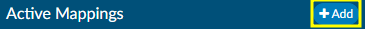

+++
title = 'Mapping Configuration'
weight = 140
+++

Mapping Configuration is an administrative tool designed for users with an administrative role, enabling them to map data field names to user-friendly, end-user-facing names. 

>[!note]
Avoid modifying data mapping tables in a production environment unless you have received proper training.

{}Export to CSV{} on the right-hand side of the the mapping title bar will export the selected mapping table to CSV should the table(s) need to be reviewed outside of the application.

##### New Mapping Table 

A new mapping table can be added by clicking {}+Add{} to the right of Active Mappings.

Each mapping table must have a unique ID and Title.
- The **ID:** is how the mapping table is identified by the application. It cannot contain spaces or symbols. 
- The **Title:** is the user friendly name for the mapping table.

The ID and Title will often match, but the Title tends to be nicer for users to read as it can contain spaces. 

##### Editing Mapping Tables

Click on a table title from the list of Active Mappings. Not every table contains the same information, but for the majority of the tables, the fields that can be updated include the key and the description. 
- The **Key** is a unique value for that entry in the database
- The **Description** is the friendly value that will be displayed to users. 

The Key and Description may or may not match. An example of when they differ is the "Stage" mapping table where the key value of "P" equals "Unbilled". 

To add values to the mapping table, click {}+Add New...{} to either the top or bottom of the list as desired.

Table values can be sorted by Ascending or Descending order using the arrow buttons. 

Each value can be individually moved using the "Action" buttons.

Table rows can also be reordered by clicking the white space in the desired row, dragging, and dropping it in the new location. 

Some tables can be removed by clicking the red X in the Active Mapping list.

If a mapping table does not have a red X to the right of its title, that means it is a default mapping table that cannot be removed from the system. 

#### Special Mapping Columns & Tables

While many of the mapping tables are set up the same way, several are unique and have more fields available to edit. 
 
### Category Mapping:

##### Incentive Multiplier

Incentive Multiplier allows administrators to optionally record an incentive multiplier that is used in the Incentive Productivity Report. Categories without a value in this column will be calculated with an incentive multiplier of 1.0.

The [Incentive Productivity Report](https://dolbeysystems.github.io/fusion-cac-web-docs/administrative-user-guide/reporting/user-reports/#incentive-productiviy-report) reports on whole weeks, but only produces an entry if the coder first submitted an account that week. This report pulls its data in real-time.

##### Display HCC Indicators

- When the user assigns a code that has a CMS HCC, a small H indicator appears.
  - The current version of HCC *and* the version for the previous calendar year (retroactively) will display when the user hovers over the H in the Assigned codes tree.
  
- The Previous HCC Overview will be available in the Navigation tree for any subsequent patient chart with the same MRN number that previously had HCC’s.
  
  

- Current HCC Total will be captured for each chart and is viewable in account search.

> [!note] HCC Indicators Are Not Retroactive
HCC data that existed prior to enabling this feature in the mapping table will **not** be captured. 

### Pending Reasons Mapping:

Administrators can specify the facilities, categories, or roles each pending reason applies to. Alternatively, these fields can be left blank to apply the pending reason universally. 

When a pending reason has the Physician Required box checked, the user will be prompted for a physician when that pending reason is assigned to an account. The selected physician will appear on the Code Summary page and in the [Pending Reasons](https://dolbeysystems.github.io/fusion-cac-web-docs/administrative-user-guide/reporting/user-reports/#pending-reasons-report) report.

 Additionally, there is another checkbox to indicate a date is required, when applicable.

### CDI Review Types Mapping:

CDI Review types are custom and not enabled at every organization. Additional information on the use of custom reviews can be found [here](https://dolbeysystems.github.io/fusion-cac-web-docs/cdi-user-guide/chart-reviews/).

> [!note] Note: Changing Existing Types
Changing an existing CDI Review Type will change reporting and dashboards.

### Payor Mapping:

The "Days to Bill" column indicates how many days are left to bill the payor. 
- A default value can be set, which will apply to any payor in the mapping table without a specified value in the "Days to Bill" column. 

  

- Each payor can have a unique number of days to bill

  

The billing date is compared to the current date (or the last submitted date if the account has already been submitted) to calculate the "Billing Countdown," which represents the number of days remaining to submit the account. If an account has no payor, no matching payor mapping, or a payor mapping without a value in the "Days to Bill" field, the "Default Days to Bill" value is used. If the "Default Days to Bill" field is blank, a value of zero is applied.

A "Billing Countdown" field can be added from Grid Column Configuration to use
for account search filters and workflow. See a use case for this workflow in the screenshot below:

