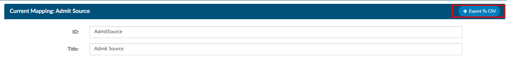
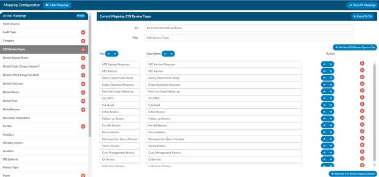

+++
title = 'Mapping Configuration'
weight = 140
+++

Mapping Configuration is an administrative tool designed for users with administrative roles, enabling them to map data field names to user-friendly, end-user-facing names. It is highly recommended to avoid modifying data mapping tables in a production environment unless you have received proper training.

A new Export to CSV button has been added to the mapping title bar. Clicking this will export that
mapping’s list to CSV, where it can then be printed.

In the list of Active Mappings, if a mapping that does not have a red X to the right of the mapping table title, that means it is a default mapping table can cannot be removed from the system by the end user. 

## Updating Mapping Tables

To update any mapping table, click on a table title from the list of Active Mappings. Not every table contains the same information, but for the majority of the tables, the fileds that can be udpated include the "Key" and the "Description". The key is a unique value for that entry in the database, while the description is the friendly 

## Add Incentive Multiplier to Category Editor

In Mappings Configuration, a new Incentive Multiplier column will appear in the Category mapping. The
administrator can optionally record an incentive multiplier that is used in the Incentive Productivity
Report. Categories without a value in the incentive multiplier will be calculated with an incentive
multiplier of 1.0.

The "Incentive Productivity Report" reports on whole weeks, but only produces an entry if the coder first
submitted an account that week. This report pulls its data in real-time.

## Adding Pending Reasons

To add a pending reason, click on “Pending Reasons” on the left side, then click the “Add New Pending
Reason” button. If you only need pending reasons for certain categories, select all categories that apply.
Leave the category blank so it applies to all categories.
A checkbox appears next to each pending reason allowing the user to tie a pending reason to a physician
and there is an additional check box requiring the date if applicable

When a pending reason has the Physician Required box checked, the user will be prompted for a
physician when a pending reason is assigned to an account. The prompt will force a physician to be
selected, and that physician will appear in the Code Summary page and in the Pending Reasons report.

## Adding Custom Review Types

Custom reviews are not enabled at every site, to see the use of custom reviews go to the section for this
in this user manual.

To add a Custom Review Type, click on “CDI Review Types” on the left side, then click the “Add New CDI
Review Types” button. Note: Changing an existing Custom Review Type will change reporting and
dashboards

## Enabling HCC Indicators

Enabling HCC Indicators does a few things.

1. Turns HCC Indicators next to diagnosis codes assigned to the “Assigned Code” Tree, when the user 
assigns a code that has a CMS HCC a small H indicator appears.
  - The version of HCC for calendar year 2023 (retroactively) and 2024 will display when the user hovers over the H in the Assigned Codes panel.
  
2. For any subsequent time, a patient chart that shares the same MRN number that previously had
HCC’s the user will see in the navigation tree a Previous HCC Overview Menu.
3. There is a field that will capture current HCC total for each chart in account search.

> [!caution] HCC Indicators Are Not Retroactive
This will not capture data that existed prior to turning this feature on in the mapping
table. These are turned on in mappings. Under the Categories mapping there is a check box.
When HCC's are enabled, these will display below grouped by HCC category and by code,
showing the account number and MRN # for the associated visit.

## Billing Countdown

The billing countdown will tell you how many days left to bill the payor. In Mapping Configuration, if
you add or edit a mapping for "Payor", you see a new "Default Bill Days" field in the header and a new
"Bill Days" column for each Payor.

These fields contain numbers zero or higher or blank to indicate the number of days to add to the
discharge date (current date is there is no discharge date) to calculate what is basically a billing due
date.

The billing date is compared to the current date (or the last submitted date if the account is
already submitted) to compute the "Billing Countdown" – the number of days left to submit an
account. If an account has no payor, no matching payor mapping, or payor mapping with no "bill days"
defined, the "default bill days" is used (zero if "default bill days" is blank as well.)

You will find a new field, "Billing Countdown," that you can add from Grid Column Configuration, to use
for account search filters and workflow. A use case for this field is to determine which accounts are
approaching a due you can do something like this

