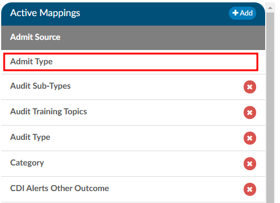

+++
title = 'Mapping Configuration'
weight = 140
+++

Mapping Configuration is an administrative tool designed for users with an administrative role, enabling them to map data field names to user-friendly, end-user-facing names. It is highly recommended to avoid modifying data mapping tables in a production environment unless you have received proper training.

A new Export to CSV button has been added to the mapping title bar. Clicking this will export that
mapping’s list to CSV.

In the list of Active Mappings, if a mapping table does not have a red X to the right of its title, that means it is a default mapping table that cannot be removed from the system by the end user. 

## Updating Mapping Tables

To update any mapping table, click on a table title from the list of Active Mappings. Not every table contains the same information, but for the majority of the tables, the fileds that can be udpated include the "Key" and the "Description". The key is a unique value for that entry in the database, while the description is the friendly value that will be displayed to users. Often times these are the same, but an instance when it is not is on the "Stage" mapping table where the key value of "P" equals "Unbilled". 

If you need to add values to the mapping table, click on the "Add New..." button where you can add the value to the top, or bottom of the list.

To arrange the order of the values in the mapping table, you can sort either column by Ascending or Descending order by using the arrow buttons. 

You can also move each value individually by using the "Action" buttons.

## Unique Mapping Tables ##

While many of the mapping tables are set up the same way, there are a few that are unique and have more fields to enter. These unique tables will be reviewed below. 

### Category Mapping Table 

#### Incentive Multiplier Column 

The "Incentive Multiplier" column has been added to the Category mapping table. This column is optional The
administrator can optionally record an incentive multiplier that is used in the Incentive Productivity
Report. Categories without a value in the incentive multiplier will be calculated with an incentive
multiplier of 1.0.

The "Incentive Productivity Report" reports on whole weeks, but only produces an entry if the coder first
submitted an account that week. This report pulls its data in real-time.

#### HCC Indicators

The Display HCC column has been added to the Category mapping and does a few things. 

1. Turns HCC Indicators next to diagnosis codes assigned to the “Assigned Code” Tree, when the user 
assigns a code that has a CMS HCC a small H indicator appears.
  - The version of HCC for calendar year 2023 (retroactively) and 2024 will display when the user hovers over the H in the Assigned Codes panel.
  
2. For any subsequent time, a patient chart that shares the same MRN number that previously had
HCC’s the user will see in the navigation tree a Previous HCC Overview Menu.
3. There is a field that will capture current HCC total for each chart in account search.

> [!caution] HCC Indicators Are Not Retroactive
This will not capture data that existed prior to turning this feature on in the mapping
table. These are turned on in mappings. Under the Categories mapping there is a check box.
When HCC's are enabled, these will display below grouped by HCC category and by code,
showing the account number and MRN # for the associated visit.

### Pending Reasons Mapping Table

To add/edit pending reasons, in the list of Active Mappings select the "Pending Reasons” mapping table. Then click the “Add New Pending
Reason” button. This particlar mapping table offers additional options that can be linked to each pending reason, including Facilities, Categories, Roles. Administrators have the flexibility to leave these fields blank - applying the pending reason universally - or specifcy particular options to tailor how the pending reason is applied. 

A checkbox is displayed next to each pending reason, enabling users to associate a pending reason with a physician. Additionally, there is another checkbox to indicate if a date is required, when applicable.

> [!note] Physician Required Checkbox
When a pending reason has the Physician Required box checked, the user will be prompted for a
physician when a pending reason is assigned to an account. The prompt will force a physician to be
selected, and that physician will appear in the Code Summary page and in the Pending Reasons report.

### CDI Review Types Mapping Table

CDI Review types are a custom type of review that are not enabled at every site. To see the use of custom reviews go to CDI User Guide, then Chart Reviews, within this user manual.

To add a custom CDI Review Type, in the list of Active Mappings, select "CDI Review Types” then click the “Add New CDI
Review Types” button. Enter the Key and Description for the new review and sort it in the exisitng list as needed. 

> [!note] Note: Changing Existing Types
Changing an existing CDI Review Type will change reporting and dashboards.

### Payor Mapping Table

The "Days to Bill" column has been added to the Payor mapping table. This column will tell the user how many days are left to bill the payor. 

There are two ways to specify the number of days to bill for each payor. First, a default value can be set, which will apply to any payor in the mapping table without a specified value in the "Days to Bill" column. Second, you can individually assign the number of days to bill for each payor directly.

The billing date is compared to the current date (or the last submitted date if the account has already been submitted) to calculate the "Billing Countdown," which represents the number of days remaining to submit the account. If an account has no payor, no matching payor mapping, or a payor mapping without "bill days" defined, the "default bill days" value is used. If the "default bill days" field is blank, a value of zero is applied.

A "Billing Countdown" field can be added from Grid Column Configuration to use
for account search filters and workflow. See a use case for this workflow in the screenshot below:

