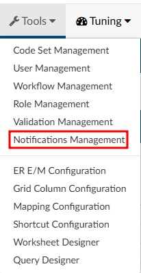
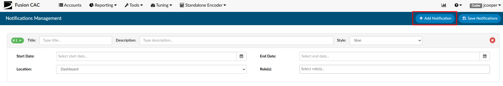
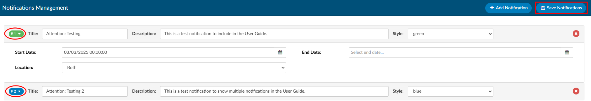
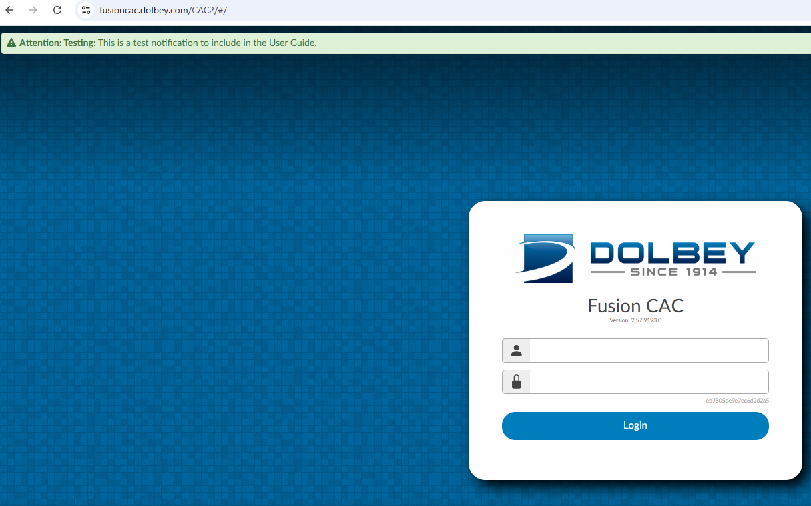
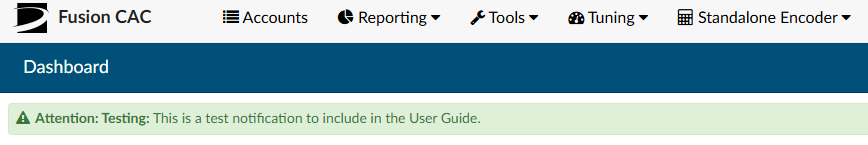
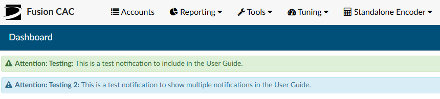

+++
title = 'Notifications Management'
weight = 145
+++

Notifications Manager, found in the [Tools](http://localhost:1313/fusion-cac-web-docs/administrative-user-guide/tools/) dropdown menu, allows users with an Administrative role to create notifications that will alert other users of anything that may need to be aware of within the system and/or organization. The notifications can be added to the CAC login screen, the Dashboard, or both.

## Adding a Notification

To add a new notification, select **Notificaiton Manager** from the Tools dropdown menu, then click on {}+Add Notification{}. Fields will become available on the screen to allow the user to build out the notification. 
* **Title** - Name the alert with a brief title.
* **Description** - Add more detials to the title with a description of what the users should exepct as a result of the notification.
* **Syle** - The notification can be displayed in a color that will draw attention to the user. 
* **Start and End Date** - Each notification can have a start and end date. If there should be no end date to the notification, simply keep the End Date blank.
* **Location** - The Location is where the notification will appear. It can either be on the login screen, Dashboard, or both.
* **Role(s)** - If desired, the notification can be directed to a specific user role or roles IF the Location is set to Dashboard only.

There can be multiple notifications and each will be numbered. To collapse the details of the notification, click on the number icon and it will hide the information. If a notification is no longer needed, the user can delete the notification by click on the **RED X **. When a user is done adding or making changes to a notification, click on {}Save Notifications{}.

## Viewing a Notification

Notification on the login screen:

Notification on the Dashboard:

Multiple Notifications:

