+++
title = 'Query Designer'
weight = 151
+++

Query designer is used to create custom queires per organization. Query templates are frequently created and saved as a base template with most of the query written to show as read only text. The creator can then add open fields for the end user to add additional questions to the base query template.

Access to queries can be restricted by user role:
- Audit
- CDI
- Coding
- Physician Coder

Alternatively, queires can be shared. A **Shared Query** can be utilized by Auditors, CDI Specialists, and Coders. 

## Creating a Query

To add a query, simply click on the {}+Add{} button in the desired section. 

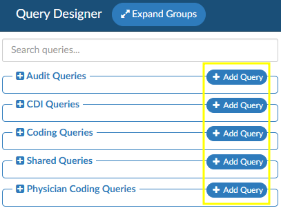

A blank template will appear on screen. The first step is to enter a unique a document name. Each query must have a unique name for reporting purposes. **A document name must exist *before* the template can be saved.** 

>[!note] Renaming a Query
>Once a query name has been saved, it cannot be edited. To rename an exisitng query, please see the Source Code section below or contact the SME Team (smeteam@dolbey.com).

To start with a document that has already been created, copy the text and paste it into the form
designer. Changes to the formatting may be needed once pasted depending on the original document format.

Text copied or typed directly into the query will be read-only for the end user(s) working with the form. This text is often used as labels and to direct users on completing the template. 

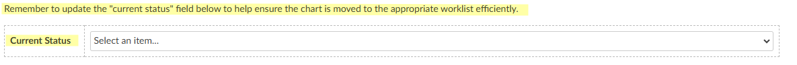

### Adding Fields

Fusion CAC offers several types of fields that can be added to query templates. These fields allow end users to enter information into the query after it has been added to an account. 

Add a new field by clicking {}+Add Field{} in the template tool menu.

#### Field Type

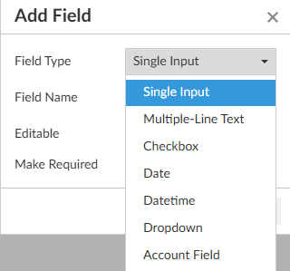

{}

###### Sections

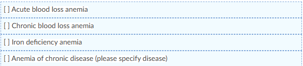

Sections allows end users to customize the query by removing sections as needed from the template or to rearrange the order of information.

Static text and fields can be inserted into a section, however **sections cannot be inserted in other sections**.

When the query is added to an account, each section will have arrows so the end user can re-order as needed. Sections will also have a X to remove that section from the query. Once a section has been removed, an undo button will become available to place it back into the query.

###### Physician

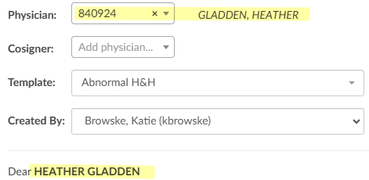

The physician field will auto-populate the name of the physician being sent the query, if the information is available. 

#### Field Name

Each field should have a unique name for reporting purposes. 

Field names can repeat across queries, but **each field on a query must be unique.** If a field name is repeated on a query, whatever is entered into one field will be automatically duplicated into the other fields with the same name on that query. 

{}

#### Creating Internal Notes

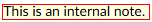

Internal notes can be added to query templates to provide a note for the *end user only* from the Insert menu in the template tool menu.

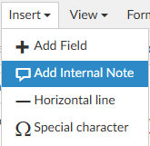

These notes are only displayed for the user filling out the query and is not set to the provider receiving the query. When adding a physician query the user will see the highlighted section in the query when that template is selected.

After sending the query, the internal note will no longer be seen unless the user has the privilege of "Edit Open Queries to Resend" in [Role Management](https://dolbeysystems.github.io/fusion-cac-web-docs/administrative-user-guide/tools/role-management/). 

## Blank Query Template

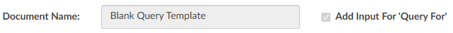

If a Physician Query has a document name of “Blank Query Template”, then an additional **Add Input For 'Query For'** field is automatically added for the user to enter plain text when the query is added to an account. **This field cannot be removed from the Blank Query Template.** 

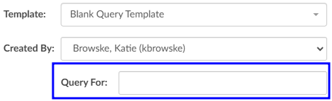

When the end users use this template, they will be presented with a box to free type the query topic.

In the following reports, the Query template column will show “Blank Query Template”: followed by the value for the ”Query For” field:

- Outstanding Queries
- Query Impact by Discharge Date
- Query Impact Report
- Query TAT by Author Report
- Query Template Volume Overview

## Verbal Query Template

A verbal query template can be requested through CAC Support (cacsupport@dolbey.com). Scripting logic will be added so that when a template named “VERBAL QUERY” is used, the query will not be sent outbound to the provider. 

For accurate reporting on the topics of the query, Dolbey recommends creating a template using the exact name “VERBAL QUERY” and selecting the check box **Add Field For 'Query For'** next to the document name. 

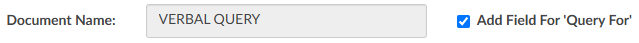

When the end users use this template to record the verbal query outcome they will be presented with a box to free type the query topic. 

## Show History

Query Designer will create a history for changes made to templates in Query Designer. Once a change is
made on a template and saved, a {}Show History{} will appear in the top right of the query. Clicking
on it will bring up a notes box, just like in Workflow Management.

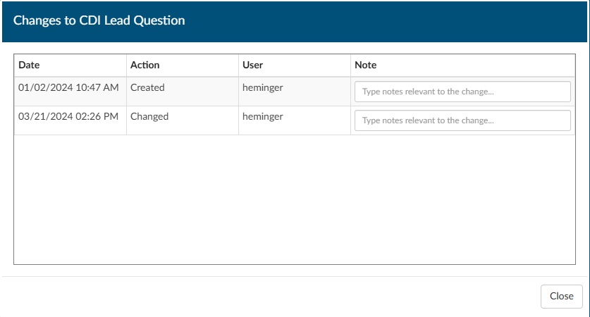

## Source Code

The template source code can be found under the Tools menu within the template tool bar. The source code is the programming language that tells the application how to display the query. It may be overwhelming to look through, but can be helpful in making quick edits to queries. 

{}

### Renaming/Moving a Query

Once a query has been named and saved, the Document Name cannot be edited. This is intentional for accurate reporting. If a query needs to have a new name, the simplest way to change the name is to copy the source code into a new template and give that template the correct name. Copying the source code will bring over the whole body of the query as is, so the only thing that needs to change is the document name. 

1. In query designer, open the template to be copied/renamed
2. Open the template's source code
3. Select all the text in the source code box
   - This can be done by clicking and dragging to highlight or with the keyboard shortcut Ctrl + A
4. Copy the source code
   - This can be done by right-clicking in the highlighted text and choosing copy or with the keyboard shortcut Ctrl + C
5. Click Ok to close the source code window
6. Add a new query in the desired section
7. Open the template's source code
8. Paste the copied source code into the box
   - This can be done by right-clicking and choosing paste or with the keyboard shortcut Ctrl + V
9. Click Ok
10. Enter a new document name and Save

Click the red {}X{} button to remove the original query so it can no longer be used. The deleted query will still show up on accounts it was added to prior to being deleted, but users will not be able to add it to new accounts. 

This method also allows for an existing query to easily be re-categorized by role. 

If you have any questions or would like to walk through editing source code with someone, please reach out to the Dolbey SME team (smeteam@dolbey.com).

