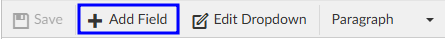

+++
title = 'Query Designer'
weight = 151
+++

Query designer is used to create custom queires per organization. Query templates are frequently created and saved as a base template with most of the query written to show as read only text. The creator can then add open fields for the end user to add additional questions to the base query template.

Access to queries can be restricted by user role:
- Audit
- CDI
- Coding
- Physician Coder

Alternatively, queires can be shared. A **Shared Query** can be utilized by Auditors, CDI Specialists, and Coders. 

## Creating a Query

To add a query, simply click on the {}+Add{} button in the desired section. 

A blank template will appear on screen. The first step is to enter a unique a document name. Each query must have a unique name for reporting purposes. **A document name must exist *before* the template can be saved.** 

>[!note] Renaming a Query
>Once a query name has been saved, it cannot be edited. To rename an exisitng query, please see the Source Code section below or contact the SME Team (smeteam@dolbey.com).

To start with a document that has already been created, copy the text and paste it into the form
designer. Changes to the formatting may be needed once pasted depending on the original document format.

Text copied or typed directly into the query will be read-only for the end user(s) working with the form. This text is often used as labels and to direct users on completing the template. 

### Adding Fields

Fusion CAC offers several types of fields that can be added to query templates. These fields allow end users to enter information into the query after it has been added to an account. 

Add a new field by clicking {}+Add Field{} in the template tool menu.

#### Field Type

###### Single Input

A single input field allows the end user to free type text. This field is best used for entering a concise amount of information, such as a name or short series of numbers. The box will grow horizontally as the user types to fit the data entered.

###### Multiple-Line Text

A multiple-line text field allows the end user to free type text. This field is often used for entering a large amount of information, such as taking notes or providing detailed comments. The box will grow vertically as the user types to fit the data entered. 

###### Checkbox

A checkbox allows the end user to indicate certain items are applicable. This field has been used to show that the query is complete or as a way for users to select certain action items. 

###### Date/Datetime

 

These fields allow the end user to indicate the date and time of a response, test, or other item being tracked. 

###### Dropdown

Dropdown menus allow end users to select from a pre-determined list of options. 

After naming and determining who can edit the field, a dialogue will open to set the options in the dropdown menu. 

Dropdown items can be edited by pulling up the template in Query Designer and clicking {}Edit Dropdown{} in the template tool bar. 

###### Account Field

Account fields will automatically populate information from the account, if it has been sent to Fusion CAC. Autopopulated account information will be displayed in a bolder font to differentiate it from text manually entered by an end user. 

###### Sections

What is a Dynamic Section? This allows users to create a template for the user creating the query to
customize the query by removing sections as needed from the template or to
rearrange the order of information.

The Field Name will be displayed in the template above its section. Text and
fields can be inserted into a section; sections cannot be inserted in other sections.
When the template is added to a query, each section will now show an up and
down arrow for movement, along with an X to delete that section from the query.

Once sections are created, they will look like the below within form designer:

Once sections are created, they will look like this when a user created a query within an account

A user can move sections up or down, or remove sections. If you remove a section you will be presented
with an undo button to place it back into the query.

###### Physician

#### Field Name

Each field should have a unique name for reporting purposes. 

Field names can repeat across queries, but **each field on a query must be unique.** If a field name is repeated on a query, whatever is entered into one field will be automatically duplicated into the other fields with the same name on that query. 

#### Make Required

Fields can be made required by checking the box. Leaving the box unchecked means the field is optional and the query can be completed even if that field is left blank. 

When a query is added to a chart, required fields will have a light red background to indicate action must be taken. Addiontally, the user will be presented with a red toast message if they try to save the chart without completing all required fields. The toast message will include the fields that need to be completed. 

Clicking OK, will add the selected field to the template with the specified settings. A box will then display in Query Designer as a
placeholder for the selected field with the field name. The fields are not interactive from Query Designer. Once a query has been added to a chart, the field name will be replaced with instructions for the end user. 

#### Creating Internal Notes

Internal only notes can now be added to Physician Query templates from
the form designer. On a template, clicking the Insert dropdown will now
show a new option of Add Internal Note. The Internal note is only
displayed for the user filling out the query and is not set to the provider
receiving the query.

Selecting this option will add a highlighted free text line to the
document.

When adding a physician query the user will see the highlighted section in the query when that template
is selected.

After sending the query, this note will no longer be seen unless the user has the privilege of ‘Edit Open
Queries to resend’ in Role Management. An Edit checkbox will show on the date line, and checking it
will show the query with the internal note.

In user reports, the following
reports will display the "Query For" field in the same field as the "Query Template" column separated
with a colon:

- Outstanding Queries
- Query Impact by Discharge Date
- Query Impact Report
- Query TAT by Author Report
- Query Template Volume Overview

Form Designer will create a history for changes made to templates in Form Designer. Once a change is
made on a form and saved, a Show History button will show in the top right of the query. Clicking
on it will bring up a notes box, just like in Workflow Management.

## Creating a Blank Query Template

If a Physician Query has a document name of “Blank Query Template”, then an additional Add Query For field is automatically added for the user to enter plain text when the query is added to an account. **This field cannot be removed from the Blank Query Template.** 

In applicable reports, the Query template column will show “Blank Query Template”: followed by the value for the ”Query For” field.

## Verbal Query

You can request with CAC Support a verbal query template that will not be sent outbound. CAC Support
can add logic into the script so that when a template named “VERBAL QUERY” is used it will not be sent
outbound to the provider. To ensure you can still report on the topics of the query we would
recommend creating a template using the exact name “VERBAL QUERY” and then select the check box
Add Field For 'Query For'

If this box is checked, when the end users use this template to record the verbal query outcome they
will be presented with a box to add in what the query was for, it should be something like Sepsis or CHF
that follows the normal template names so the reporting is still available.

## Show History

Query Designer will create a history for changes made to templates in Query Designer. Once a change is
made on a template and saved, a {}Show History{} will appear in the top right of the query. Clicking
on it will bring up a notes box, just like in Workflow Management.

## Source Code

The template source code can be found under the Tools menu within the template tool bar. The source code is the programming language that tells the application how to display the query. It may be overwhelming to look through, but can be helpful in making quick edits to queries. 

### Changing Field Width

By default, fields will take up the full width of the template. The width can be reduced in the source code to best fit formatting needs. 

In the example below, the width of the dropdown menu has been modified so that it can be on the same line as a checkbox and a multi-line text box. 

This was done by opening the source code, finding the name of the field, and changing the width percentage. 

### Renaming/Moving a Query

Once a query has been named and saved, the Document Name cannot be edited. This is intentional for accurate reporting. If a query needs to have a new name, the simplest way to change the name is to copy the source code into a new template and give that template the correct name. Copying the source code will bring over the whole body of the query as is, so the only thing that needs to change is the document name. 

1. In query designer, open the template to be copied/renamed
2. Open the template's source code
3. Select all the text in the source code box
   - This can be done by clicking and dragging to highlight or with the keyboard shortcut Ctrl + A
4. Copy the source code
   - This can be done by right-clicking in the highlighted text and choosing copy or with the keyboard shortcut Ctrl + C
5. Click Ok to close the source code window
6. Add a new query in the desired section
7. Open the template's source code
8. Paste the copied source code into the box
   - This can be done by right-clicking and choosing paste or with the keyboard shortcut Ctrl + V
9. Click Ok
10. Enter a new document name and Save

Click the red {}X{} button to remove the original query so it can no longer be used. The deleted queryt will still show up on accounts it was added to prior to being deleted, but users will not be able to add it to new accounts. 

This method also allows for an existing queryt to easily be re-catagorized by role. 

If you have any questions or would like to walk through editing source code with someone, please reach out to the Dolbey SME team (smeteam@dolbey.com).

