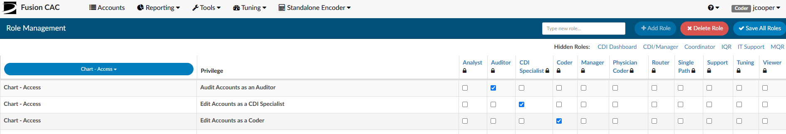
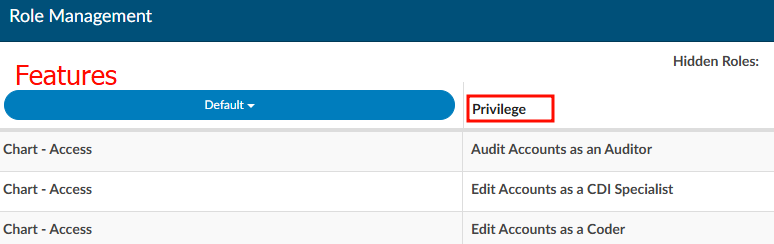
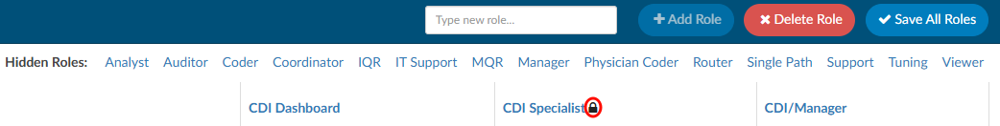

+++
title = 'Role Management'
weight = 90
+++

Under "Tools" in the application, there is a tab for "Role Management". This allows you to create custom user roles that can access certain privileges of Fusion CAC by checking or unchecking the box next to each of the privileges. When first viewed, Role Management will already have default privileges for each role checked for backwards compatibility. This allows management to
create new roles. Even though the user can have more privileges, they will still maintain a current role of
either coder or CDI which controls what assigned code tree and fields need completed upon their
actions within the software.

To create a new role, navigate to the top-right corner and locate the "Type new role" field. Enter the desired name for the new role (e.g., CDI Enhanced). After naming the role, click the "+Add Role" button. In this example of a "CDI Enhanced" user role, this role may require providing CDI access to all previous permissions while also enabling the ability to design queries. To add the privileges, replicate the settings from the CDI Specialist default role and add privileges for the form designer to create and edit both CDI forms and physician query forms. Once all privileges for the custom role are selected, click "Save All Roles" in the top-right corner.

## Features and Privileges

Various privileges are able to be assgined to a user for specific features in the application. To grant access, identify the feature the user needs and assign the corresponding privileges. Features include the following and are located in the blue drop down box:

- Chart (Access, Editing, Physician Queries, Routing)

- Community

- Dashboard

- Document Types Management

- Form Designer

- Grid Column Configuration

- Login

- Mapping Configuration

- Reporitng (Account Search, Calendar, Scheduled Reports, User Reports)

- Role Management

- Shortcut Configuration

- System Search

- Tuning (Dashboard, Productivity)

- User Management

- Workflow Management

## Hidden Roles

When creating custom roles, consider removing any roles that are not relevant to navigate checked/unchecked privileges easier. To hide a column, simply click on its header. For instance, clicking on "CDI Specialist" will hide the corresponding column, moving it to the "Hidden Roles" section that is located above the role columns. To unhide the role, click on "CDI Specialist" under "Hidden Roles," and the column will reappear.

## Locked Roles

A lock icon appears next to certain roles, indicating they are default roles within the application and cannot be deleted. In contrast, custom roles, which do not have a lock icon, are not tied to specific areas of the software and can be removed if needed.

## Deleting Roles

Click the "Delete Role" button in the top right corner to display a list of all custom user roles in the software.

The pop-up box for deleting custom roles provides a warning that any users assigned to the role will lose their privileges. As a best practice, reassign users to a different role before deleting the custom role to prevent them from being locked out of the software.v

