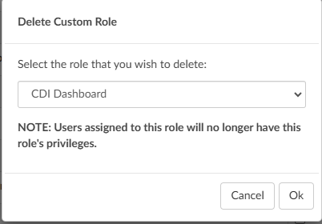

+++
title = 'Role Management'
weight = 90
+++

Under "Tools" in the application, is a tab for "Role Management". Role Management allows administrators and managers to create custom user roles in the Fusion CAC application by checking or unchecking the box next to each of the privileges. By default, Role Management will already have privileges for each default role checked. 

>[!note] 
>Even though a role may have additional privileges, they will still maintain default chart access (Auditor, CDI Specialist, Coder, etc) to determine the assigned code tree and required fields within the software.

## Create a New Role

Navigate to the **Type new role...** field in the top right corner of the screen. Enter the desired name for the new role (e.g., CDI Enhanced) and click the "+Add Role" button. 

In the example of a "CDI Enhanced", management may provide users with this role access to all previous CDI permissions while also enabling the ability to design queries. To start, replicate the settings from the CDI Specialist default role. Then, add privileges for the [Query Designer](https://dolbeysystems.github.io/fusion-cac-web-docs/administrative-user-guide/tools/query-designer/) to Create/Edit All Physician Query Templates. 

Once all privileges for the custom role are selected, click {}Save All Roles{} in the top-right corner.

### Features and Privileges

Privileges are assgined to roles for specific features within the application. To grant privileges, first identify the feature the role should have access to. Features can be viewed all at once or narrowd down using the blue dropdown list on the left side of the screen. Application features are sorted into the following:

- Chart - (Access, Editing, Physician Queries, Routing)
- Community
- Dashboard
- Document Types Management
- Grid Column Configuration
- Login
- Mapping Configuration
- Query Designer
- Reporting - (Account Search, Calendar, Scheduled Reports, User Reports)
- Role Management
- Shortcut Configuration
- System Search
- Tuning Dashboard
- Tuning Productivity
- User Management
- Workflow Management
- Worksheet Designer

## Hidden Roles

When editing custom roles, consider removing irrelevant roles to make the page easier to navigate. Columns can be hidden and unhidden by simply clickling on the role name. For instance, clicking on "CDI Specialist" will hide the corresponding column, moving it to the "Hidden Roles" section above the role columns. To unhide the role, click on "CDI Specialist" again and the column will reappear.

## Deleting Roles

Click the "Delete Role" button in the top right corner to display a list of all custom user roles in the software.

The pop-up box for deleting custom roles provides a warning that any users assigned to the role will lose their privileges. As a best practice, **reassign users to a different role before deleting the custom role** to prevent them from being locked out of the software.

### Locked Roles

A lock icon appears next to certain roles, indicating they are default roles within the application and cannot be deleted. In contrast, custom roles, which do not have a lock icon, are not tied to specific areas of the software and can be removed if needed.

