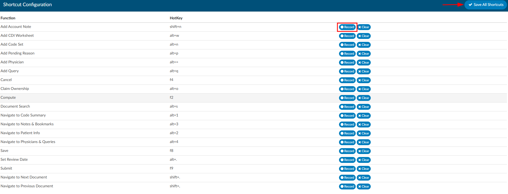

+++
title = 'Shortcut Configuration'
weight = 160
+++

Keyboard shortcuts are keys or key combinations allowing users to take certain action within the application without using their mouse. Some users find it more efficent to work without having to take their hands off the keyboard to use their mouse. 

Many different applications use hotkeys and keys may already be mapped to different software solutions used by an organization. Dolbey allows hotkeys for Fusion CAC to be configured per organization. Default settings have been provided, but can be changed as needed by users with the role of Administrator.

To record a new hotkey combination, simply press the record button on the line of the function you wish to configure and enter in a key combination (usually 1-2 keys on the keyboard). Since Fusion CAC is a browser-based application, **standard browswer hotkeys should not be used**.

