+++
title = 'User Management'
weight = 70
+++

User Management allows management to add, delete, or change permissions and/or set work lists for other users. The grid view will display all users with a Fusion CAC User ID. The columns can be arranged in any order and saved per user.

| Column |Description|
| -------|-----------|
|Action  |Copy exisiting profile when creating new user: Edit existing profile: Remove unused profile: |
|[Locked](https://dolbeysystems.github.io/fusion-cac-web-docs/administrative-user-guide/tools/user-management/#locked-1)   |Indicates if the user is locked out of the application|
|Employee Number|Employee number from ogranization|
|User ID|Username used to log into the application|
|First Name|User's first name|
|Last Name|User's last name|
|Facilities|User's assigned facilites|
|Roles|User’s assigned role(s) in the applicationied to their permissions|
|Workgroups|User's assigned workgroups|
|Active User|Indicates if the user has active access to the application|
|Last Access Time|Date and time the user last logged into the application|
|Force Autoload|Status of Force Autoload for the user|
|Email|User's email address|

>[!note] Removing a Profile
> A profile can only be removed if the user has not signed into the application. Once a user logs in, the delete icon will no longer show in their Actions column. This is to maintain accurate reporting. If a user should no longer have access to the Fusion CAC application, their profile should be [locked](https://dolbeysystems.github.io/fusion-cac-web-docs/administrative-user-guide/tools/user-management/#locked-1).

## Edit User Profile 

### New User

{}+Add User{} allows management to create a brand new user profile from scratch

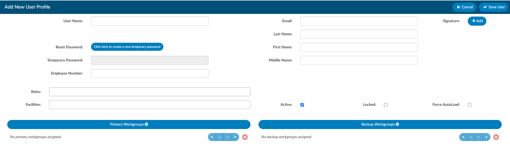

Copying a user profile will carry over some settings from an existing profile to a brand new profile
- Roles
- Facilites
- Chart Access
- Workgroups

### User Name and Password (Required)

It is common practice for organizations to use LDAP to communicate with their Active Directory, which stores user information such as usernames and passwords. When a user logs into Fusion CAC, the application can use LDAP to check Active Directory for the user's credentials. In short, LDAP allows the application to use existing usernames and passwords from Active Directory, so users do not need to remember separate login credentials specific to Fusion CAC. 

For this process to work, the credentials entered into Fusion CAC must be identical to the Windows login provided by the organization. As long as the user name matches, there is no need to enter a password when creating a new profile in the application. Fusion CAC will be able to link to Active Directory and the end user can log into the application using the same information they use to log into their work computer. 

>[!info] User Name Cannot be Changed
>Once a user name is entered it cannot be edited. If a profile is created with an invalid user name, a new profile with the correct user name must be created. This is to maintain consistency for reporting. If the incorrect profile is never used, it may be removed from the User Management page.

### Employee Number

If applicable, the user's employee number can be entered. Only administrators can see and edit user Employee Numbers. 

### Roles

In Fusion CAC, roles determine the permissions and privileges a user has while navigating the application. Users can have multiple roles. Roles can be configured by management in the [Role Management](https://dolbeysystems.github.io/fusion-cac-web-docs/administrative-user-guide/tools/role-management/) tool. 

Default roles include:

| Role                  | Description |
| --------------------- | ----------- |
| **Viewer**            | Can view the patient chart but cannot make changes. |
| **Coder**             | Can view the patient chart, as well as add, delete, and change codes and DRGs on the coding abstract. Can add and remove items on coding forms, access editable fields in account information, and add notes and bookmarks. |
| **Physician Coder**   | Can view the patient chart, add, delete, and change codes for physician-specific coding. Can add and remove items on physician coding forms, access editable fields in account information, and add notes and bookmarks. |
| **Single Path Coder** | Can view the patient chart and has permissions to add, delete, and modify final codes for both physician and hospital coding. |
| **CDI Specialist**    | Can view the patient chart, add, delete, and change codes and DRGs on the CDI abstract. Can add and remove items on CDI forms, access editable fields in account information, and add notes and bookmarks. |
| **Router**            | This role is an add-on for Coder, Physician Coder, or CDI Specialist roles. Enables users to manually route tasks to other users or workgroups, overriding the system’s automated workflow. |
| **Auditor**           | Can view the patient chart and add, delete, and change codes and DRGs on the coding abstract. Can add and remove items on coding forms, access editable fields in account information, and add notes and bookmarks. Can also import previously submitted codes and initiate an audit worksheet. |
| **CDI Auditor**       | Can view the patient chart, add, delete, and change codes and DRGs on the CDI abstract. Can add and remove items on CDI forms, access editable fields in account information, and add notes and bookmarks. Can also audit inpatient accounts on the CDI Audit Viewer.| 
| **Manager**           | Can do everything that Coders and Viewers can do. They can also add and delete users to the system from their own facility, change passwords, or change user roles. Managers can assign accounts to users and produce reports describing the state of the work queue and various coder statistics from their own facility. |
| **Administrator**     | Can do everything that Coders and Viewers can do. They can also add and delete users to the system, change passwords, or change user roles throughout all facilities (if multi-site). Administrators can assign accounts to users and produce reports describing the state of the work queue and various coder statistics. |

### Facilities

Multi-site organizations can assign specific facilities to users. Options in the dropdown menu can be customized using the [Mapping Configuration](https://dolbeysystems.github.io/fusion-cac-web-docs/administrative-user-guide/tools/mapping-configuration/) tool. Once assigned, the user will only be able to acces charts from their assigned facilities.

### Manager

The user can be assigned to an individual manager. Selecting a user from the Manager dropdown and saving the user will add/edit the manager assigned to the coder.

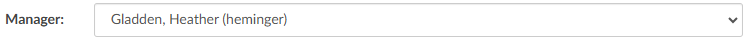

Managers only have accessibility to pull user reports and dashboard activities for the end users assigned to them. When the manager logs in and has at least one coder assigned to them, the coder and audit administrative dashboards will only show data relevant to the assigned coder(s). When the manager runs a [User Report](https://dolbeysystems.github.io/fusion-cac-web-docs/administrative-user-guide/reporting/user-reports/), the report will automatically be filtered to the users assigned to the manager. The manager is unable to gather any report information involving users not assigned to the manager. 

For this feature, managers are defined as users with the role of "Manager" but not a role of "Administrator." No users have managers by default, since the configuration of managers is entirely optional. Additionally, a user cannot be their own manager.

### Email

The user's email can be entered for documentation purposes, unless the organization is using the [Enable Query](https://dolbeysystems.github.io/fusion-cac-web-docs/administrative-user-guide/tools/user-management/#enable-query) functionality. 

### Name (Required)

Data entered in these fields are used to identify the user various areas of the application, including reporting. 

### Signature

Clicking {}+Add{} next to Signature in the top right corner allows each user to create a signature that will automatically be sent at the bottom of physician queries. This line
will appear at the bottom of Physician Queries to show who created the
query. A new button is located next to the user’s name in the user profile.

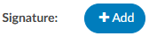

Clicking it will open a box allowing the user to create the signature.

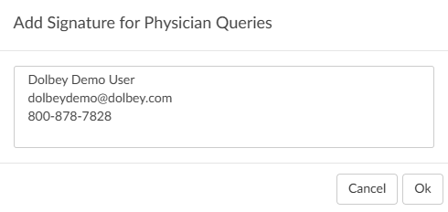

For formatting options, highlight the text in the signature box. 

### Enable Query

This setting is *not* commonly configured. Enable Query allows a user to send a Physician Query to a valid email, if the user receiving the query is added in User Management with a vaild email address. 

If that checkbox is checked, the user becomes searchable in the physician dropdown within a physician query.

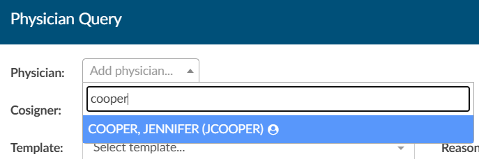

The user will only be visable upon typing in the User ID and will show a little person icon next to their name to indicate they are not a physician.

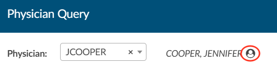

> [!note] Email-based Physician Queries Only
Most sites sending physician queries choose to send to physicians in their MFN file rather than email. This feature was developed for a select few sites that do query through email.
This setting **must be turned on** by your Project Team or CAC Support. Enableing this functionality requires development work as an interface change is needed as to how and where queries are sent.

### Active

This field allows management to revoke access to the system. If checked the user is active and can log into the application. If unchecked, the user is inactive and will not have access to the system.

### Locked

The user will not be able to login until this box is unchecked. An account will automatically lock by incorrectly after three (3) incorrect sign in attempts. If a user's profile is locked, they will not be able to log into the Fusion CAC application. Unchecking the box will allow the user to attempt to sign back in. 

>[!caution] Active Directory Users - Reset Password
If a user forgets their password the system is configured to use Windows log-in (Active Directory), the password must be reset through the organization's internal processes for resetting account information.

### Workgroups

Workgroups selected from the dropdown are assigned to the user. 

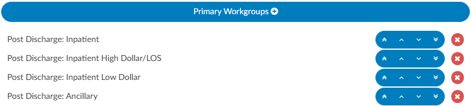 

Assigned workgroups will display to the end user in the Assgned To: dropdown on the [Accounts](https://dolbeysystems.github.io/fusion-cac-web-docs/general-user-guide/accessing-accounts/#account-list) page. 

Primary workgroups will be presented to the end user first. Backup workgroups will be presented if there are no accounts availble in the user's primary queues. 

To select multiple workgroups at a time, hold the Ctrl key while clicking. 

### Force AutoLoad

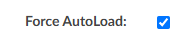

Force Autoload helps prevent cherry-picking by forcing the order in which patient charts are presented to end users. Dolbey recommends using Force Auto Load for high-volume coders where quality and productivity tracking is critical.

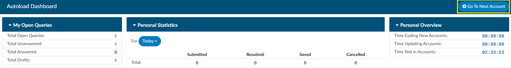

Users with ForceAutoload enabled will bypass the Account List page upon logging in and be directed to the AutoLoad page. To access their next account, they simply click {}Go To Next Account{}, which automatically loads the first available account from their assigned workgroups. The system follows the sort order set by the manager and skips any charts currently locked in use by another user.

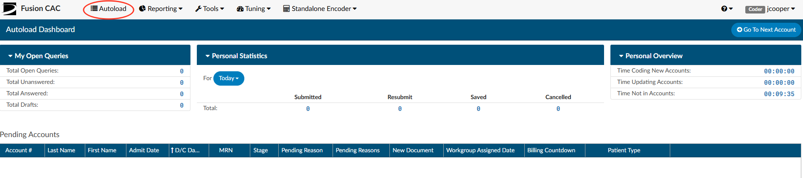

One or multiple work lists can be assigned by management. Users will work the one assigned work list until complete or rotate through multiple based on the assigned [workgroup limits](http://localhost:1313/fusion-cac-web-docs/administrative-user-guide/tools/user-management/#workgroup-limits). If there are no accounts left to work, the user will receive a message that there are no accounts in the queue.

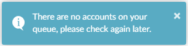

##### Force Auto Load v. Regular Work List Access

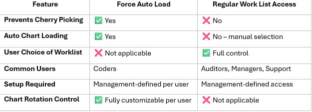

#### Workgroup Limits

When Force Autoload is enabled, *Limit:* boxes will display next to each assigned workgroup. 

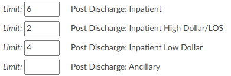

Managers can limit the number of accounts per workgroup the user will be assigned before they are presented with accounts from the next list. If no limit is set, the user will have access to however many accounts are currently in the workgroup. To transition to the next workgroup, the current workgroup must be fully completed.

> [!note] Manual Routing Always Takes Priority
If an administrator routes a chart directly to the user's “You” worklist, the chart will automatically be presetened *before* resuming normal workgroup priority order.

The Autoload page provides a copy of the Coder Personal Dashboard. The coder will also see a list of accounts they saved with a Pending Reason at the bottom of the autoload page.

## User Profile Menu

Users can access their profile information by clicking on their name in the top right hand corner.

- Selecting "Profile" will open their profile. The user's permissions will dictate which settings they are able to edit. Users with multiple roles will need to open their profile to switch roles. 
- Log Out will log the user out of the application. It is recommened for users to log out when they are done working rather than just closing the browser window.

## Today's Productivity

Daily productivity stats are displayed when the user clicks on the bar graph icon to the left of the user's ID. This is an alternative way for the user to quickly see their work if they are not looking at their [Personal Dashboard](https://dolbeysystems.github.io/fusion-cac-web-docs/administrative-user-guide/dashboard/#coder-personal-dashboard). 

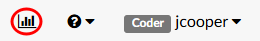

When the bar graph icon is clicked, the "Today's Productivity" dialog box will open. 

**Coder/Auditor View:**
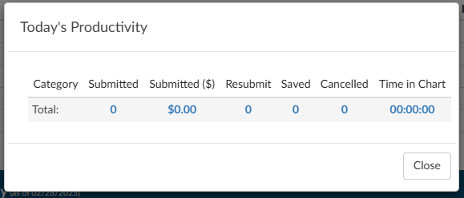

**CDI View:**
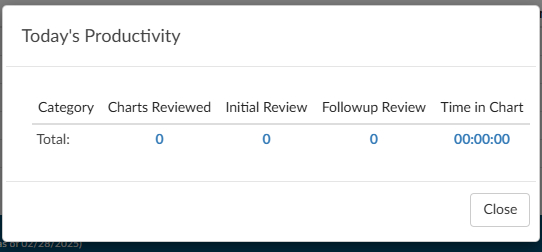

