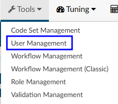

+++
title = 'User Management'
weight = 70
+++

User Management allows management to add, delete, or change permissions and/or set work lists for other users. The grid view will display all users with a Fusion CAC User ID. The columns can be arranged in any order and saved per user.

| Column |Description|
| -------|-----------|
|Action  |Copy exisiting profile when creating new user: Edit existing profile: Remove unused profile: |
|[Locked](https://dolbeysystems.github.io/fusion-cac-web-docs/administrative-user-guide/tools/user-management/#locked-1)   |Indicates if the user is locked out of the application|
|Employee Number|Employee number from ogranization|
|User ID|Username used to log into the application|
|First Name|User's first name|
|Last Name|User's last name|
|Facilities|User's assigned facilites|
|Roles|User’s assigned role(s) in the applicationied to their permissions|
|Workgroups|User's assigned workgroups|
|Active User|Indicates if the user has active access to the application|
|Last Access Time|Date and time the user last logged into the application|
|Force Autoload|Status of Force Autoload for the user|
|Email|User's email address|

>[!note] Removing a Profile
> A profile can only be removed if the user has not signed into the application. Once a user logs in, the delete icon will no longer show in their Actions column. This is to maintain accurate reporting. If a user should no longer have access to the Fusion CAC application, their profile should be [locked](https://dolbeysystems.github.io/fusion-cac-web-docs/administrative-user-guide/tools/user-management/#locked-1).

## Edit User Profile 

### New User

{}+Add User{} allows management to create a brand new user profile from scratch

Copying a user profile will carry over some settings from an existing profile to a brand new profile
- Roles
- Facilites
- Chart Access
- Workgroups

### User Name and Password (Required)

It is common practice for organizations to use LDAP to communicate with their Active Directory, which stores user information such as usernames and passwords. When a user logs into Fusion CAC, the application can use LDAP to check Active Directory for the user's credentials. In short, LDAP allows the application to use existing usernames and passwords from Active Directory, so users do not need to remember separate login credentials specific to Fusion CAC. 

For this process to work, the credentials entered into Fusion CAC must be identical to the Windows login provided by the organization. As long as the user name matches, there is no need to enter a password when creating a new profile in the application. Fusion CAC will be able to link to Active Directory and the end user can log into the application using the same information they use to log into their work computer. 

>[!info] User Name Cannot be Changed
>Once a user name is entered it cannot be edited. If a profile is created with an invalid user name, a new profile with the correct user name must be created. This is to maintain consistency for reporting. If the incorrect profile is never used, it may be removed from the User Management page.

### Employee Number

If applicable, the user's employee number can be entered. Only administrators can see and edit user Employee Numbers. 

### Roles

In Fusion CAC, roles determine the permissions and privileges a user has while navigating the application. Users can have multiple roles. Roles can be configured by management in the [Role Management](https://dolbeysystems.github.io/fusion-cac-web-docs/administrative-user-guide/tools/role-management/) tool. 

Default roles include:

| Role                  | Description |
| --------------------- | ----------- |
| **Viewer**            | Can view the patient chart but cannot make changes. |
| **Coder**             | Can view the patient chart, as well as add, delete, and change codes and DRGs on the coding abstract. Can add and remove items on coding forms, access editable fields in account information, and add notes and bookmarks. |
| **Physician Coder**   | Can view the patient chart, add, delete, and change codes for physician-specific coding. Can add and remove items on physician coding forms, access editable fields in account information, and add notes and bookmarks. |
| **Single Path Coder** | Can view the patient chart and has permissions to add, delete, and modify final codes for both physician and hospital coding. |
| **CDI Specialist**    | Can view the patient chart, add, delete, and change codes and DRGs on the CDI abstract. Can add and remove items on CDI forms, access editable fields in account information, and add notes and bookmarks. |
| **Router**            | This role is an add-on for Coder, Physician Coder, or CDI Specialist roles. Enables users to manually route tasks to other users or workgroups, overriding the system’s automated workflow. |
| **Auditor**           | Can view the patient chart and add, delete, and change codes and DRGs on the coding abstract. Can add and remove items on coding forms, access editable fields in account information, and add notes and bookmarks. Can also import previously submitted codes and initiate an audit worksheet. |
| **Manager**           | Can do everything that Coders and Viewers can do. They can also add and delete users to the system from their own facility, change passwords, or change user roles. Managers can assign accounts to users and produce reports describing the state of the work queue and various coder statistics from their own facility. |
| **Administrator**     | Can do everything that Coders and Viewers can do. They can also add and delete users to the system, change passwords, or change user roles throughout all facilities (if multi-site). Administrators can assign accounts to users and produce reports describing the state of the work queue and various coder statistics. |

### Facilities

Multi-site organizations can assign specific facilities to users. Options in the dropdown menu can be customized using the [Mapping Configuration](https://dolbeysystems.github.io/fusion-cac-web-docs/administrative-user-guide/tools/mapping-configuration/) tool. Once assigned, the user will only be able to acces charts from their assigned facilities.

### Manager

### Email

### Name (Required)

Data entered in these fields are used to identify the user in reports. 

### Signature

Clicking {}+Add{} next to Signature in the top right corner allows each user to create a signature that will automatically be sent at the bottom of physician queries. This line
will appear at the bottom of Physician Queries to show who created the
query. A new button is located next to the user’s name in the user profile.

Clicking it will open a box allowing the user to create the signature.

For formatting options, highlight the text in the signature box. 

### Enable Query

This setting is *not* commonly configured. Enable Query allows a user to send a Physician Query to a valid email, if the user receiving the query is added in User Management with a vaild email address. 

If that checkbox is checked, the user becomes searchable in the physician dropdown within a physician query.

The user will only be visable upon typing in the User ID and will show a little person icon next to their name to indicate they are not a physician.

> [!note] Email-based Physician Queries Only
Most sites sending physician queries choose to send to physicians in their MFN file rather than email. This feature was developed for a select few sites that do query through email.
This setting **must be turned on** by your Project Team or CAC Support. Enableing this functionality requires development work as an interface change is needed as to how and where queries are sent.

### Active

This field allows management to revoke access to the system. If checked the user is active and can log into the application. If unchecked, the user is inactive and will not have access to the system.

###### Locked

The user will not be able to login until this box is unchecked. An account will automatically lock by incorrectly after three (3) incorrect sign in attempts. If a user's profile is locked, they will not be able to log into the Fusion CAC application. Unchecking the box will allow the user to attempt to sign back in. 

>[!caution] Active Directory Users - Reset Password
If a user forgets their password the system is configured to use Windows log-in (Active Directory), the password must be reset through the organization's internal processes for resetting account information.

## Using Force AutoLoad

This feature helps prevent cherry-picking by enforcing the order in which workgroups and patient charts are assigned to end users. When enabled, users will bypass the Account List page upon logging in and instead be directed to the AutoLoad page. To access the next account, they simply click the "Go to Next Account" button, which automatically loads the first available account from their assigned workgroups. The system follows the sort order set by the manager and skips any charts currently locked by another user.

If there are no accounts left, the system will automatically load the first account from the visible linked
workgroups. If there are no accounts left, the user will be presented with a new screen informing the
user that there are no accounts.

### Setting Limits on the Number of Charts

Users that are configured to have Forced Autoload will now have a column under the Workgroup
assignement panels in their user profile. This will allow managers to limit the amount of accounts in each workflow that the
forced user will be assigned. If no limit is set, the user will have access to however many accounts are currently in the workgroup. To transition to the next workgroup, the current workgroup must be fully completed.

In the example below, I’ve set account limits for the user for each of their assigned workgroups. With these limits in place, if the Post Discharge SDS workgroup contains 20 accounts, the user can only complete 5 charts before moving on to their next assigned workgroup. The user will sequentially receive 5 accounts from Post Discharge Surgery Center and up to 5 from Urgent Care. Once all assigned workgroups are cycled through, the system will return to the first workgroup, starting again with up to 5 Post Discharge SDS accounts.

> [!note] Manual Routing Always Takes Priority
If an admin routes a chart directly to the users “You” worklist, the chart will appear next
in autoload before resuming normal workgroup priority order.

The "Autoload" page provides a copy of the Coder Personal Dashboard. The coder will also see a list of
accounts they saved with a Pending Reason at the bottom of the autoload page that they can access by
clicking.

###### Primary Workgroups

This field is a list of check boxes that are populated based on the queues that
are created in the "Automatic Assignment" tab. By checking these boxes, you
are giving that user access to queues.

###### Backup Workgroups

These workgroups are only visible to the user from the Account List page if
all other assigned queues are empty. As soon as an assigned workgroup
receives an account, the backup queues are no longer visible. Auto-
Download will not be affected.

###### Save User Button

This button allows you to save the user profile you are adding or editing.

###### Cancel

This button allows you to cancel the user you are adding or editing without
making or saving any changes.

## User Profile

A user's profile can be accessed through the top-right corner of the application or via the User Management section. Clicking on the user’s name and selecting "Profile" will open their profile. The settings available within the profile depend on the user’s assigned permissions. Additionally, by clicking on the user’s name, you can view their productivity statistics for the day.

