+++
title = 'Validation Management'
weight = 100
+++

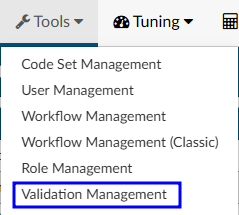

Validation Management allows user roles with the correct permission to create rules that show up on the code summary page prior to submitting an account. These rules can be made to either prevent an account from being submited until certain requirements are met, or issue a warning to alert users about incomplete items while still allowing the user to submit an account. 

Examples of rules that can be created with this tool include:

- A user must have a discharge date to submit an inpatient chart
- The newborn weight must exist on a newborn chart
- If a certain charge is on a chart and a diagnosis code is not present

## Creating a Validation Rule

Begin by entering a rule name in the top right-hand corner of the page and then clicking on {}+Add Rule{}.

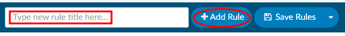

When the new rule is added, a number will be associated with the rule. The number will be used as reference when users troubleshoot a rule that may not be working as intended. When a rule is triggered in Code Summary, the rule number will display on the right end of the rule. Knowing this number will help administrators find the rule quickly in Validation Management for troubleshooting/updates.

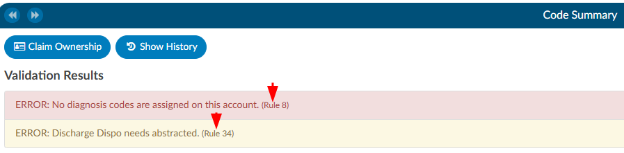

### Level Type

Once a validation rule has been named and added, the rule is edited by clicking on the **+** to the left of the rule number. After expanding the rule, add criteria to define what the validation rule will do.

Start by selecting the **Level** from the dropdown menu on the left-hand side of the screen. 

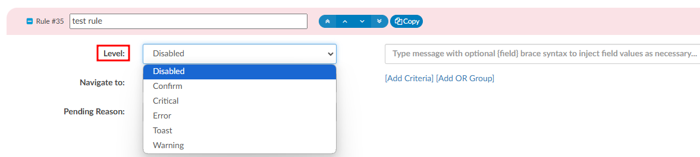

|Level|Description|
|-----|-----------|
|**Error**|Must be resolved before the user can submit a chart. This validation rule typically only applies to Coders because CDI specialists do not generally submit charts. Errors have a red background, indicating there is a hard stop|
|**Critical**|Same as an error, with an additional warning. If upon clicking save, the end-user still has a critical error, they will get a pop-up box that indicates they still have validation rules outstanding and will be asked if they wish to continue. This validation rule has a red background, indicating there is a hard stop|
|**Warning**|A soft stop used to notify a user that there *may* be things to resolve. It does not prevent the user from submitting the chart. This validation rules has a yellow color background, indicating possible intervention is needed|
|**Toast Message**|This is a notification that comes from the top right-hand corner of the browser as a red message presented for a few seconds Toast messages do not stop the user from submitting or saving a chart. It is simply a notification message to alert the user|
|**Disabled**|This level will disable the validation rule and prevent it from alerting the end user. The rule will turn red within validation management to show it is not active|

### Defining the Criteria

Once you have selected the level of the validation rule you want to create, you must define what the
criteria is starting with the verbiage you want to display to the end user. For example, you can display an
error if a chart does not have a discharge disposition so it does not get submitted to billing without one.
Since we would want to warn the Coder and not the CDI specialist, we would add another criterion input
so user role is not equal to CDI specialist. First, type in the display name; this will be what the user will see on the code summary. 
Keep the informaiton concise, but also provide how they can fix the error.

Example: **Missing Discharge Disposition** - The end user would know they have to add the disposition to continue.

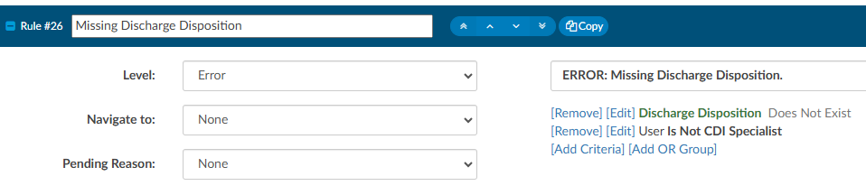

### Type of Criteria

To add criteria to rule, as in the example above, click on **Add Criteria** to define how the system fires this rule.

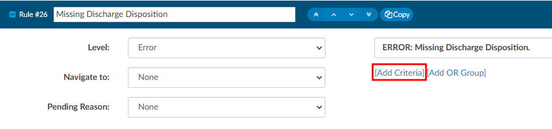

Upon clicking on **Add Criteria**, you will be presented with differnt types of criteria.

**Account** - Account type criteria allows you to select fields for a patient chart/account such as discharge
date, discharge disposition, admit date, procedure codes, diagnosis codes, and many others.

**User** - User type criteria allows you to restrict the rule to a certain users role, such as a Coder or a CDI
user role only. Typically, account-level criteria and user roles are used together, though account-level criteria can be used independently of user roles. However, creating a rule based solely on a user role without specifying any additional account-level criteria is not advisable.

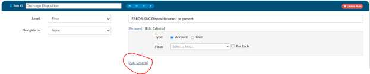

Once you have defined the type of criteria, you can then add the details.

Example: **ERROR: D/C Disposition must be present**

Building criteria for a validation rule is much like workflow. For this example, select account, then in the
field name find Discharge Disposition. Once you drop in the field name, it will then give you other fields.
In this example it allows you to select an operator.

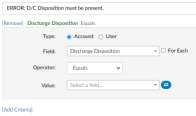

## AND/OR Criteria

Validation Rules, much like workflow, has two different options to create a validation rule.

1. AND criteria
2. OR Criteria.

### Example of AND Criteria

At the end of each criterion, you add an “AND” (see below). This criterion will cause the validation rule
to display if the patient has both a newborn Z code AND an admit type of 4.

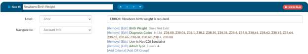

### Example of OR Criteria

At the end of each criterion, you add an “OR” (see below). When you add an OR criteria it will turn blue
to differentiate between the first and second statement. This criterion will cause the validation rule to
display if the patient has either a newborn Z code OR an admit type of 4.

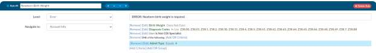

| Operator             | Description |
| -------------------- | ----------- |
| Equals               | This is used if you have one value, and it must equal the value. This is case sensitive. |
| >                    | This sign means that the value must be less than the value noted. |
| <                    | This sign means that the value must be greater than the value noted. |
| >=                   | This sign means that the value must be less or equal to than the value noted. |
| <=                   | This sign means that the value must be greater or equal to the value noted. |
| In List              | If you have more than one value, it could be any of the following. |
| Not In List          | If you have more than one value, you do not want it to equal. |
| Contains             | If you have a word, phrase or value that can contain it must have what you added exactly. This is common when including payors. |
| Only Contains        | Any one of the codes it is not needed to do all 3. |
| Exists               | This will search to see if anything “exists” in this field, if it’s not blank it will match. No value is needed after the operator. |
| Does not Exist       | This will search to see if anything “does exists” in this field if it’s blank it will match. No value is needed after the operator. |
| More Than            | This operator is only used with date fields, you will need to define “more than” how many days ago. You cannot add a date into the field as this field will need to be dynamic therefore days ago is used. |
| Less Than            | This operator is only used with date fields, you will need to define “less than” how many days ago. You cannot add in a date into the field as this field will need to be dynamic therefore days ago is used. |
| Later Than           | This operator is only used with date fields, you will need to define the exact date you do not wish to exceed. |
| Is On                | This is for an exact date, this is uncommon to use for workflow. |
| Includes Each Of     | If you have more than one value, it must contain all of the following. However, note the chart must have each of the values but can also have other values. |
| Includes Any Of      | If you have more than one value and it could be any of the following. |
| Does not Include     | If you have more than one value, you do not want it to equal you must use “Not In List” |

Once you have selected the field and your operator add a value.

Example: **ERROR: D/C Disposition must be present** We might select **Does Not Exist** as an operator. This would
mean if a discharge disposition does not exist, then this rule would display on the code summary and prevent 
the user from submitting the chart.

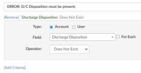

Additionally, we may only want to display this rule if the user has a role of a coder. To constrain the rule further,
click on the **Add Criteria** again, select user, and then select “Is not CDI Specialist”. This will prevent the
rule from display to a user with a role of a CDI.

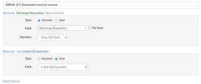

### For Each Check Box

**For each** is used for fields that are repetitive. For example, a field like discharge disposition is a single
field (there are not multiple discharge dispositions on a patient chart) therefore, you do not need the
"for each" checkmark.

The **For Each** checkmark makes sense when you’re trying to create a rule that would have multiple
outcomes, such as checking if any diagnosis codes have a POA status of U. We don’t want to check only
the first diagnosis rather we want to check all diagnosis to see if it has a status of U. **For Each** can also be
used if you want to check if a procedure code has a date of service and/or provider attached. We don’t
want to just check the first procedure code for the date of service, we want to check each of them.

To use this field, first select **For Each** before defining a field. The system will open another drop-down
field to the right of **For Each** to indicate where you want to create the rule. There are only a handful of
fields the **For Each** field make sense for: charges, CPT codes, diagnosis codes, procedures, pending
reasons, and physicians.

Once you have selected a fields, you need to define the field you are looking for.
Example: Place an error reminding the Coder to add the POA status on any diagnosis code that has a U
Click on **For Each**, then select diagnosis codes. Select POA from the field drop-down menu which will
allow you to review operators. For this example, use the operator of Equals. Once you select the
operator of Equals, then you have a field to fill in the value, which would e be “U” in this example.

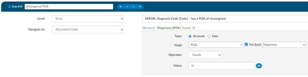

Then, because it makes sense to direct the coder to where the diagnosis code was validated or added,
we can then select Navigate to document code and it will take the end user back to the documentation
so they can review and assign the POA status appropriately.

### Adding fields to a rule

You can add fields to the rule to tell the user exactly what POA is triggering this rule so they don’t have
to look through all of the codes to determine which one has a U status.

You can inject a field within the rule that will be displayed for the end-user. Do this by putting the field
name in braces exactly like this {Code}. When the rule fires for the end-user, it will display the code with
the issue. If there are multiple, use the For Each
field to see each of the codes that are the issue as
an individual rule.

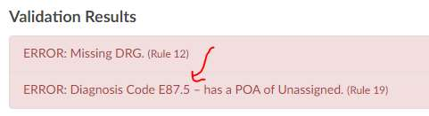

### Navigate To

Once you have defined your rule, you will want to decide if it makes sense to take the end user
somewhere in the software to correct the issue based on the rule created. In the example of a discharge
disposition, it does make sense to direct the user to go to the account information
page as that is where they would likely change the disposition. Under where you
selected the level, there is a field for

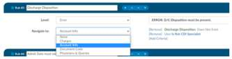

**Navigate** to (these are placed within the patient chart, under the navigation pane).

- **None** – Will not take the user anywhere if they click on the error/warning.
- **Charges** – Will take the user to the charges viewer.
- **Account Info** – Will take the user to the account information viewer.
- **Document Code** – Will take the user to where the code was validated/added.
- **Physicians & Queries** – Will take the user to the Physicians & Queries viewer.

### Pending Reason

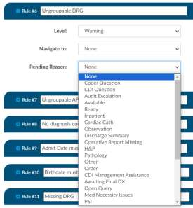

This field will have a dropdown with all available pending reasons.
If a rule is triggered on an account and it has a pending reason
attached, then the pending reason will be added and the user will
be able to see the number of the rule. Pending reasons that have a
physician or date requirement will NOT be available in this list. The
only way to remove a pending reason that was added by a rule is
to have that rule cleared

### Saving your Rule

Once you’ve completed adding criteria for your validation rule
remember to click on Save Rules in the top right-hand corner. It is
recommended that you test your validation rule by opening a chart that
fits the criteria of your validation rule

