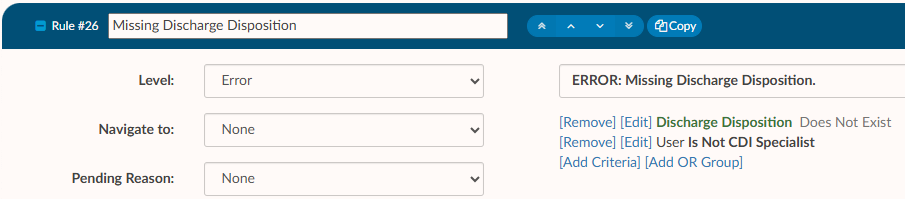

+++
title = 'Validation Management'
weight = 100
+++

Validation Management allows user roles with the correct permission to create rules that show up on the code summary page prior to submitting an account. Rules can be made to prevent an account from being submitted until certain requirements are met, or issue a warning to alert users about potentially incomplete items while still allowing the user to submit an account. 

Examples of rules that can be created include:

- An account must have a discharge date to submit an inpatient chart
- The newborn weight must exist on a newborn chart
- If a certain charge is on a chart and a diagnosis code is not present

## Creating a Validation Rule

Begin by entering a rule name in the top right-hand corner of the page and then click on {}+Add Rule{}.

When the new rule is added, a number will be associated with the rule. The number will be used as reference when troubleshooting a rule that may not be working as intended. 

When a rule is triggered in Code Summary, the rule number will display on the right end of the rule. 

### Level Type

Once a validation rule has been added, the rule can be edited by clicking on the **+** to the left of the rule number. 

Start by selecting the **Level** from the dropdown menu on the left-hand side of the screen. 

|Level|Description|
|-----|-----------|
|Error|**Must be resolved before the user can submit a chart**. This validation rule typically only applies to Coders because CDI specialists do not generally submit charts. Errors have a red background, indicating there is a hard stop.|
|Critical|Same as an error, with an additional warning. If upon clicking save, the end-user still has a critical error, they will get a pop-up box that indicates they still have validation rules outstanding and will be asked if they wish to continue. This validation rule has a red background, indicating there is a hard stop.|
|Warning|A soft stop used to notify a user that there *may* be items to resolve. It **does not prevent the user from submitting the chart**. This validation rules has a yellow color background, indicating possible intervention is needed.|
|Toast Message|A notification that comes from the top right-hand corner of the browser as a red message presented for a few seconds. Toast messages **do not stop the user from submitting or saving a chart**. It is simply a notification message to alert the user.|
|Disabled|This level will disable the validation rule and prevent it from alerting the end user. The rule will turn red within validation management to show it is not active.|

### Criteria

Enter the message to be displayed to the end user when the rule is triggered. For example, 

**ERROR: Missing Discharge Disposition** - The end user would know the chart cannot be submitted until the discharge disposition is added. 

Criteria should then be added to define what causes the rule to trigger. To add criteria to rule, click on **Add Criteria**.

Upon clicking on **Add Criteria**, a dialogue box will open with different types of criteria.

**Account** - Account type criteria allows users to select fields for an account, such as discharge
date, discharge disposition, admit date, procedure codes, diagnosis codes, and many others.

**User** - User type criteria allows users to restrict the rule to a certain user role(s), such as a Coder or a CDI Specialist.

Typically, account-level criteria and user roles are used together, though account-level criteria can be used independently 
of user roles. Creating a rule based solely on a user role without specifying any additional account-level criteria is not 
advisable.

Once you have defined the type of criteria, you can then add the details.

#### AND/OR Criteria

Building criteria for a validation rule is much like adding criteria to workflow. Many of the same fields and operators are available in both places. Validation Rules, much like workflow, has two different criteria options when creating a validation rule:

- AND criteria - think about adding "and" to the end of each criterion. 
   - *example:* The user must not be a CDI Specialist **and** the discharge disposition must not exist for the rule to trigger
  
- OR Criteria - think about adding "or" to the end of each blue criterion. When added, OR criteria will turn blue
to differentiate between the first and second statement.
   - *example:* The user must not be a CDI Specialist and the discharge disposition must equal 30 **or** not exist for the rule to trigger
  

| Operator             | Description |
| -------------------- | ----------- |
| Equals               |One value must be the same as another value. This is case sensitive|
| >                    |The value on the left must be greater than the value on the right|
| <                    |The value on the left must be less than the value on the right|
| >=                   |The value on the left must be greater than or equal to the value on the right|
| <=                   |The value on the left must be less than or equal to the value on the right|
| In List              |The value can be any of the following listed items|
| Not In List          |The value should not be any of the listed items|
| Contains             |The value that can contain exactly what is entered. This is common when including payors.|
| Only Contains        |Any one of the codes it is not needed to do all 3. |
| Exists               | This will search to see if anything “exists” in this field, if it’s not blank it will match. No value is needed after the operator. |
| Does not Exist       | This will search to see if anything “does exists” in this field if it’s blank it will match. No value is needed after the operator. |
| More Than            | This operator is only used with date fields, you will need to define “more than” how many days ago. You cannot add a date into the field as this field will need to be dynamic therefore days ago is used. |
| Less Than            | This operator is only used with date fields, you will need to define “less than” how many days ago. You cannot add in a date into the field as this field will need to be dynamic therefore days ago is used. |
| Later Than           | This operator is only used with date fields, you will need to define the exact date you do not wish to exceed. |
| Is On                | This is for an exact date, this is uncommon to use for workflow. |
| Includes Each Of     | If you have more than one value, it must contain all of the following. However, note the chart must have each of the values but can also have other values. |
| Includes Any Of      | If you have more than one value and it could be any of the following. |
| Does not Include     | If you have more than one value, you do not want it to equal you must use “Not In List” |

#### For Each Check Box

**For each** is used when the value is likely to occur more than once on the account, such as charges or procedures.

Select **For Each** to open another drop-down field to the right of **For Each**. Once the user has selected a field, they can define what the rule should be looking for.

*example:* The application will check each diagnoses code for a Present on Arrival status of U. 

Then, because it makes sense to direct the coder to where the diagnosis code was validated or added,
we can then select Navigate to document code and it will take the end user back to the documentation
so they can review and assign the POA status appropriately.

### Adding fields to a rule

Fields can be added to the message displayed by rule to tell the user exactly what is triggering the rule when it is displayed in the Code Summary.

Fields are added by putting the field name in braces {}. 

When the For Each box is checked, the For Each field name can be used to display each of the codes that caused the rule to trigger.

### Navigate To

It may make sense to have the rule take the end user to a different location in the chart to correct whatever caused the rule to trigger. If a location is selected in the Navigate To dropdown, the rule will act as a link to the specified location in the chart.

- **None** – Will not take the user anywhere if they click on the error/warning.
- **Charges** – Will take the user to the charges viewer.
- **Account Info** – Will take the user to the account information viewer.
- **Document Code** – Will take the user to where the code was validated/added.
- **Physicians & Queries** – Will take the user to the Physicians & Queries viewer.

### Pending Reason

All available pending reasons from the [pending reasons mapping table](https://dolbeysystems.github.io/fusion-cac-web-docs/administrative-user-guide/tools/mapping-configuration/#pending-reasons-mapping) will be available in this dropdown.

If a rule is triggered on an account and it has a pending reason attached, the specified pending reason will be automatically added to the account and the user will be able to see the number of the rule. The only way to remove a pending reason that was added by a rule is to meet the requirement to clear the rule. 

Pending reasons that have a physician or date requirement will **NOT** be available in this list.

>[!info] Remember to Save
>Click {}Save Rules{} in the top right-hand corner as to not lose changes. It is
recommended that to test validation rules by opening a chart that fits the specified criteria.

