+++
title = 'Workflow Management'
weight = 80
+++

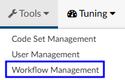

The workflow management editor allow administrators to create, design, modify, and manage workflow(s) within Fusion CAC.

The purpose of a workflow is to systematically organize and streamline the patient chart activities for proper completion. Workflows are designed to improve efficiency, productivity, and collaboration between the various user roles by defining the sequence of steps, assigning responsibilities,
and establishing the flow of information between different individuals or departments involved in the process. They ensure that tasks are completed in a structured and efficient manner, enabling organizations to achieve their goals more effectively. 

## Worklists

Worklists are organized into one of the following categories:

|Category|Description|
|--------|-----------|
|[Audit](https://dolbeysystems.github.io/fusion-cac-web-docs/administrative-user-guide/tools/workflow-management/#audit)|Available for any charts needing an audit. This workflow can be used to define certain days for when charts are added to the Auditor worklist(s)|
|[Autoclose](https://dolbeysystems.github.io/fusion-cac-web-docs/administrative-user-guide/tools/workflow-management/#autoclose)|Process by which an ancillary patient chart can be autoclosed based upon a set of rules without coder intervention
|CDI/Concurrent|**ONLY** valid if the patient chart does not have a discharge date and has a status of unbilled|
|Post Discharge|**ONLY** valid if patient chart has a discharge date and has a status of unbilled|
|QA Review|Available for any charts needing QA and/or for reconciliation workflow|
|[Custom](http://localhost:1313/fusion-cac-web-docs/administrative-user-guide/tools/workflow-management/#custom-category)|Allows custom categories to meet unique client specification|

Categories are made up of one or more worklists. Each worklist is then made up of one or more criteria groups. For example:

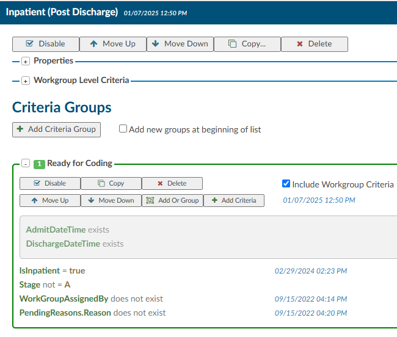

- The Post Discharge category 
  - contains the Inpatient worklist
    - which has the Ready for Coding criteria group
      - hich is then made up of multiple pieces of criteria 

It is possible for an account to be in more than one worklist at a time, depending on the category: 

- An account may only be in one default category at a time
- Custom categories allow an account to be in multiple custom categories at the same time.
- An account can also be in one default category and multiple custom categories at the same time
- An account cannot be in more than one workgroup within the same category

Often a worklist will contain multiple criteria groups. Each criteria group has many different filters to fully constrain the data. This ensures the appropriate number of charts are caught in each worklist.

>[!note]Terminology
>Worklist and Workgroup are often used interchangeably when discussing the "buckets" accounts are sorted into.

### Audit

Audit workflow collects charts meeting the specified criteria needed to be reviewed by an auditor. The workflow can define certain days for when charts are added to the Auditor worklist(s).In Workflow Management the Audit default workgroup category is identical
to all other workgroup categories, but Audit workflow is triggered on a schedule instead of in real-time.

Example: Select that workflow automatically adds charts to the worklist on the first day of every month and last day of the month.

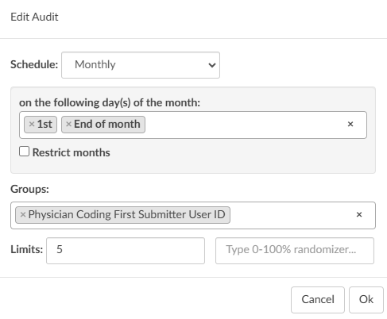

On the designated days every month, 5 charts (the limit can be changed) from every coder (First Submitter) will be automatically routed to the auditor’s worklist. 

#### Schedule 

The setting to determine when workflow will run for this Audit (Daily, Weekly, or Monthly).

#### Groups

One or more single fields to perform the grouping. For example, a grouping of “Last Submitter” and “Is Inpatient” would tell Audit workflow that after gathering the list of accounts, group them by unique Last Submitter *and* Is Inpatient.

#### Limits

The number of accounts to assign from each grouping. This value can be a maximum number, a
percentage, or both. Using the example above:

- Setting the selection to 5 maximum with no percentage means that for each unique group of "Last Submitter" and "Is Inpatient" accounts, randomly assign up to 5 accounts
- Setting the selection to 50 percent and 10 maximum means that for each unique group of "Last Submitter" and "Is Inpatient" accounts, randomly assign 50% of the accounts, up to 5 maximum
- Setting the selection to 50 percent with no maximum means that for each unique group of Last Submitter" and "Is Inpatient" accounts, randomly assign 50% of the accounts

### AutoClose

This automation is the a process by which an ancillary patient chart can be closed by the application based upon a set of rules without coder intervention. Autoclose is a process that takes routine outpatient visits and automates the coding process by submitting the chart directly to billing. This concept is known in the industry as autonomous coding.

Organizations often use AutoClose to ensure they can capitalize on the value of these ancillary charts while not sacrificing the staff they have.
Common outpatient service lines that make great candidates for AutoClose include:

- Screening Mammogram
- Sleep Lab
- Labs
- Chest X-rays
- ED Left Without Being Seen
- Canceled Accounts
- Cardiac rehab
- Dietary or nutritional counseling
- Esophageal motility studies
- Outpatient dialysis
- Pulmonary function tests
- Vaccine visits

The types of accounts eligible for AutoClose depend on the organization, the type of services offered, payor(s), and state requirements. The Dolbey SME Team is happy to answer any questions and will work with each organization to configure AutoClose. 

With AutoClose, charts can be processed within seconds and the total turn-around time can be a little as a few minutes. Charts are processed 24 hours a day, 365 days a year with AutoClose. The impact AutoClose can have on revenue is one of the best benefits of this feature. Many
organizations AutoClose, on average, **10,000 or more charts per month**. This equals out to about 120,000 outpatient visits AutoClosed per year without coder intervention. That is an estimate of 2.5FTEs.

#### Completeing Charts

AutoClose can be set to complete charts on day one. Many organizations, however, choose to learn more about how the engine functions before AutoClose is enabled. Autoclose has a **test mode** which allows organizations to simulate what would have AutoClosed had it been enabled in production. This allows users to review and determine if AutoClose is ready for production at their facility.  

Patient charts that pass AutoClose criteria are coded and submitted to billing. Those that fail AutoClose are rejected and routed to a worklist for coder intervention. Rejected are presented to the coder with a failure reason.

As an organization expands their AutoClose capabilities, Dolbey recommends conducting regular audits to ensure the system captures and codes everything correctly.

## Add Workflow

>[!note]Terminology
>Worklist and Workgroup are often used interchangeably when discussing the "buckets" accounts are sorted into.

### New Category

To add a new category in Workflow Management, click {}+Add New Category{} in the top right corner.

The dialogue box has options to add a default/standard category or a new custom category. 

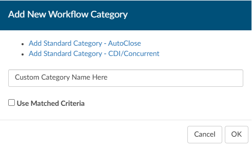

### Add Worklist 

To add a new worklist, click {}+Add{} under the appropriate category on the left hand side of the screen. 

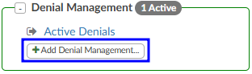

Name the new workgroup.

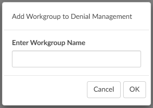

Add a Criteria Group

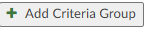

Name the Criteria Group something simple but meaningful to describe the reason accounts will move into the workgroup. This will help with
troubleshooting in the future.

### Set Criteria 

Workflow has two different criteria options to build workflow.

- AND criteria
- OR Criteria

#### AND

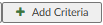

All the criteria must be met for an account to "match" and be sorted into a workgroup.

For example, for an account to "match" with the Ready for Coding workgroup pictured below, the category must be inpatient **and** the admit date/time must exist **and** the discharge date/time must exist **and** the stage cannot equal A (submitted) **and** the workgroupassignedby cannot exist **and** it must not have a pending reason.

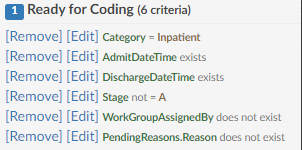

#### OR

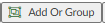

At least one of the criteria must be met for an account to "match" and be sorted into a workgroup.

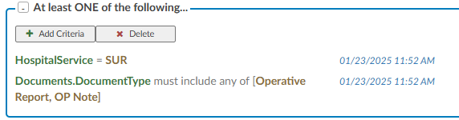

The OR criteria is listed in blue to call attention.

#### Workgroup Level Criteria

Workgroup level criteria works like all other criteria, but when enabled will apply to every group under that workflow. This alleviates the
need the same criteria to be added to all of the criteria groups.

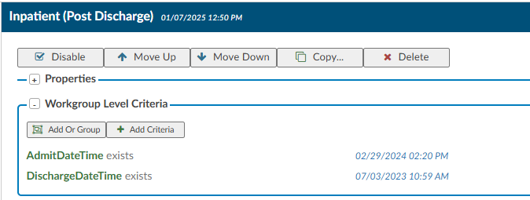

After setting the Workgroup Level criteria, check the box to include the criteria in the appropriate criteria groups.

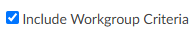

This functionality helps to keep repetitive criteria creation to a minimum.

1. Then click on the criteria name and click “Add Filter” and select “Set Value…”. The property are
database fields. Add as many values as needed to ensure you filter the data down so the
appropriate charts make it into each queue. One you add a property you will be presented with
a set of operators; depending on the property you select the operators can be different.
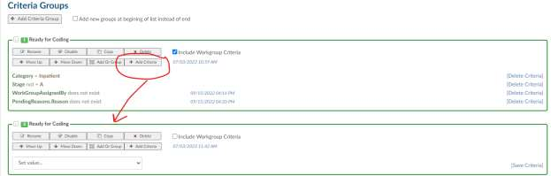

#### Workflow History Edits

The display for Workflow Management has been changed to allow for an onscreen running history of
edits. Users and Linked Users will now be seen under the name of the workgroup and will be defaulted
as collapsed. Clicking on the link will toggle the box open.

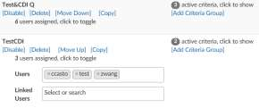

Any change made to criteria will show as a time
stamp on the criteria bar next to the specific criteria
that was changed. The date on the criteria bar will
always be the latest change date.

Hovering over the date will give detailed data for
that specific date change. If multiple changes have
been made to a workgroup, clicking on the date in
the criteria bar will open a box listing all changes for that workgroup.

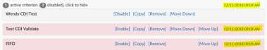

### Workflow Operators

| Operator             | Description |
| -------------------- | ----------- |
| Equals               | This is used if you have one value, and it must equal the value. This is case sensitive. |
| >                    | This sign means that the value must be less than the value noted. |
| <                    | This sign means that the value must be greater than the value noted. |
| >=                   | This sign means that the value must be less or equal to than the value noted. |
| <=                   | This sign means that the value must be greater or equal to the value noted. |
| In List              | If you have more than one value, it could be any of the following. |
| Not In List          | If you have more than one value, you do not want it to equal. |
| Contains             | If you have a word, phrase or value that can contain it must have what you added exactly. This is common when including payors. |
| Only Contains        | Any one of the codes it is not needed to do all 3. |
| Exists               | This will search to see if anything “exists” in this field, if it’s not blank it will match. No value is needed after the operator. |
| Does not Exist       | This will search to see if anything “does exists” in this field if it’s blank it will match. No value is needed after the operator. |
| More Than            | This operator is only used with date fields, you will need to define “more than” how many days ago. You cannot add a date into the field as this field will need to be dynamic therefore days ago is used. |
| Less Than            | This operator is only used with date fields, you will need to define “less than” how many days ago. You cannot add in a date into the field as this field will need to be dynamic therefore days ago is used. |
| Later Than           | This operator is only used with date fields, you will need to define the exact date you do not wish to exceed. |
| Is On                | This is for an exact date, this is uncommon to use for workflow. |
| Includes Each Of     | If you have more than one value, it must contain all of the following. However, note the chart must have each of the values but can also have other values. |
| Includes Any Of      | If you have more than one value and it could be any of the following. |
| Does not Include     | If you have more than one value, you do not want it to equal you must use “Not In List” |

### Random Audit

The criteria filter, "Random Percentage" is included in the workflow criteria options. When set to a number
between 0 and 100 and detected in the workflow engine, a random number will be generated. If the
random number is less than or greater than the number in the filter criteria, the Criteria will match.

Random Inclusion Factor that is less than 20 will pass a theoretical 20% of accounts through the filter.
You don't want to use this with equals (=) because it would always cause a ~1% result, and you don't
want to use it with greater than (>) because it will pass an inverse percentage.

As noted, this is not going to be an exact percentage, only a theoretical one. In edge cases, you could
ask for "20% of accounts" and end up getting zero, or you could end up getting all of them, but most of
the time, you should get ~20%.

This field is intended to be used with QA Workflow, although the application won't prevent an
administrator from using it in other types of workflow. Valid values for this field are from 1 to 99; any
other values in this field won't work.

Do not think of this field as a percentage, but rather as a 100-sided die. When workflow examines this
filter, it'll "roll the die". The common use case for this filter is "Random Inclusion Factor --> less than -->
10".

