+++
title = 'Workflow Management'
weight = 80
+++

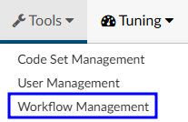

The Workflow Management tool allows Administrators to create, design, modify, and manage workflow(s) within Fusion CAC.

The purpose of a workflow is to systematically organize and streamline the patient chart activities for proper completion. Workflows are designed to improve efficiency, productivity, and collaboration between the various user roles by defining the sequence of steps, assigning responsibilities, and establishing the flow of information between different individuals or departments involved in the process. They ensure that tasks are completed in a structured and efficient manner, enabling organizations to achieve their goals more effectively. 

## Worklists

Worklists are organized into one of the following categories:

|Category|Description|
|--------|-----------|
|[Audit](https://dolbeysystems.github.io/fusion-cac-web-docs/administrative-user-guide/tools/workflow-management/#audit)|Available for any charts needing an audit. This workflow can be used to define certain days for when charts are added to the Auditor worklist(s)|
|[Autoclose](https://dolbeysystems.github.io/fusion-cac-web-docs/administrative-user-guide/tools/workflow-management/#autoclose)|Process by which an ancillary patient chart can be autoclosed based upon a set of rules without coder intervention
|CDI/Concurrent|**ONLY** valid if the patient chart does not have a discharge date and has a status of unbilled|
|Post Discharge|**ONLY** valid if patient chart has a discharge date and has a status of unbilled|
|QA Review|Available for any charts needing QA and/or for reconciliation workflow|
|[Custom](http://localhost:1313/fusion-cac-web-docs/administrative-user-guide/tools/workflow-management/#custom-category)|Allows custom categories to meet unique client specification|

Categories are made up of one or more worklists. Each worklist is then made up of one or more criteria groups. For example:

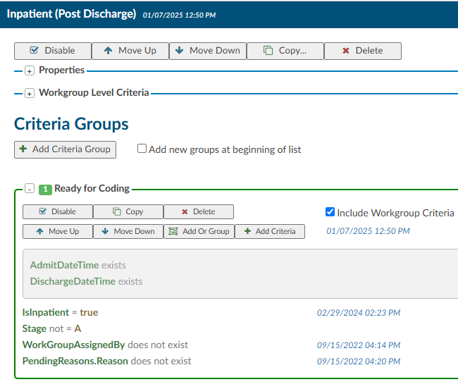

- The Post Discharge category 
  - contains the Inpatient worklist
    - which has the Ready for Coding criteria group
      - which is then made up of multiple pieces of criteria 

It is possible for an account to be in more than one worklist at a time, depending on the category: 

- An account may only be in one default category at a time.
- Custom categories allow an account to be in multiple custom categories at the same time.
- An account can also be in one default category and multiple custom categories at the same time.
- An account cannot be in more than one workgroup within the same category.

Often a worklist will contain multiple criteria groups. Each criteria group has many different filters to fully constrain the data. This ensures the appropriate number of charts are caught in each worklist.

>[!note]Terminology
>Worklist, Workgroup, and Queue are often used interchangeably when discussing sorting accounts into "buckets".

### Audit

Audit workflow collects charts meeting the specified criteria needed to be reviewed by an Auditor. The workflow can define certain days for when charts are added to the Auditor worklist(s).In Workflow Management the Audit default workgroup category is identical
to all other workgroup categories, but Audit workflow is triggered on a schedule instead of in real-time.

Example: Select that workflow automatically adds charts to the worklist on the first day of every month and last day of the month.

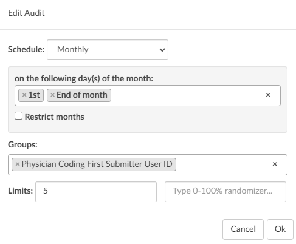

On the designated days every month, 5 charts (the limit can be changed) from every Coder (First Submitter) will be automatically routed to the Auditor’s worklist. 

>[!note]
>If a month occurs that does NOT have the date set, (ex. the month of November does not have a 31st day) the month will not run an Audit worklow.

#### Schedule 

The setting to determine when workflow will run for this Audit (Daily, Weekly, or Monthly).

#### Groups

One or more single fields to perform the grouping. For example, a grouping of “Last Submitter” and “Is Inpatient” would tell Audit workflow that after gathering the list of accounts, group them by unique Last Submitter *and* Is Inpatient.

#### Limits

The number of accounts to assign from each grouping. This value can be a maximum number, a
percentage, or both. Using the example above:

- Setting the selection to 5 maximum with no percentage means that for each unique group of "Last Submitter" and "Is Inpatient" accounts, randomly assign up to 5 accounts
- Setting the selection to 50 percent and 10 maximum means that for each unique group of "Last Submitter" and "Is Inpatient" accounts, randomly assign 50% of the accounts, up to 10 maximum
- Setting the selection to 50 percent with no maximum means that for each unique group of Last Submitter" and "Is Inpatient" accounts, randomly assign 50% of the accounts
  
##### Random Audit

The criteria filter, "Random Percentage" is included in the workflow criteria options. When set to a number
between 0 and 100 and detected in the workflow engine, a random number will be generated. If the
random number is less than or greater than the number in the filter criteria, the Criteria will match.

Random Inclusion Factor that is less than 20 will pass a theoretical 20% of accounts through the filter.
You don't want to use this with equals (=) because it would always cause a ~1% result, and you don't
want to use it with greater than (>) because it will pass an inverse percentage.

As noted, this is not going to be an exact percentage, only a theoretical one. In edge cases, you could
ask for "20% of accounts" and end up getting zero, or you could end up getting all of them, but most of
the time, you should get ~20%.

This field is intended to be used with QA Workflow, although the application will not prevent an
Administrator from using it in other types of workflow. Valid values for this field are from 1 to 99; any
other values in this field will not work.

Do not think of this field as a percentage, but rather as a 100-sided die. When workflow examines this
filter, it will "roll the die". The common use case for this filter is "Random Inclusion Factor --> less than -->
10".

### AutoClose

This automation is the a process by which an ancillary patient chart can be closed by the application based upon a set of rules without Coder intervention. Autoclose is a process that takes routine outpatient visits and automates the coding process by submitting the chart directly to billing. This concept is known in the industry as autonomous coding.

Organizations often use AutoClose to ensure they can capitalize on the value of these ancillary charts while not sacrificing the staff they have.
Common outpatient service lines that make great candidates for AutoClose include:

- Screening Mammogram
- Sleep Lab
- Labs
- Chest X-rays
- ED Left Without Being Seen
- Canceled Accounts
- Cardiac rehab
- Dietary or nutritional counseling
- Esophageal motility studies
- Outpatient dialysis
- Pulmonary function tests
- Vaccine visits

The types of accounts eligible for AutoClose depend on the organization, the type of services offered, payor(s), and state requirements. The Dolbey SME Team is happy to answer any questions and will work with each organization to configure AutoClose. 

With AutoClose, charts can be processed within seconds and the total turn-around time can be a little as a few minutes. Charts are processed 24 hours a day, 365 days a year with AutoClose. The impact AutoClose can have on revenue is one of the best benefits of this feature. Many
organizations AutoClose, on average, **10,000 or more charts per month**. This equals out to about 120,000 outpatient visits AutoClosed per year without Coder intervention. That is an estimate of 2.5FTEs.

#### Completeing Charts

AutoClose can be set to complete charts on day one. Many organizations, however, choose to learn more about how the engine functions before AutoClose is enabled. Autoclose has a **test mode** which allows organizations to simulate what would have AutoClosed had it been enabled in production. This allows users to review and determine if AutoClose is ready for production at their facility.  

Patient charts that pass AutoClose criteria are coded and submitted to billing. Those that fail AutoClose are rejected and routed to a worklist for Coder intervention. Rejected accounts are presented to the Coder with a failure reason.

As an organization expands their AutoClose capabilities, Dolbey recommends conducting regular audits to ensure the system captures and codes everything correctly.

## Edit Workflow

>[!note]Terminology
>Worklist and Workgroup are often used interchangeably when discussing sorting accounts into "buckets".

### New Category

To add a new category in Workflow Management, click {}+Add New Category{} in the top right corner.

The dialog box has options to add a default/standard category or a new custom category. 

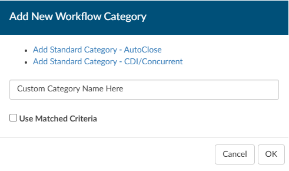

### Add Worklist 

To add a new worklist, click {}+Add{} under the appropriate category on the left hand side of the screen. 

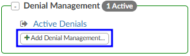

Name the new workgroup.

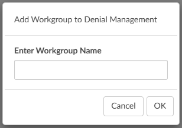

### Add a Criteria Group

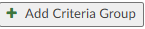

Name the Criteria Group something simple but meaningful to describe the reason accounts will move into the workgroup. This will help with
troubleshooting in the future.

### Set Criteria 

Workflow has two different criteria options to build workflow.

- AND criteria
- OR Criteria

#### AND

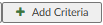

All the criteria must be met for an account to "match" and be sorted into a workgroup.

For example, for an account to "match" with the Ready for Coding workgroup pictured below, the category must be inpatient **and** the admit date/time must exist **and** the discharge date/time must exist **and** the stage cannot equal A (submitted) **and** the workgroupassignedby cannot exist **and** it must not have a pending reason.

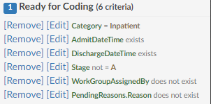

#### OR

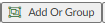

At least one of the criteria must be met for an account to "match" and be sorted into a workgroup.

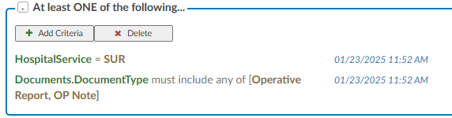

The OR criteria is listed in blue to call attention.

#### Workgroup Level Criteria

Workgroup level criteria works like all other criteria, but when enabled will apply to every group under that workflow. This alleviates the need for the same criteria to be added to all of the criteria groups.

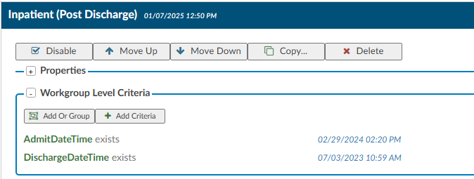

After setting the Workgroup Level criteria, check the box to include the criteria in the appropriate criteria groups.

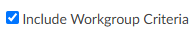

This functionality helps to keep repetitive criteria creation to a minimum.

Add as many values as needed to ensure the data is sufficiently constrained so the appropriate charts make it into each queue. 

#### Workflow Operators

Each criterion has a set of operators. Depending on the property slected, the operators may be different.

| Operator             | Description |
| -------------------- | ----------- |
| Equals               | This is used if you have one value, and it must equal the value. This is case sensitive. |
|Not Equal             | This is used if you have one value, and it must not equal the value. This is case sensitive. |
| >                    | This sign means that the value must be less than the value noted. |
| <                    | This sign means that the value must be greater than the value noted. |
| >=                   | This sign means that the value must be less or equal to than the value noted. |
| <=                   | This sign means that the value must be greater or equal to the value noted. |
| In List              | If you have more than one value, it could be any of the following. |
| Not In List          | If you have more than one value, you do not want it to equal. |
|Starts With           | This operator is a search function that identifies resulsts where a string begins with a specific set of characters such as codes and document types.
| Contains             | If you have a word, phrase or value that can contain it must have what you added exactly. This is common when including payors. |
| Only Contains        | Any one of the codes it is not needed to do all 3. |
| Exists               | This will search to see if anything “exists” in this field, if it’s not blank it will match. No value is needed after the operator. |
| Does not Exist       | This will search to see if anything “does exists” in this field if it’s blank it will match. No value is needed after the operator. |
| More Than            | This operator is only used with date fields, you will need to define “more than” how many days ago. You cannot add a date into the field as this field will need to be dynamic therefore days ago is used. |
| Less Than            | This operator is only used with date fields, you will need to define “less than” how many days ago. You cannot add in a date into the field as this field will need to be dynamic therefore days ago is used. |
| Later Than           | This operator is only used with date fields, you will need to define the exact date you do not wish to exceed. |
| Is On                | This is for an exact date, this is uncommon to use for workflow. |
| Weekday In           | This operator allows the user to select the specific day of the week. |
| Hour In Range        | This operator allows the user to select a range of hours for the admit/discharge date. |
| Hour In              | This operator allows the user to select a specific hour of the day. |
| Last Month           | This operator looks for specified criteria in the previous calendar month. Primarily used in Audit workflow. |
| This Month           | This operator looks for specified criteria in the current calendar month. Primarily used in Audit workflow. |
| Includes Each Of     | If you have more than one value, it must contain all of the following. However, note the chart must have each of the values but can also have other values. |
| Includes Any Of      | If you have more than one value and it could be any of the following. |
| Does not Include     | If you have more than one value, you do not want it to equal you must use “Not In List” |

>[!Note]Operator Values
Unless an operator does not require a value, the value field must be filled in to save the criteria.

#### Properties

Workgroup properties can be edited by clicking {}+Properties{} to expand the dialog.

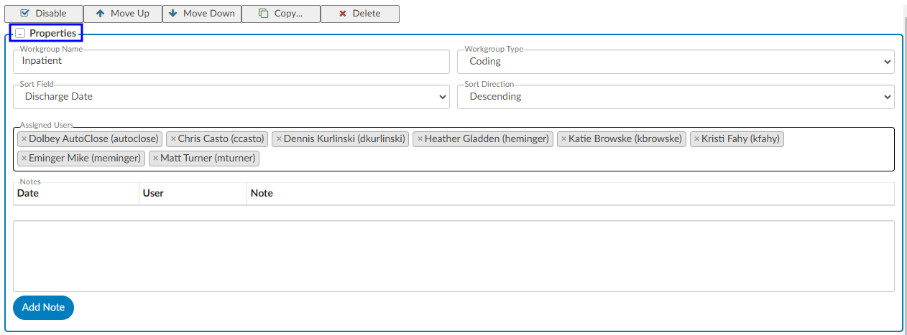

###### Workgroup Type

Workgroup Type is used to identify which team or department owns a specific workgroup. This classification is essential for determining ownership and accountability within the workflow. For example, to verify whether a particular chart is accessible or being held up, management can check which team owns that worklist. This property allows users to quickly identify the appropriate workgroup for reporting and ensure accurate tracking and visibility across departments.

###### Sort Field and Direction 

Sort Field is used to define how patient charts are automatically organized when added to a worklist. This field determines the primary criterion for sorting, ensuring that charts are arranged in a consistent and logical order to streamline the workflow. For example, coding worklists are commonly sorted by Discharge Date to prioritize records based on when the patient was discharged. 

After selecting the appropriate sort field, setting the Sort Direction allows management to specify the order in which the charts will appear:
- Ascending: Sorts the charts starting with the oldest date, ensuring that older records are addressed first.
- Descending: Sorts the charts starting with the most recent date, prioritizing the newest records.

This sorting mechanism helps users efficiently manage their workload by organizing patient charts in a way that aligns with their operational priorities, such as completing older cases first or focusing on more recent discharges.

###### Assigned Users

Users listed here are assigned to the worklist and will see it in the Assigned To: dropdown on the [Accounts](https://dolbeysystems.github.io/fusion-cac-web-docs/general-user-guide/accessing-accounts/#account-list) page. 

Click in the assigned users box and select the desired user(s). Holding down Ctrl allows for selecting multiple users at once. 

Click the **X** next to an assigned user to remove them from the worklist. 

###### Notes

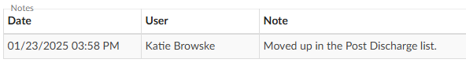

Notes can be added to indicate to anyone reviewing workflow management why changes were made to criteria or sequencing. As notes are added, they will be added to a table in the workgroup properties.

#### Reordering Worklists

When workflow is triggered, placement decisions are made top-down and inside-out
- Examine criteria in the first workgroup's first criteria group
- Potentially assign the workgroup and criteria If the account meets all the criteria
- If no "match", examine the next criteria group in the same workgroup (if applicable)
- If there are no more criteria groups, examine the next workgroup and repeat until a "match" is found

Worklist order matters because of how placement decisions are made. 

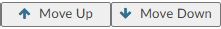

Workgroups can be reordered using the buttons at the top of the worklist or by clicking and dragging the worklist name in the list on the left hand side of the screen.

## Workflow History Edits

The Workflow Management page displays a running history of edits. A timestamp next to the worklist name will show the date and time of the last change made. Hovering over the date/time stamp will provide additional details. Clicking on that timestamp will open a log of changes made to the workgroup and criteria group(s).

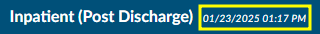

Any change made to criteria will show as a timestamp to the right of the specific criteria that was changed. Hovering over the date/time stamp will provide additional details. Clicking on that timestamp will open a log of changes made to that criteria.

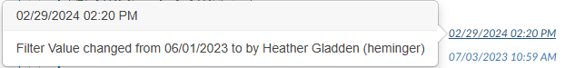

Users and Linked Users will now be seen under the name of the workgroup and will be defaulted
as collapsed. Clicking on the link will toggle the box open.

## Manual Routing
Users with the ability to route charts, can right-click on an account and manually assign it to a user or workgroup. 

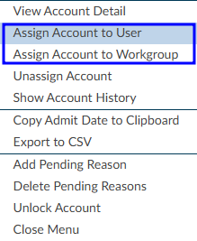

If an account is manually routed to a user it will populate their "You" queue. 

>[!note]Not Recommended
>It is not recommended to manually route a chart unless absolutely necessary. Once a chart has been manually routed it will no longer move through workflow automatically. 

 A patient chart will only leave a "You" worklist when one of the following events occurs:

- The chart is submitted.
- Save and Route To is selected.
- The chart is reconciled or released from CDI.
- The chart is processed under Physician Coding workflow rules.
- The chart matches a Custom Workflow after a save.
- The chart contains a closed audit and is saved after review.

If a chart appears to leave the worklist unexpectedly, review the chart's workflow history, routing

### Understanding When a Patient Chart Leaves a "You" Worklist

The "You" queue is designed to display patient charts that currently require action from a specific user. In most cases, charts will remain on the worklist until the user completes an action that either routes the chart elsewhere or indicates that work on the chart is complete.

There are several system-defined events that will cause a patient chart to automatically leave a user's "You" worklist. Understanding these events can help users determine why a chart is no longer visible in their queue.

#### Chart Submission

When a user submits a patient chart, the system considers the assigned work complete and removes the chart from the user's "You" worklist. Submission is the most common method by which a chart exits the worklist and typically indicates that the chart is ready for the next step in the workflow.

#### Save and Route To

Users may choose to route a chart directly to another user, worklist, or workflow destination by selecting Save and Route To. When this action is performed, ownership of the chart is transferred according to the routing instructions, and the chart is removed from the current user's worklist.

#### CDI Reconcile or Release Actions

When a patient chart is reconciled or released from CDI, the system treats these actions similarly to a chart submission. Because these actions indicate that CDI review activities have been completed, the chart is removed from the user's "You" worklist.

#### Physician Coding Workflow

Charts assigned to users functioning as Physician Coders follow a specialized workflow. As part of this workflow, charts may automatically leave the "You" worklist based on physician coding rules and processing logic. This behavior is expected and differs from standard coding workflows.

#### Custom Workflow Processing

Whenever a user saves a patient chart, the system evaluates any configured Custom Workflow rules before applying default workflow behavior.

If the chart meets the criteria of a custom workflow, the chart is immediately routed according to the custom workflow configuration. Because the chart has been assigned to a new workflow destination, it is removed from the user's current "You" worklist.

For this reason, if a chart appears to leave the worklist after a simple save action, users should verify whether the chart qualifies for a custom workflow rule. In most cases, the chart's removal is the result of successful custom workflow processing rather than an issue with the default workflow configuration.

#### Closed Audit Processing

A chart may also be removed from a "You" worklist if it contains a closed audit. The system assumes that when a user opens a chart with a closed audit and subsequently saves the chart, the audit has been reviewed and no further action is required.

Because the audit-related work is considered complete, the chart is automatically removed from the user's worklist following the save action.
