+++
title = 'Workflow Management'
weight = 80
+++

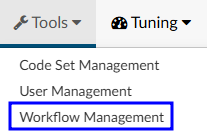

The Workflow Management tool lets Administrators create, design, modify, and manage workflows within Fusion CAC.

At its core, a workflow keeps patient chart activities organized and moving — routing each chart to the right person at the right time so nothing falls through the cracks. By defining clear steps, assigning responsibility, and controlling how information flows between roles and departments, workflows help teams collaborate more efficiently and get charts completed accurately and on time.

## Worklists

Worklists are organized into one of the following categories:

|Category|Description|
|--------|-----------|
|[Audit](https://dolbeysystems.github.io/fusion-cac-web-docs/administrative-user-guide/tools/workflow-management/#audit)|Available for any charts that need an audit. Lets you define specific days when charts are added to the Auditor worklist(s).|
|[Autoclose](https://dolbeysystems.github.io/fusion-cac-web-docs/administrative-user-guide/tools/workflow-management/#autoclose)|	Automatically closes an ancillary patient chart based on a set of rules, without a Coder needing to step in.|
|CDI/Concurrent|**Only** valid if the patient chart doesn't have a discharge date yet and has a status of unbilled.|
|Post Discharge|**Only** valid if the patient chart has a discharge date and a status of unbilled.|
|QA Review|Available for any charts that need QA review and/or reconciliation.|
|Custom|Lets you build custom categories to fit your organization's unique needs.|

>[!info]Additional Information
>Audit and AutoClose have additional configuration options and are covered in their own sections (linked). CDI/Concurrent, Post Discharge, and QA Review are standard categories with no extra setup.

Categories are made up of one or more worklists. Each worklist is then made up of one or more criteria groups. For example:

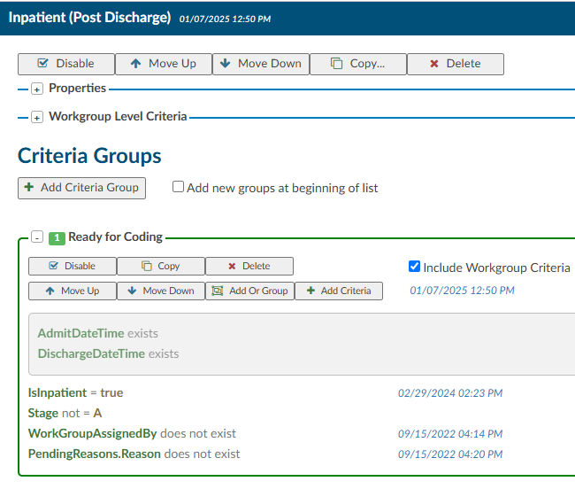

- The Post Discharge category 
  - contains the Inpatient worklist
    - which has the Ready for Coding criteria group
      - which is then made up of multiple pieces of criteria 

An account can be in more than one worklist at a time, depending on the category:

- An account may only be in one default category at a time.
- Custom categories allow an account to be in multiple custom categories at the same time.
- An account can also be in one default category and multiple custom categories at the same time.
- An account cannot be in more than one workgroup within the same category.

A worklist will often contain multiple criteria groups, and each criteria group can include several filters to narrow down the data. This makes sure the right charts land in each worklist.

>[!note]Terminology
>Worklist, Workgroup, and Queue are often used interchangeably when discussing sorting accounts into "buckets".

### Audit

Audit workflow gathers up charts that meet your specified criteria so an Auditor can review them. You can define specific days for when charts get added to the Auditor worklist(s). In Workflow Management, the Audit default workgroup category works just like any other category — the main difference is that Audit workflow runs on a schedule instead of in real time.

Example: You could set workflow to automatically add charts to the worklist on the first and last day of every month.

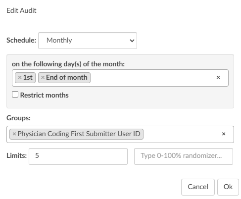

On the designated days each month, 5 charts (you can change this limit) from every Coder (First Submitter) are automatically routed to the Auditor's worklist.

>[!note]
>If a month occurs that does NOT have the date set, (ex. the month of November does not have a 31st day) the month will not run an Audit workflow.

#### Schedule 

Determines when workflow runs for this Audit — Daily, Weekly, or Monthly.

#### Groups

One or more single fields used to group the results. For example, grouping by "Last Submitter" and "Is Inpatient" tells Audit workflow to gather the list of accounts, then group them by unique Last Submitter and Is Inpatient.

#### Limits

The number of accounts to assign from each grouping. This can be a maximum number, a percentage, or both. Using the example above:

- Setting the selection to 5 maximum with no percentage means that for each unique group of "Last Submitter" and "Is Inpatient" accounts, randomly assign up to 5 accounts
- Setting the selection to 50 percent and 10 maximum means that for each unique group of "Last Submitter" and "Is Inpatient" accounts, randomly assign 50% of the accounts, up to 10 maximum
- Setting the selection to 50 percent with no maximum means that for each unique group of "Last Submitter" and "Is Inpatient" accounts, randomly assign 50% of the accounts
  
##### Random Audit

The "Random Percentage" criteria filter is included in the workflow criteria options. Set it to a number between 0 and 100. When the workflow engine reaches this filter, it generates a random number, and if that number falls above or below the number you set (depending on which operator you choose), the criteria matches.

A Random Inclusion Factor set to "less than 20," for example, will theoretically pass about 20% of accounts through the filter. Avoid pairing this with Equals (=), since Equals only matches the single number rolled out of 100 possible outcomes and will almost always fail to match, letting through close to none of your accounts instead of the percentage you intended. Likewise, avoid Greater Than (>), since it passes the inverse percentage of what you'd expect.

Keep in mind this won't be an exact percentage, just a theoretical one. In rare edge cases, asking for "20% of accounts" could get you zero accounts, or even all of them, but most of the time you'll land close to ~20%.

This field is intended for QA Workflow, though the application won't stop an Administrator from using it elsewhere. Valid values range from 1 to 99; anything outside that range won't work.

A helpful way to think about this field: it's less like a percentage and more like a 100-sided die. Each time workflow checks this filter, it "rolls the die." A common setup looks like "Random Inclusion Factor → less than → 10."

### AutoClose

AutoClose lets the application close an ancillary patient chart automatically, based on a set of rules, with no Coder intervention needed. It takes routine outpatient visits and automates the coding process, submitting the chart directly to billing. In the industry, this concept is known as autonomous coding.

Organizations often turn to AutoClose to capture the full value of these ancillary charts without stretching their staff thin. Common outpatient service lines that make great candidates for AutoClose include:

- Screening Mammogram
- Sleep Lab
- Labs
- Chest X-rays
- ED Left Without Being Seen
- Canceled Accounts
- Cardiac rehab
- Dietary or nutritional counseling
- Esophageal motility studies
- Outpatient dialysis
- Pulmonary function tests
- Vaccine visits

Which accounts are eligible for AutoClose depends on your organization, the services you offer, your payor(s), and state requirements. The Dolbey SME Team is happy to answer questions and will work with you to configure AutoClose for your needs.

With AutoClose, charts can be processed in seconds, and total turn-around time can be as little as a few minutes. AutoClose runs 24 hours a day, 365 days a year, and its impact on revenue is one of its biggest benefits. To put that in perspective:

- Many organizations AutoClose 10,000 or more charts per month
- That's about 120,000 outpatient visits AutoClosed per year, without any Coder intervention
- Which works out to roughly the equivalent of 2.5 FTEs
  
#### Completing Charts

AutoClose can be set to complete charts from day one, though many organizations prefer to first learn how the engine functions before turning it on. That's where test mode comes in: it lets you simulate what would have AutoClosed had it been live in production, so you can review the results and decide when you're ready to go live.

Patient charts that pass AutoClose criteria are coded and submitted to billing automatically. Charts that don't pass are routed to a worklist for a Coder to review, along with the reason they were rejected.

As you expand your AutoClose capabilities, Dolbey recommends running regular audits to make sure the system is capturing and coding everything correctly.

## Edit Workflow

### New Category

To add a new category in Workflow Management, click {}+Add New Category{} in the top right corner.

The dialog box has options to add a default/standard category or a new custom category. 

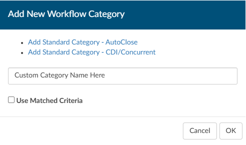

### Add Worklist 

To add a new category in Workflow Management, click {}+Add New Category{} in the top right corner. From there, you can choose to add a default/standard category or create a new custom one.

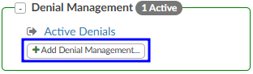

Name the new workgroup.

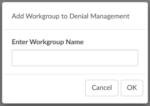

### Add a Criteria Group

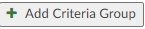

Give the Criteria Group a name that's simple but meaningful, something that describes why accounts land in this workgroup. It'll make troubleshooting much easier down the road.

### Set Criteria 

Workflow has two different criteria options to build workflow.

- AND criteria
- OR Criteria

#### AND

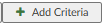

With AND criteria, every condition must be met for an account to "match" and get sorted into a workgroup.

For example, for an account to "match" with the Ready for Coding workgroup pictured below, the category must be inpatient and the admit date/time must exist and the discharge date/time must exist and the stage cannot equal A (submitted) and the workgroupassignedby cannot exist and it must not have a pending reason.

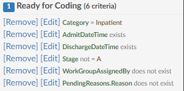

#### OR

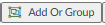

With OR criteria, an account only needs to meet at least one condition to "match" and get sorted into a workgroup.

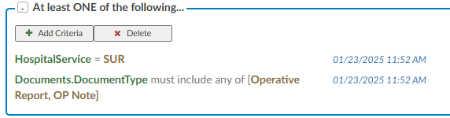

OR criteria appears in blue so it stands out at a glance.

#### Workgroup Level Criteria

Workgroup level criteria works just like any other criteria, but once enabled, it applies to every group under that workflow, so you don't have to add the same criteria to each criteria group individually.

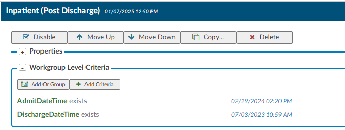

After setting the Workgroup Level criteria, check the box to include the criteria in the appropriate criteria groups.

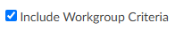

This keeps repetitive criteria-building to a minimum.

Add as many values as you need to make sure the right charts land in each queue.

#### Workflow Operators

Each criterion has its own set of operators, and the available operators can vary depending on the property you select. Operators tell the system how to compare the value you enter against the value on the chart. The right one depends on whether you're checking for an exact match, a range, a list of options, or a date.

##### Matching a Single Value

| Operator             | Description | Example |
| -------------------- | ----------- | ------- |
| Equals               | The field must match your value exactly — nothing more, nothing less. Uppercase/lowercase matters. |Setting Equals → "Inpatient" will only match accounts where the field says exactly "Inpatient" — not "inpatient" or "Inpatient Chart."|
|Not Equal             | This is used if you have one value, and it must not equal the value. Uppercase/lowercase matters. |Not Equal → "Inpatient" matches every account except those marked exactly "Inpatient."|

##### Comparing Numbers or Amounts

| Operator             | Description | Example |
| -------------------- | ----------- | ------- |
| < (less than)        | The field's value must be smaller than the number you enter.|< 5 matches 4, 3, 0 — not 5 itself. |
| > (greater than)     | The field's value must be larger than the number you enter.|> 5 matches 6, 7, 100 — not 5 itself. |
| <= (less than or equal to) | This sign means that the value must be less or equal to than the value noted. |<= 5 matches 5, 4, 3.|
| >= (greater than or equal to) | The field's value must be larger than or the same as the number you enter. |>= 5 matches 5, 6, 7.|

##### Matching Against Several Possible Values

| Operator             | Description | Example |
| -------------------- | ----------- | ------- |
| In List              | The field must exactly match one of the values you list — the whole field, not part of it. |In List → [Return to CDI, Return to Coding] matches an account only if the field's entire value is exactly one of those two phrases.|
| Not In List          | The field must not exactly match any of the values you list. |Not In List → [Return to CDI, Return to Coding] excludes accounts where the field is exactly one of those two phrases.|

##### Searching Within Text

| Operator             | Description | Example |
| -------------------- | ----------- | ------- |
| Starts With           | Matches if the field begins with the characters you enter — useful for codes or document type prefixes.|Starts With → "I10" matches "I10.9," "I10.0," "I10-related note," etc.|
| Contains             | Matches if your word or phrase appears anywhere in the field — even if it's only part of a longer value, not the whole thing. |Contains → "Blue Cross" matches "Blue Cross of Ohio," "Anthem Blue Cross," or a note that simply mentions "Blue Cross" partway through.|
| Only Contains        | Matches only if every value in the field comes from your list — nothing extra is allowed. |If an account has codes A, B, and C, "Only Contains → [A, B, C]" matches. If the account also has code D, it does not match.|

##### Checking Whether a Field Has Any Value

| Operator             | Description | Example |
| -------------------- | ----------- | ------- |
| Exists               | Matches if the field has anything in it — it just can't be blank. No value needs to be entered for this operator. |Exists on "Discharge Date" matches any account that has a discharge date recorded, regardless of what that date is.|
| Does not Exist       | Matches if the field is blank. No value needs to be entered for this operator. |Does Not Exist on "Discharge Date" matches accounts with no discharge date yet — i.e., still admitted.|

##### Working with Dates

| Operator             | Description | Example |
| -------------------- | ----------- | ------- |
| More Than            | Only for date fields. Matches if the date is more than X days ago. You enter a number of days, not a calendar date, since this needs to stay relative to "today." |More Than → 30 (days ago) on Admit Date matches accounts admitted over a month ago.|
| Less Than            | Only for date fields. Matches if the date is less than X days ago. Again, you enter a number of days, not a calendar date. |Less Than → 7 (days ago) on Admit Date matches accounts admitted within the last week.|
| Later Than           | Only for date fields. Matches if the date is later than one specific, fixed calendar date you choose. |Later Than → 01/01/2026 matches any account dated after January 1, 2026.|
| Is On                | Matches an exact calendar date. Rarely used in workflow since most workflows need to stay relative to "today." |Is On → 03/15/2026 matches only accounts dated exactly March 15, 2026.|
| Weekday In           | Matches if the date falls on one of the specific days of the week you select. |Weekday In → [Saturday, Sunday] matches accounts admitted on a weekend.|
| Hour In Range        | Matches if the time (admit or discharge) falls within a range of hours you set. |Hour In Range → 8:00 AM–5:00 PM matches accounts admitted during standard business hours.|
| Hour In              | Matches if the time falls on one specific hour you select. |Hour In → 2:00 PM matches accounts admitted between 2:00–2:59 PM.|
| Last Month           | Matches records from the previous calendar month. Mainly used for Audit workflows. |If today is any day in August, Last Month matches everything dated in July.|
| This Month           | Matches records from the current calendar month. Mainly used for Audit workflows. |If today is any day in August, This Month matches everything dated in August.|

##### Matching Against Multiple Values at Once (Lists Within a Field)

| Operator             | Description | Example |
| -------------------- | ----------- | ------- |
| Includes Each Of     | The field must contain all of the values you list — but it's okay if it has other values too.|Includes Each Of → [A, B] matches an account with codes A, B, and C, because A and B are both present. It would not match an account with only A.|
| Includes Any Of      | The field must contain at least one of the values you list. | Includes Any Of → [A, B] matches an account with just A, just B, or both.|
| Does not Include     |This operator isn't available on its own — if you need 'must not contain any of these values,' use Not In List instead|-|

>[!Note]Operator Values
>Unless an operator does not require a value, the value field must be filled in to save the criteria.

#### Properties

Workgroup properties can be edited by clicking {}+Properties{} to expand the dialog.

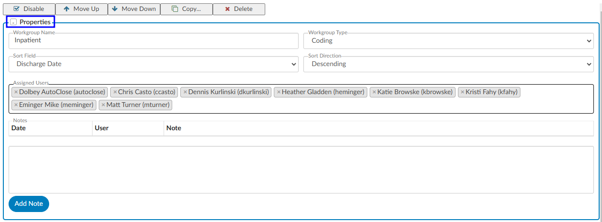

##### Workgroup Type

Workgroup Type is used to identify which team or department owns a specific workgroup. This classification is essential for determining ownership and accountability within the workflow. For example, to verify whether a particular chart is accessible or being held up, management can check which team owns that work list. This property allows users to quickly identify the appropriate workgroup for reporting and ensure accurate tracking and visibility across departments. Additionally, specifying the Workgroup Type sets the ability for accounts assigned to custom work groups to be retained by the user's current role when account is directly assigned to a user.

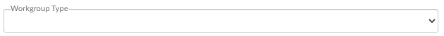

To configure Workgroup Type, examine the mapping for WorkGroupType in Mappings Configuration. The Used By column determines how custom work groups will behave during account assignment.

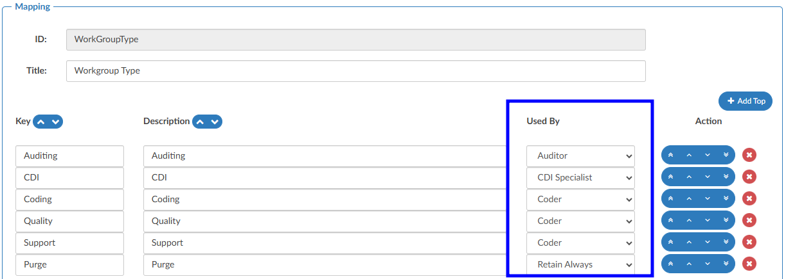

##### Used By

Here's a quick summary of what each option does. See below for a more detailed explanation, including a walkthrough example for **Role Specific**, since it depends on which role makes the assignment.

|Option         |What happens when an account is assigned |
|---------------|-------|
|Blank (default)|Custom workgroup is removed|
|Retain Always  |Custom workgroup is never removed|
|Role Specific  |Custom workgroup is removed only if assigned by the specified role|

- **Blank (default):** This is the standard behavior for most workgroup types and needs no extra configuration — use it unless you specifically need one of the two behaviors below.

- **Retain Always:** Use this when a custom workgroup should always persist regardless of who assigns the account — for example, a flag that should stay on the account until someone manually clears it.

- **Role Specific:** Use this when a custom workgroup exists to support one particular role's work, and should disappear once that role has acted on it.

  *example:* a workgroup type with **Used By** set to Physician Coder (which also includes Single Path) designates a custom workgroup to be used by coders only. 
    - If a CDI Specialist assigns the account to a user, the custom workgroup remains on the account
    - If a Coder assigns the account to a user, the custom workgroup also remains
    - If a Physician Coder (or Single Path user) assigns the account to a user, the custom workgroup is removed because it has fulfilled its intended purpose for that role.

  In other words, a role-specific Workgroup Type is only removed when the account is assigned by the role specified in the Used By field. Assignments performed by any other role will leave the custom workgroup intact.

Troubleshooting Best Practice - 

- Identify the Workgroup Type: Begin by opening the workflow in question and identifying the Workgroup Type assigned to it. The Workgroup Type controls how the system manages the custom workgroup when an account is assigned to a user.
- Review the Mapping Table: After identifying the Workgroup Type, navigate to the WorkGroupType Mapping Table and locate the matching entry. Review the Used By column, as this setting determines whether the custom workgroup is retained or removed during account assignment.

##### Sort Field and Direction 

Sort Field defines how patient charts are automatically organized when added to a worklist. This determines the primary criterion for sorting, keeping charts arranged in a consistent, logical order to streamline the workflow. For example, coding worklists are commonly sorted by Discharge Date to prioritize records based on when the patient was discharged.

After selecting the appropriate sort field, setting the Sort Direction lets you specify the order in which charts appear:

- Ascending: Sorts the charts starting with the oldest date, ensuring that older records are addressed first.
- Descending: Sorts the charts starting with the most recent date, prioritizing the newest records.

This helps users manage their workload more efficiently, organizing patient charts to match their operational priorities, whether that's clearing out older cases first or focusing on the most recent discharges.

##### Assigned Users

Users listed here are assigned to the worklist and will see it in the Assigned To: dropdown on the Accounts page.

Click in the assigned users box and select the desired user(s). Holding down Ctrl allows for selecting multiple users at once.

Click the **X** next to an assigned user to remove them from the worklist.

##### Notes

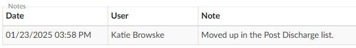

Notes can be added to let anyone reviewing workflow management know why changes were made to criteria or sequencing. As notes are added, they'll appear in a table in the workgroup properties.

#### Reordering Worklists

When workflow is triggered, placement decisions are made top-down and inside-out:

- Examine criteria in the first workgroup's first criteria group
- Assign the workgroup and criteria if the account meets all the criteria
- If there's no "match," examine the next criteria group in the same workgroup (if applicable)
- If there are no more criteria groups, examine the next workgroup and repeat until a "match" is found

Worklist order matters because of how these placement decisions are made.

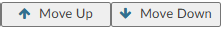

Workgroups can be reordered using the buttons at the top of the worklist, or by clicking and dragging the worklist name in the list on the left-hand side of the screen.

## Workflow History Edits

The Workflow Management page displays a running history of edits. A timestamp next to the worklist name shows the date and time of the last change made. Hovering over the timestamp shows additional details, and clicking it opens a log of changes made to the workgroup and criteria group(s).

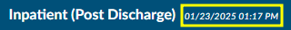

Any change made to criteria shows up as a timestamp to the right of the specific criteria that was changed. Hovering over the timestamp shows additional details, and clicking it opens a log of changes made to that criteria.

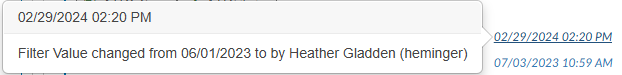

Users and Linked Users now appear under the name of the workgroup, collapsed by default. Click the link to toggle the box open.

## Manual Routing

Users with the ability to route charts can right-click on an account and manually assign it to a user or workgroup.

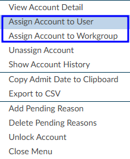

If an account is manually routed to a user, it will populate their "You" queue.

>[!note]Not Recommended
>It is not recommended to manually route a chart unless absolutely necessary. Once a chart has been manually routed it will no longer move through workflow automatically. 

A patient chart will only leave a "You" worklist when one of the following events occurs:

- The chart is submitted.
- Save and Route To is selected.
- The chart is reconciled or released from CDI.
- The chart is processed under Physician Coding workflow rules.
- The chart matches a Custom Workflow after a save.
- The chart contains a closed audit and is saved after review

If a chart appears to leave the worklist unexpectedly, review the chart's workflow history, routing history, and audit trail to determine the cause.

### Understanding When a Patient Chart Leaves a "You" Worklist

The "You" queue is designed to show patient charts that currently need action from a specific user. In most cases, charts remain on the worklist until the user completes an action that either routes the chart elsewhere or marks the work as complete.

There are several system-defined events that will automatically remove a patient chart from a user's "You" worklist. Understanding these events can help you figure out why a chart is no longer showing up in your queue.

#### Chart Submission

When a user submits a patient chart, the system considers the assigned work complete and removes the chart from the user's "You" worklist. Submission is the most common way a chart exits the worklist, and typically means the chart is ready for the next step in the workflow.

#### Save and Route To

Users may choose to route a chart directly to another user, worklist, or workflow destination by selecting Save and Route To. When this action is performed, ownership of the chart transfers according to the routing instructions, and the chart is removed from the current user's worklist.

#### CDI Reconcile or Release Actions

When a patient chart is reconciled or released from CDI, the system treats these actions similarly to a chart submission. Since these actions mean CDI review activities are complete, the chart is removed from the user's "You" worklist.

#### Physician Coding Workflow

Charts assigned to users functioning as Physician Coders follow a specialized workflow. As part of this workflow, charts may automatically leave the "You" worklist based on physician coding rules and processing logic. This is expected behavior, and differs from standard coding workflows.

#### Custom Workflow Processing

Whenever a user saves a patient chart, the system checks any configured Custom Workflow rules before applying default workflow behavior.

If the chart meets the criteria of a custom workflow, it's immediately routed according to that configuration. Since the chart has been assigned to a new workflow destination, it's removed from the user's current "You" worklist.

So if a chart appears to leave the worklist after a simple save, check whether it qualifies for a custom workflow rule first. In most cases, the chart's removal is the result of successful custom workflow processing rather than an issue with the default workflow configuration.

#### Closed Audit Processing

A chart may also be removed from a "You" worklist if it contains a closed audit. The system assumes that once a user opens a chart with a closed audit and saves it, the audit has been reviewed and no further action is needed.

Because that work is considered complete, the chart is automatically removed from the user's worklist following the save action.
