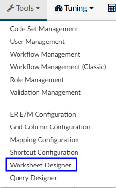
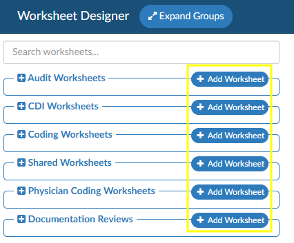
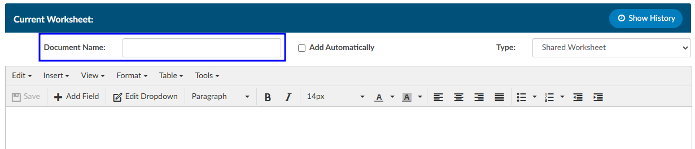
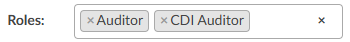
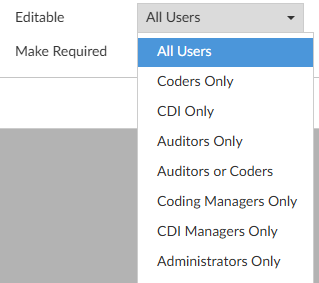
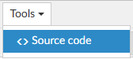

+++
title = 'Worksheet Designer'
weight = 150
+++

Worksheet designer is used to create custom worksheets for users, which are used to collect data and/or take notes.

Access to worksheets can be restricted by user role:
- Audit
- CDI
- Coding
- Physician Coder

Alternatively, worksheets can be shared. A **Shared Worksheet** is a worksheet that can be utilized by Auditors, CDI Specialists, and Coders unlike the "CDI Worksheet" and "Coder Worksheet" which are exclusive to CDI and Coding, respectively.

## Creating a New Worksheet

To add a workheet, simply click on the {}+Add{} button in the desired section. 

A blank template will appear on screen. The first step is to enter a unique a document name. Each worksheet must have a unique name for reporting purposes. **A document name must exist *before* the template can be saved.** 

>[!note] Renaming a worksheet
>Once a worksheet name has been saved, it cannot be edited. To rename an exisitng worksheet, please see the Source Code [section below](https://dolbeysystems.github.io/fusion-cac-web-docs/administrative-user-guide/tools/worksheet-designer/#renamingmoving-a-worksheet) or contact the SME Team (smeteam@dolbey.com).

To start with a document that has already been created, copy the text and paste it into the form
designer. Changes to the formatting may be needed once pasted depending on the original document format.

Text copied or typed directly into the worksheet will be read-only for the end user(s) working with the form. This text is often used as labels and to direct users on completing the template. 

### Configure Roles

The Roles field is available on CDI, Coding, and Shared worksheets. When one or more roles are assigned to a worksheet, only users who have at least one of those roles assigned to their profile will be able to add that worksheet to an account. Users without a matching role will not see the option to add the worksheet, though they will still be able to view worksheets that have already been added. This role restriction is based on the full list of roles assigned to a user's profile, not just the role they are currently signed in under. 

The Roles field does not apply to Documentation Review or Physician Query templates and will not appear for those template types.

### Adding Fields

Fusion CAC offers several types of fields that can be added to worksheet templates. These fields allow end users to enter information into the worksheet once it has been added to an account. 

Add a new field by clicking {}+Add Field{} in the template tool menu.

#### Field Type

{}

#### Field Name

Each field should have a unique name for reporting purposes. 

Field names can repeat across worksheets, but **each field on a worksheet must be unique.** If a field name is repeated on a worksheet, whatever is entered into one field will be automatically duplicated into the other fields with the same name on that worksheet. 

#### Editable

Individual fields can be locked down per user role. This way Auditors, CDI Specialists, and Coders can add and view a shared worksheet to a chart, but only users with the specified role can edit certain fields. All users will be able to see the information in that field, but only the specified user role can edit the field. 

{}

## Show History

Worksheet Designer will create a history for changes made to templates in Worksheet Designer. Once a change is
made on a template and saved, {}Show History{} will appear in the top right of the worksheet. Clicking
on it will bring up a notes box, just like in Workflow Management.

## Source Code

The template source code can be found under the Tools menu within the template tool bar. The source code is the programming language that tells the application how to display the worksheet. It may be overwhelming to look through, but can be helpful in making quick edits to worksheets. 

{}

### Renaming/Moving a Worksheet

Once a worksheet has been named and saved, the Document Name cannot be edited. This is intentional for accurate reporting. If a worksheet needs to have a new name, the simplest way to change the name is to copy the source code into a new template and give that template the correct name. Copying the source code will bring over the whole body of the worksheet as is, so the only thing that needs to change is the document name. 

1. In worksheet designer, open the template to be copied/renamed
2. Open the template's source code
3. Select all the text in the source code box
   - This can be done by clicking and dragging to highlight or with the keyboard shortcut Ctrl + A
4. Copy the source code
   - This can be done by right-clicking in the highlighted text and choosing copy or with the keyboard shortcut Ctrl + C
5. Click Ok to close the source code window
6. Add a new worksheet in the desired section
7. Open the template's source code
8. Paste the copied source code into the box
   - This can be done by right-clicking and choosing paste or with the keyboard shortcut Ctrl + V
9. Click Ok
10. Enter a new document name and Save

Click the red {}X{} button to remove the original worksheet so it can no longer be used. The deleted worksheet will still show up on accounts it was added to prior to being deleted, but users will not be able to add it to new accounts. 

This method also allows for an existing worksheet to easily be re-categorized by role. 

If you have any questions or would like to walk through editing source code with someone, please reach out to the Dolbey SME team (smeteam@dolbey.com).
