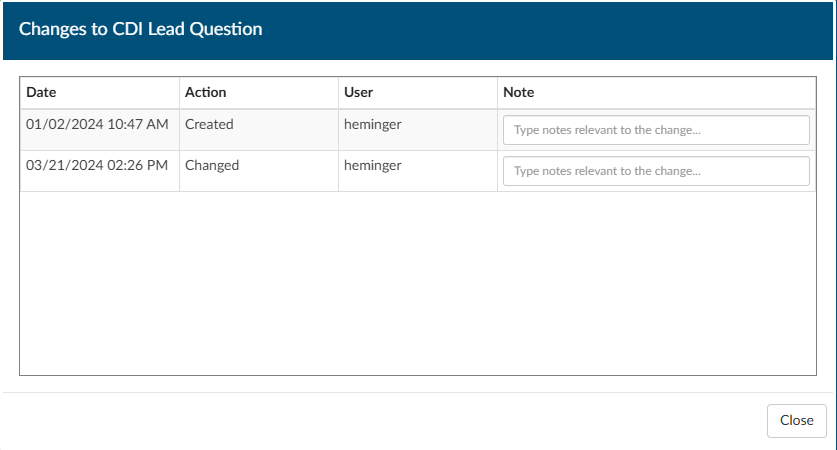

+++
title = 'Worksheet Designer'
weight = 150
+++

Worksheet designer is used to create custom worksheets for users, which are used to collect data and/or take notes.

Access to worksheets can be restricted by user role:
- Audit
- CDI
- Coding
- Physician Coder

Alternatively, worksheets can be shared. A **Shared Worksheet** is a worksheet that can be utilized by Auditors, CDI Specialists, and Coders unlike the "CDI Worksheet" and "Coder Worksheet" which are exclusive to CDI and Coding, respectively.

## Creating a New Worksheet

To add a workheet, simply click on the {}+Add{} button in the desired section. 

A blank template will appear on screen. The first step is to enter a unique a document name. Each worksheet must have a unique name for reporting purposes. **A document name must exist *before* the template can be saved.** 

>[!note] Renaming a worksheet
>Once a worksheet name has been saved, it cannot be edited. To rename an exisitng worksheet, please see the Source Code [section below](https://dolbeysystems.github.io/fusion-cac-web-docs/administrative-user-guide/tools/worksheet-designer/#renamingmoving-a-worksheet) or contact the SME Team (smeteam@dolbey.com).

To start with a document that has already been created, copy the text and paste it into the form
designer. Changes to the formatting may be needed once pasted depending on the original document format.

Text copied or typed directly into the worksheet will be read-only for the end user(s) working with the form. This text is often used as labels and to direct users on completing the template. 

### Adding Fields

Fusion CAC offers several types of fields that can be added to worksheet templates. These fields allows end users to enter information into the worksheet once it has been added to an account. 

Add a new field by clicking {}+Add Field{} in the template tool menu.

#### Field Type

###### Single Input

A single input field allows the end user to free type text. This field is best used for entering a concise amount of information, such as a name or short series of numbers. The box will grow horizontally as the user types to fit the data entered.

###### Multiple-Line Text

A multiple-line text field allows the end user to free type text. This field is often used for entering a large amount of information, such as taking notes or providing detailed comments. The box will grow vertically as the user types to fit the data entered. 

###### Checkbox

A checkbox allows the end user to indicate certain items are applicable. This field has been used to show that the worksheet is complete or as a way for users to select certain action items. 

###### Date/Datetime

 

These fields allow the end user to indicate the date and time of a response, test, or other item being tracked. 

###### Dropdown

Dropdown menus allow end users to select from a pre-determined list of options. 

After naming and determining who can edit the field, a dialog box will open to set the options in the dropdown menu. 

Dropdown items can be edited by pulling up the template in Worksheet Designer and clicking {}Edit Dropdown{} in the template tool bar. 

###### Account Field

Account fields will automatically populate information from the account, if it has been sent to Fusion CAC. Auto-populated account information will be displayed in a bolder font to differentiate it from text manually entered by an end user. 

#### Field Name

Each field should have a unique name for reporting purposes. 

Field names can repeat across worksheets, but **each field on a worksheet must be unique.** If a field name is repeated on a worksheet, whatever is entered into one field will be automatically duplicated into the other fields with the same name on that worksheet. 

#### Editable

)

Individual fields can be locked down per user role. This way Auditors, CDI Specialists, and Coders can add and view a shared worksheet to a chart, but only users with the specified role can edit certain fields. All users will be able to see the information in that field, but only the specified user role can edit the field. 

#### Make Required

Fields can be made required by checking the box. Leaving the box unchecked means the field is optional and the worksheet can be completed even if that field is left blank. 

When a worksheet is added to a chart, required fields will have a light red background to indicate action must be taken. Addiontally, the user will be presented with a red toast message if they try to save the chart without completing all required fields. The toast message will include the fields that need to be completed. 

Clicking OK, will add the selected field to the template with the specified settings. A box will then display in Worksheet Designer as a
placeholder for the selected field with the field name. The fields are not interactive from Worksheet Designer. Once a worksheet has been added to a chart, the field name will be replaced with instructions for the end user. 

## Show History

Worksheet Designer will create a history for changes made to templates in Worksheet Designer. Once a change is
made on a template and saved, {}Show History{} will appear in the top right of the worksheet. Clicking
on it will bring up a notes box, just like in Workflow Management.

## Source Code

The template source code can be found under the Tools menu within the template tool bar. The source code is the programming language that tells the application how to display the worksheet. It may be overwhelming to look through, but can be helpful in making quick edits to worksheets. 

### Changing Field Width

By default, fields will take up the full width of the template. The width can be reduced in the source code to best fit formatting needs. 

In the example below, the width of the dropdown menu has been modified so that it can be on the same line as a checkbox and a multi-line text box. 

This was done by opening the source code, finding the name of the field, and changing the width percentage. 

### Renaming/Moving a Worksheet

Once a worksheet has been named and saved, the Document Name cannot be edited. This is intentional for accurate reporting. If a worksheet needs to have a new name, the simplest way to change the name is to copy the source code into a new template and give that template the correct name. Copying the source code will bring over the whole body of the worksheet as is, so the only thing that needs to change is the document name. 

1. In worksheet designer, open the template to be copied/renamed
2. Open the template's source code
3. Select all the text in the source code box
   - This can be done by clicking and dragging to highlight or with the keyboard shortcut Ctrl + A
4. Copy the source code
   - This can be done by right-clicking in the highlighted text and choosing copy or with the keyboard shortcut Ctrl + C
5. Click Ok to close the source code window
6. Add a new worksheet in the desired section
7. Open the template's source code
8. Paste the copied source code into the box
   - This can be done by right-clicking and choosing paste or with the keyboard shortcut Ctrl + V
9. Click Ok
10. Enter a new document name and Save

Click the red {}X{} button to remove the original worksheet so it can no longer be used. The deleted worksheet will still show up on accounts it was added to prior to being deleted, but users will not be able to add it to new accounts. 

This method also allows for an existing worksheet to easily be re-catagorized by role. 

If you have any questions or would like to walk through editing source code with someone, please reach out to the Dolbey SME team (smeteam@dolbey.com).
