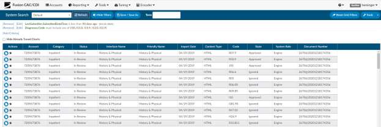
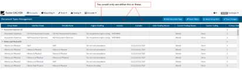
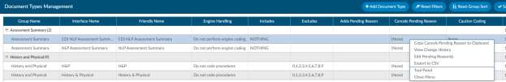
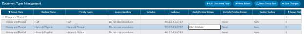
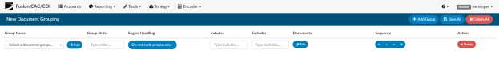
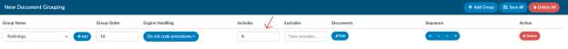
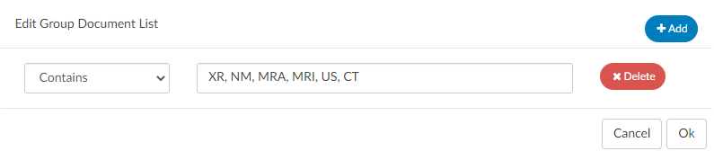
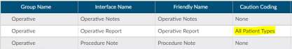
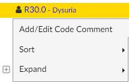

+++
title = 'Tuning'
weight = 33
+++

## System Search
System Search works similarly to Account Search. By creating filters, you can search for patient charts
using different criteria. This System Search feature will also be used by the Tuning Team to identify
targeted codes that need reviewed and possibly refined.

An example of a System Search would be all inpatient charts with a diagnosis of hypertension.

```python
Is inpatient = True
Diagnosis Code = In List = I10 
  # (you may want to include other hypertension codes such as I13.0, I13.9, I12.0, I12.9, etc.)
```

When you select “refresh”, a list of all accounts that meet the criteria will be displayed. If this is a search
that you will want to use more than once, you can Save the search, making it available in the drop-down
box



The results that yield may show you other codes, as the filter you place will bring up any chart with the
codes suggested, however, the grid displays all codes on the account as well as the code in question.

To filter to only those codes within in the grid column, click on the 3 dashes in the column header to
further filter the list.

## Document Type Management

This is used for many reasons, further explained here:

### Filing Documents

Document Type Management can be used to file documents.

- Open Document Type Management
- Sort on documents by clicking on the group name to display the documents currently not in a
folder. Choose the documents that need to be filed.
- Change the friendly name by double-clicking on the name and replacing it with another name. It
is important to remember to use a naming convention that new users will understand


### Engine Handling
Engine Handling is set up after the documents have a friendly name. This set-up basically instructs the
code suggesting engine what to do when it [engine] encounters the document. Does the engine suggest
codes on the document or ignore it? What type of code does the engine suggest for that document?

Depending on how your site is set up, there can be a drop-down menu to select the type of handling the
document receives. On the other hand, there can be two different fields - one called inclusion and one
called exclusion - that allows us to include or exclude certain code sets starting with a prefix.
For example, on a document called Newborn History and Physical, the engine should exclude O codes so that if the
documentation has mother documentation, the engine doesn’t get confused and try to suggest O codes
on a newborn chart.



For further assistance setting up Engine Handling, contact the Tuning Team at results@dolbey.com
Once engine handling is set up, it’s now time to place the document into a folder by double-clicking the
empty space in the Group Name column and type in the name of the folder where the document should
be filed. If you’re not familiar with the folder structure that is already set up, go to the top of the group
name, hover over the column, and click on the three dashes to see all the group names that are
available.

### Cancels Pending Reason

“Cancels Pending Reason” is a field In Document Types Management, which can be used to cancel an
existing pending reason. By selecting this, the existing pending reason will remove the pending reason
and re-trigger workflow. If you don’t want to delete this because the original pending reason is used for
DNFC reporting and/or a user needs to know the original reason for pending, you don’t need to delete it.
Instead, there is another option to Add a Pending reason.



### Add a Pending Reason

In Document Types Management, a field "Adds Pending Reason" now can contain the name of a
pending reason to add when the document type is added to an account with matching pending reasons
from the "Cancels Pending Reason" field.

Two important facts about the "Adds Pending Reason" field:

1. The presence of an "Adds Pending Reason" value overrides the functionality that cancels
pending reasons from the "Cancels Pending Reason" field. In other words, when a pending
reason exists on the account that matches the "Cancels Pending Reason" field, the pending
reason is not deleted when there is an "Adds Pending Reason" value present. The functionality is
designed to be one or the other – not both – but the account must have one of the "Cancels
Pending Reasons" to add the pending reason.
2. The "Adds Pending Reason" is intentionally free-form text. It can contain a value that is not
listed in the Pending Reasons mapping so that users cannot select it. Whatever value is recorded
in this field will be the pending reason name that the Script Engine will automatically add to the
account.



> [!note] Enabling "Adds Pending Reason"
If you wish to use this functionality, you must perform a one-time step to add the **Adds Pending
Reason** column to the Document Types Management grid. This is done by clicking on the three dashes
in the column header column, clicking on the column list tab, and checking **Adds Pending Reason**.
In the grid, you double click in the field to edit the **Adds Pending Reason** field, but you must press
Enter to "commit" that value before saving (just like all other text fields in this grid). The "Mass Edit"
dialog in Document Types Management also supports the entry of the **Adds Pending Reason** field

## New Document Grouping

New Document Grouping allows you to automatically put documents into folders. For example, if the
document name contains the word “consults” or “consultation”, you may want to file it within the
Consults folder and set the engine handling set to Do not Code Procedures.

By default, users with the Administrator role or the Tuning role have access to the "New Document
Grouping" page in the Tuning menu. In this page, users create a list of groups that should be created for
new document types:

- Group Name equals the name of an existing document group from Document Types
Management. Note that when one is selected, its Group Order automatically populates.
- Add equals click to add a new document group that is not in Document Types Management.
Users enter the document group name and its order number.
- Group Order = the sequence of the document grouping. Note this is copied from Document
Types Management but it can be edited, which would only affect new document types.
- Includes, Excludes, and NLP Handling = same functionality as in Document Types Management
- Documents = click to add string matching for new document types from the interface. Note that
there are four supported operators
- Sequencing buttons = new document types are processed through the groups in the order that
is displayed

### How to Create a New Automated Grouping

1. Click on + Add Group
2. Select the group name you are creating the automation for or click on the Add Button to
create a new group that doesn’t already exist.


3. Select how you want the engine to handle these types of documents - you can either
have engine handling dropdown or use includes or excludes.

#### Engine Handling Drop Down

This drop down allows you to block certain code sets. But,if you need more targeted handling to
include or exclude certain codes, then consider using the includes or excludes method shown
below.


#### Includes and Excludes

Using the includes or excludes allows you to override the settings and choose to either includeor
exclude certain code prefixes. The below figure shows that this group will only include codes
that begin with the prefix of A. To note you can not use both includes and excludes this is an
either or.



4.  Once you have set the folder and the engine handling, then select the documents you
want to include in this group. Click on the edit button then select +Add. Then, choose
your operator. HINT: Contains will likely be the best choice. For example, if you want to
put all radiology documents into to a folder, you may consider that if it contains XR, NM,
MRA, MRI, US, CT, then those should go into the radiology folder. Use a comma to
separate multiple items. Click OK once complete.



Once you have completed the new grouping, select Save All in the top right corner.


## Caution Code

A caution code is a code that is suggested by the system but, cannot be assigned by a coder due to the
document type. If a document is configured in Document Types management to be a caution code
document it means the coder should not code from that but, be aware that the verbiage exists as it may
result in a possible query. For example, if a nurse indicates the patient was being treated for respiratory
failure but, the provider never mentioned it the caution code will help to ensure you aren’t missing
anything.

In Document Types Management, change the "Caution Coding" field of the Document Type to "All
Patient Types". Save your change, then load the account and that document. A "caution coding"
document is a document from which the user cannot assign codes, so the code suggestions within the
document have a "caution" background instead of the usual lavender background. The Unassigned Code
tree now displays the same caution background for those codes, and the right-click menu on those
codes prevent assigning or changing the caution code.



In the Unassigned Codes pane, any code attached to that document will show in a yellow background,
and will not have the option to assign on the right click menu.


