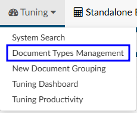
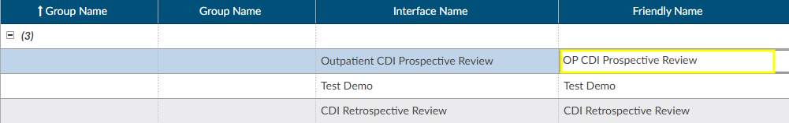
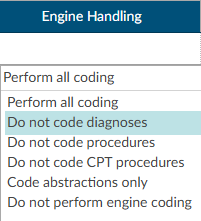
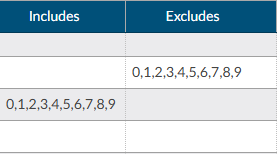
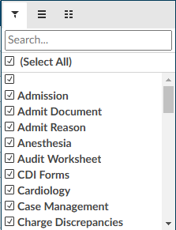
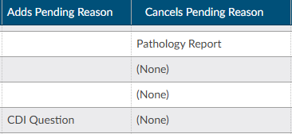
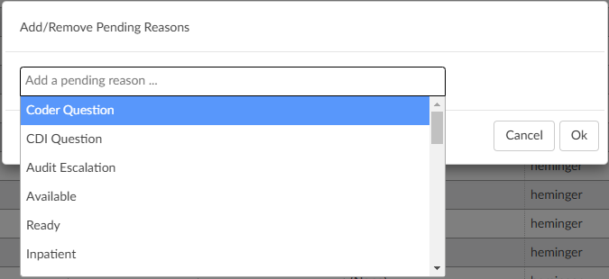
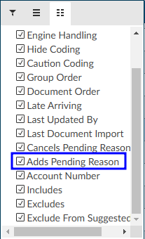
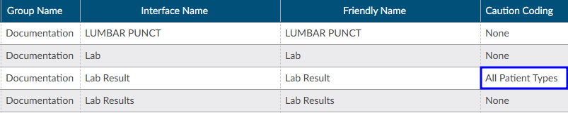
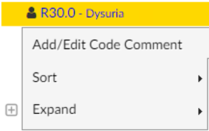

+++
title = 'Document Types Management'
weight = 31
+++

### Filing Documents

To file documents:

- Open Document Type Management
- Sort on documents by clicking on the group name to display the documents currently not in a folder. Choose the documents that need to be filed
- Change the friendly name by double-clicking on the name and replacing it with another name **using a naming convention that new users will understand**

### Engine Handling

Engine Handling is set up *after* the documents have a friendly name. This set-up instructs the code suggestion engine what to do when it encounters each document. 

Depending on how the organization is configured, there may be a drop-down menu to select the type of handling the document receives. 

Alternatively, there are two different columns that allow for inclusion or exclusion of certain code sets starting with a prefix. 

For example, on a Newborn History and Physical, the engine should exclude O codes to prevent confusion in if the account conatins documentation for the mother. This exclusion will prevent O codes from being suggested on the newborn's chart.

Once engine handling is set up, documents can be sorted into a folders. Sorting is done by double-clicking the
empty space in the Group Name column and entering the name of the desired folder. To view the folder structure, go to the top of the group name, hover over the column, and click on the hamburger button to see all the available group names.

### Adds/Cancels Pending Reason

This field in Document Types Management can be used to edit any existing pending reason. 

A selection in the Cancels column will remove the existing pending reason(s) and re-trigger workflow. If the original pending reason is used for DNFC reporting and/or a user needs to know the original reason for pending, the pending reason does not need to be deleted. Instead, there is an option to Add a Pending reason.

Two important facts about the "Adds Pending Reason" field:

1. The presence of an "Adds Pending Reason" value overrides the functionality that cancels pending reasons from the "Cancels Pending Reason" field. In other words, when a pending reason exists on the account that matches the "Cancels Pending Reason" field, the pending reason is *not deleted* when there is an "Adds Pending Reason" value present. The functionality is designed to be one or the other – not both – but the account must have one of the "Cancels Pending Reasons" to add the pending reason.
2. The "Adds Pending Reason" is intentionally free-form text. It can contain a value that is not listed in the Pending Reasons mapping so that users cannot select it. Whatever value is recorded in this field will be the pending reason name that the Script Engine will automatically add to the account.

> [!note] Enabling "Adds Pending Reason"
To use this functionality, a one-time step must be performed to add the **Adds Pending Reason** column to the Document Types Management grid. This is done by clicking on the hamburger icon in the column header, clicking on the column list tab, and checking **Adds Pending Reason**.

In the grid, double click in the field to edit the **Adds Pending Reason**. The user must press Enter to save that value (just like all other text fields in this grid). The "Mass Edit" dialog in Document Types Management also supports the entry of the **Adds Pending Reason** field.

### Caution Coding

Documents can configured in Document Types management to be caution code documents. Coders should not code from these documents, but still be aware that the verbiage exists as it may result in a possible query. For example, if a nurse indicates the patient was being treated for respiratory
failure but the provider never mentioned it, the caution code will help to ensure users aren't missing anything.

In Document Types Management, change the "Caution Coding" field of the Document Type to "All Patient Types" by double clicking in the Caution Code column. Save the change, then load the account and that document. The code suggestions within the document will have a golden "caution" background instead of the usual lavender background to indicate they cannot be assigned. The Unassigned Code tree displays the same caution background for those codes, and the right-click menu on those
codes prevent assigning or changing the caution code.

In the Unassigned codes tree, any code attached to a caution document will show in a yellow background and will not have the option to assign on the right click menu.

