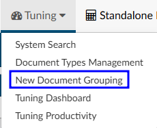
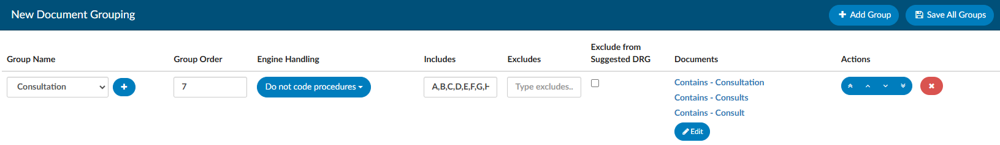
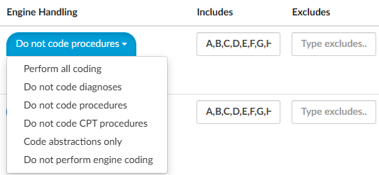

+++
title = 'New Document Grouping'
weight = 32
+++

By default, users with the Administrator role or the Tuning role have access to the "New Document Grouping" page in the Tuning menu. This page allows users to create a list of groups that should be created for new document types. For example, if the document name contains the word “consults” or “consultation”, the organization may want to file it within the Consults folder and set the engine handling to Do not Code Procedures.

### Creating a New Automated Grouping

|Field Name|Description|
|----------|-----------|
|Group Name|Name of existing document group from Document Types Management. When one is selected, the Group Order automatically populates.|
|+Add Group|Adds a new document group that is not in Document Types Management. Users will be prompted to enter a new document group name and order number.|
|Group Order|Sequence of the document grouping. The order is copied from Document Types Management but can be edited. Edits will only affect new document types.|
|Includes, Excludes, and NLP Handling|As in Document Types Management, these fields indicate limitations placed on the group(s).|
|Documents|List of documents included in the group.|
|Sequencing buttons|New document types are processed through the groups in the order that is displayed.|

##### To create a new group: 

1. Click {}+Add Group{}
2. Select the appropriate group name from the drop down or click **+** to create a custom group name
3. Select how the engine should handle these types of documents using the engine handling dropdown or includes/excludes
   

The drop down allows users to block certain code sets. If more targeted handling is needed to
include or exclude certain codes, consider using the includes or excludes method.

Using includes or excludes allows users to override the settings and choose to either include or exclude certain code prefixes. The image above indicates that the group will uses codes that start with A,B,C,D,E,F,G, or H. 

>[!Warning] Includes and excludes cannot be used at the same time. 

Once the folder and engine handling have been set, select the documents to be included in this group. Click on {}Edit{}, then {}+Add{}. When choosing an operator, "Contains" will likely be the best choice. For example, if the user wants to
put all radiology documents into a folder, consider that if it contains XR, NM, MRA, MRI, US, CT, then those should go into the radiology folder. Use a comma to separate multiple items. Click OK once complete.

Once the new grouping is complete, select {}Save All{} in the top right corner.
