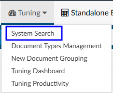
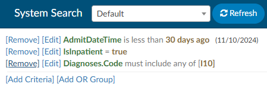

+++
title = 'System Search'
weight = 30
+++

## System Search
System Search works similarly to [Account Search](https://dolbeysystems.github.io/fusion-cac-web-docs/administrative-user-guide/reporting/account-search/). 

Creating filters allows the user to search for patient charts using different criteria. System Search is also used by the Tuning Team to identify targeted codes that need reviewed and possibly refined.

An example of a System Search would be all inpatient charts with a diagnosis of hypertension.

> [!Note] Users may want to include other hypertension codes such as I13.0, I13.9, I12.0, I12.9, etc.

Clicking {}Refresh{} will display a list of all accounts that meet the criteria. If this is a search that will be used more than once, users can save the search, making it available in the drop-down box.

The results that yield may show other codes, as the filter placed will bring up *any* chart with the
codes suggested. The grid displays all codes on the account as well as the code in question. To filter to only those codes within in the grid column, click on the hamburger button in the column header to further filter the list.

