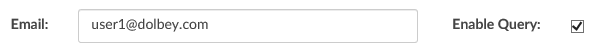
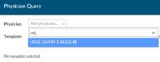
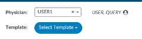
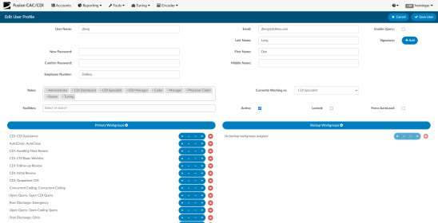
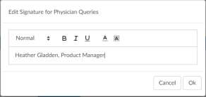
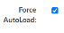
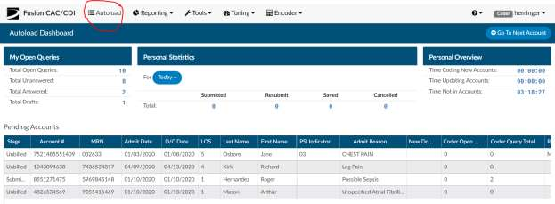
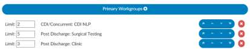
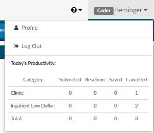

+++
title = 'User Management'
weight = 70
+++

This tab is where a user can add, delete or change any permissions and set work lists. The grid view will
show you all users that have access to the system. The page has columns listed above the grid which are
explained below.

## User Management Columns

###### Actions 

| Action                        | Description |
| ----------------------------- | ----------- |
|    | Copy User allows you to copy a user’s profile when creating a new user. |
|    | Edit User allows you to edit the user’s profile. |
|  | Delete allows you to delete incorrect user profiles. **This icon will appear ONLY for users that have not signed in.** Once a user logs in, the delete icon will no longer show in their Actions column. |

###### Locked

This field provides if the users login is locked, a user’s account can be locked by incorrectly typing in
their password or user id more than 3 times.

###### User Id

This field provides the user's user id to login to the system

###### First Name

This field provides the user's first name

###### Last Name

This field provides the user’s last name.

###### Facilities

This field provides the users, facilities they are assigned to. The user will only be able to access
charts that come from facilities they are assigned to.

###### Roles

This field provides the user’s role which is also tied to their permissions:

| Role                  | Description |
| --------------------- | ----------- |
| **Viewers**           | can view the patient chart. They can add notes within the coding application but, will not be able to make changes to codes or DRG’s. Viewers do not have access to the administration application. |
| **Coders**            | like Viewers, can view the patient chart. In addition to, adding, deleting and changing final codes and DRG’s. |
| **CDI**               | like Viewers, can view the patient chart. In addition to, adding, deleting and changing working codes and DRG’s. |
| **Managers**          | can do everything that Coders and Viewers can do. They can also add and delete users to the system from their own facility, change passwords, or change user roles. Managers can assign accounts to users and produce reports describing the state of the work queue and various coder statistics from their own facility. |
| **Administrators**    | can do everything that Coders and Viewers can do. They can also add and delete users to the system, change passwords, or change user roles throughout all facilities (if multi-site). Administrators can assign accounts to users and produce reports describing the state of the work queue and various coder statistics. |
| **Read Only**         | can view the patient chart. They cannot add notes, make changes to codes or DRG’s. Read Only users do not have access to the administration application. |
| **Physician Coder**   | like Viewers, can view the patient chart. In addition to, adding, deleting and changing final physician coder codes which is different than the coder role which looks at hospital codes. |
| **Single Path Coder** | like Viewers, can view the patient chart. In addition to, adding, deleting and changing final codes for both physician and hospital coder. |
| **Auditor**           | like Viewers, can view the patient chart. In addition to, adding, deleting and changing final coded codes from the coder role. |

###### Workgroups

This field tells you which Workgroups the user has access to. If there are
multiple Workgroups they will be separated by a comma. For an easier view,
click on the user to see Workgroups

###### Active User

This field provides if the user is an active user or inactive.

###### Last Access Time

This field will tell you the last time the user accessed the system, for more
detailed audit trail see user reports.

###### Enable Query

This is a setting that must be configured at your site and is uncommon. It has been
created to allow a user to send a Physician Query to a valid email. If the user
receiving the query is added as a user in User Management and have a valid email
address listed. When an email address is added to the user profile, a new checkbox
will appear to enable Physician Queries.

If that checkbox is checked, the user will then appear in the pick list for the physician
within a physician query.

The user will only show up by typing in the user’s ID and will show a little person icon
next to their name to indicate they are not a physician.

> [!info]
Note: This is uncommon as most sites physician query is used from the MFN file not to
email. This feature was developed for a select few sites that do query through email.
This setting must be turned on by your Project Team or CAC Support in the
configuration settings. Once enabled this will also require a development interface
change as to how and where queries are sent.

## Adding A User

Click on the ‘Add User’ button at the top right of User Administration page.

You will be presented with a new user profile screen

### Add User Fields

###### User ID

This field allows you to enter in a user id, this user id will be used for the user
to access the system. Once this id is entered, it cannot be changed.

###### Password

Enter in the user name exactly as your windows login appears (Most facilities
use Active Directory).

>[!info]
The password fields need to have something in it but, if using active
directory then this password is not used, your windows password will be
utilized. Also, if a user forgets their password and active directory is used
then the password must be reset through your internal process of resetting
your windows password.

###### Last Login

Auto populated with the date/time that the user logged in

###### Prior Login

Auto populated with the prior login date/time

###### Last Name

This field allows you to enter in the user’s last name.

###### First Name

This field allows you to enter in the user’s first name.

###### Email Address

This field allows you to enter in the user’s email address, this is not used for
another other than reference.

###### Employee Number

This field allows you to enter in a user’s employee number.

###### Signature

This button allows you create a signature line. This line
will appear at the bottom of Physician Queries to show who created the
query. A new button is located next to the user’s name in the user profile.

Clicking it will open a box allowing the user to create the signature

###### Role

| Role                  | Description |
| --------------------- | ----------- |
| **Viewers**           | can view the patient chart but, can not make changes to the chart. |
| **Coders**            | can view the patient chart. In addition to, adding, deleting and changing both codes and DRG’s on the coding abstract. They can also add and remove from any coding forms in addition to accessing any available editable fields in account information and they can add any notes and bookmarks. |
| **CDI Specialist**    | can view the patient chart. In addition to, adding, deleting and changing both codes and DRG’s on the CDI abstract. They can also add and remove from any CDI forms in addition to accessing any available editable fields in account information and they can add any notes and bookmarks. |
| **Auditor**           | can view the patient chart. In addition to, adding, deleting and changing both codes and DRG’s on the coding abstract. They can also add and remove from any coding forms in addition to accessing any available editable fields in account information and they can add any notes and bookmarks. The role of an auditor will import any previously submitted codes by the coder and also allow for an audit worksheet to start an audit. |
| **Physician Coder**   | can view the patient chart. In addition to, adding, deleting and changing both codes and DRG’s on the physician coding abstract. They can also add and remove from any physician coding forms in addition to accessing any available editable fields in account information and they can add any notes and bookmarks. |
| **Managers**          | can do everything that Coders and Viewers can do. They can also add and delete users to the system from their own facility, change passwords, or change user roles. Managers can assign accounts to users and produce reports describing the state of the work queue and various coder statistics from their own facility. |
| **Administrators**    | can do everything that Coders and Viewers can do. They can also add and delete users to the system, change passwords, or change user roles throughout all facilities (if multi-site). Administrators can assign accounts to users and produce reports describing the state of the work queue and various coder statistics. |
| **Read Only**         | can view the patient chart. They cannot add notes, make changes to codes or DRG’s. Read Only users do not have access to the administration application. |
| **Router**            | is a role that is accompanied by either the coder, physician coder or CDI specialist role. This allows the user to route to other users, they can either save and route to a user or workgroup overriding the natural automatic workflow of the system. |

###### Primary Workgroups

This field is a list of check boxes that are populated based on the queues that
are created in the ‘Automatic Assignment’ tab. By checking these boxes, you
are giving that user access to queues

###### Backup Workgroups

These workgroups are only visible to the user from the Account List page if
all other assigned queues are empty. As soon as an assigned workgroup
receives an account, the backup queues are no longer visible. Auto-
Download will not be affected.

###### Group ID

This field allows you to enter in a user’s group ID.

###### Active

This field allows you to provide or revoke access to the system. If checked
the user is active, if unchecked the user is inactive and will not have access
to the system.

###### Locked

If a user has been locked out of the system due to, too many login attempts
they might be locked out, if you check the box the user will be locked out of
the system and the user will not be able to login until this box is unchecked.

###### Save User Button

This button allows you to save the user profile you are adding or editing

###### Cancel

This button allows you to cancel the user you are adding or editing without
making or saving any changes.

## Using Force AutoLoad

This feature allows you to reduce cherry picking allow you to force ordering of the workgroups and the
order in which patient charts are severed to the end user. If checked, then when the user
logs in, the user will skip the Account List page and they user will be presented with an
AutoLoad page. To get the next account they will click on “Go to Next Account” by
clicking this button it will automatically load the first account from the assigned workgroups based on
sort ordering set by the manager skipping charts that another user already has locked.

If there are no accounts left, the system will automatically load the first account from the visible linked
workgroups. If there are no accounts left, the user will be presented with a new screen informing the
user that there are no accounts.

### Setting Limits on the Number of Charts

Users that are configured to have Forced Autoload will now have an column under the Workgroup
assignement panels. This will allow managers to limit the amount of accounts in each workflow that the
forced user will be assigned. If limit is left as blank the user will not have a limit and to move to the next
workgroup the workgroup will need to be depleated.

In the instance below, I have set limits on the users accounts they can code out of each workgroup.
Therefore even if the CDI NLP workgroup has 20 accounts in it, the user will only be able to complete 2
charts until the user has worked through all of the other assigned workgroups. So the user will receive 2
CDI NLP accounts, then up to 5 Surgical Testing accounts, and then up to 3 Clinic accounts. When the
user has reached the end, the work starts back at the top again with up to 2 CDI NLP accounts.

> [!info]
If a user routes a chart to the users “You” worklist when the “Go to Next Account” is selected it
will pull from the “You” worklist then redirect the user to the next worklist in priority order.

The "autoload" page provides a copy of the Coder Personal Dashboard. The coder will also see a list of
accounts they saved with a pending reason at the bottom of the autoload page that they can access by
clicking.

## User Profile

The users profile can be reached from the top right corner of the application or by using user
management. By clicking on the user name you can click on the verbiage of profile to open the users
profile. Depending on the permission the user has will depend on the settings available in the users
profile. In addition clicking on the user name you will be able to see the users productivity stats for
today.

