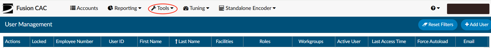
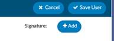
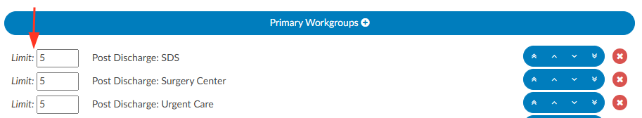

+++
title = 'User Management'
weight = 70
+++

Under "Tools" in the application there is a tab for "User Management". This tab is where a user with a Manager and/or Administrator role can add, delete, or change any permissions and/or set work lists for other users. The grid view will show you all users that have access to the system. The page has columns listed above the grid which are explained below. The columns can be arranged in any order.

## User Management Columns

###### Actions 

| Action                        | Description |
| ----------------------------- | ----------- |
|    | Copy User allows you to copy a user’s profile when creating a new user. |
|    | Edit User allows you to edit the user’s profile. |
|  | Delete allows you to delete incorrect user profiles. **This icon will appear ONLY for users that have not signed in.** Once a user logs in, the delete icon will no longer show in their Actions column. |

###### Locked

This field shows if a user's login is locked. A user’s account can be locked by incorrectly typing in
their password or user id more than three (3) times.

###### Employee Number

This field provides the user's employee number that is associated with their facility. 

###### User Id

This field provides the user's user id to login to the system.

###### First Name

This field provides the user's first name.

###### Last Name

This field provides the user’s last name.

###### Facilities

This field provides the facilities that a user is assigned to. The user will only be able to access charts that come from facilities they are assigned to.

###### Roles

This field provides the user’s role, or roles, which is also tied to their permissions.

| Role                  | Description |
| --------------------- | ----------- |
| **Viewer**            | Can view the patient chart but cannot make changes. |
| **Coder**             | Can view the patient chart, as well as add, delete, and change codes and DRGs on the coding abstract. Can add and remove items on coding forms, access editable fields in account information, and add notes and bookmarks. |
| **Physician Coder**   | Can view the patient chart, add, delete, and change codes for physician-specific coding. Can add and remove items on physician coding forms, access editable fields in account information, and add notes and bookmarks. |
| **Single Path Coder** | Can view the patient chart and has permissions to add, delete, and modify final codes for both physician and hospital coding. |
| **CDI Specialist**    | Can view the patient chart, add, delete, and change codes and DRGs on the CDI abstract. Can add and remove items on CDI forms, access editable fields in account information, and add notes and bookmarks. |
| **Router**            | This role is an add-on for Coder, Physician Coder, or CDI Specialist roles. Enables users to manually route tasks to other users or workgroups, overriding the system’s automated workflow. |
| **Auditor**           | Can view the patient chart and add, delete, and change codes and DRGs on the coding abstract. Can add and remove items on coding forms, access editable fields in account information, and add notes and bookmarks. Can also import previously submitted codes and initiate an audit worksheet. |
| **Manager**           | Can do everything that Coders and Viewers can do. They can also add and delete users to the system from their own facility, change passwords, or change user roles. Managers can assign accounts to users and produce reports describing the state of the work queue and various coder statistics from their own facility. |
| **Administrator**     | Can do everything that Coders and Viewers can do. They can also add and delete users to the system, change passwords, or change user roles throughout all facilities (if multi-site). Administrators can assign accounts to users and produce reports describing the state of the work queue and various coder statistics. |

###### Workgroups

This field tells you which Workgroups the user has access to. If there are multiple Workgroups they will be separated by a comma. For an easier view, click on the user to see Workgroups.

###### Active User

This field shows if the user is active or inactive.

###### Last Access Time

This field will tell you the last time the user accessed the system. For more detailed audit trail see User Reports.

###### Enable Query

This is a setting that must be configured at your site and is uncommon. It has been
created to allow a user to send a Physician Query to a valid email. If the user
receiving the query is added as a user in User Management and have a valid email
address listed. When an email address is added to the user profile, a new checkbox
will appear to enable Physician Queries.

If that checkbox is checked, the user will then appear in the pick list for the physician
within a physician query.

The user will only show up by typing in the user’s ID and will show a little person icon
next to their name to indicate they are not a physician.

> [!note] Email-based Physician Queries Only
This is uncommon as most sites physician query is used from the MFN file not to
email. This feature was developed for a select few sites that do query through email.
This setting must be turned on by your Project Team or CAC Support in the
configuration settings. Once enabled this will also require a development interface
change as to how and where queries are sent.

## Adding a User

Click on the "Add User" button at the top right of the User Administration page.

You will be presented with a new user profile screen.

### Add User Fields

###### User Name

This field allows you to enter a user name that will be used for the user to access the system. Enter the user name exactly how their Windows login appears (most facilities use Active Directory). Once this is entered, it cannot be changed.

###### Password

>[!info] Active Directory Users
Just like the user name, a new user's password will be the same as their Windows log-in (Active Direcotry). No password will need to be created during the process of adding a new user.

>[!caution] Active Directory Users - Reset Password
If a user forgets their password and your system is configured to use your Windows log-in (Active Directory), the password must be reset through your internal processes for resetting your Windows password.

###### Employee Number

This field allows you to enter in a user’s employee number.

###### Email Address

This field allows you to enter in the user’s email address.

###### Last Name

This field allows you to enter in the user’s last name.

###### First Name

This field allows you to enter in the user’s first name.

###### Middle Name

This field allows you to enter in the user's middle name, if needed.

###### Signature

This button allows each user to create a signature line. This line
will appear at the bottom of Physician Queries to show who created the
query. A new button is located next to the user’s name in the user profile.

Clicking it will open a box allowing the user to create the signature.

###### Roles

| Role                  | Description |
| --------------------- | ----------- |
| **Viewer**            | Can view the patient chart but cannot make changes. |
| **Coder**             | Can view the patient chart, as well as add, delete, and change codes and DRGs on the coding abstract. Can add and remove items on coding forms, access editable fields in account information, and add notes and bookmarks. |
| **Physician Coder**   | Can view the patient chart, add, delete, and change codes for physician-specific coding. Can add and remove items on physician coding forms, access editable fields in account information, and add notes and bookmarks. |
| **Single Path Coder** | Can view the patient chart and has permissions to add, delete, and modify final codes for both physician and hospital coding. |
| **CDI Specialist**    | Can view the patient chart, add, delete, and change codes and DRGs on the CDI abstract. Can add and remove items on CDI forms, access editable fields in account information, and add notes and bookmarks. |
| **Router**            | This role is an add-on for Coder, Physician Coder, or CDI Specialist roles. Enables users to manually route tasks to other users or workgroups, overriding the system’s automated workflow. |
| **Auditor**           | Can view the patient chart and add, delete, and change codes and DRGs on the coding abstract. Can add and remove items on coding forms, access editable fields in account information, and add notes and bookmarks. Can also import previously submitted codes and initiate an audit worksheet. |
| **Manager**           | Can do everything that Coders and Viewers can do. They can also add and delete users to the system from their own facility, change passwords, or change user roles. Managers can assign accounts to users and produce reports describing the state of the work queue and various coder statistics from their own facility. |
| **Administrator**     | Can do everything that Coders and Viewers can do. They can also add and delete users to the system, change passwords, or change user roles throughout all facilities (if multi-site). Administrators can assign accounts to users and produce reports describing the state of the work queue and various coder statistics. |

###### Facilities

This field allows you to assign specific facilities to a user (in multi-site setups). Once assigned, the user will only be able to acces charts that come from facilities they are assigned to.

###### Primary Workgroups

This field is a list of check boxes that are populated based on the queues that
are created in the "Automatic Assignment" tab. By checking these boxes, you
are giving that user access to queues.

###### Backup Workgroups

These workgroups are only visible to the user from the Account List page if
all other assigned queues are empty. As soon as an assigned workgroup
receives an account, the backup queues are no longer visible. Auto-
Download will not be affected.

###### Active

This field allows you to provide or revoke access to the system. If checked
the user is active, if unchecked the user is inactive and will not have access
to the system.

###### Locked

If a user has attempted too many unsuccessful logins, they will be locked out of the system. When this happens the "Locked" check box will be checked. The user will not be able to login until this box is unchecked.

###### Save User Button

This button allows you to save the user profile you are adding or editing.

###### Cancel

This button allows you to cancel the user you are adding or editing without
making or saving any changes.

## Using Force AutoLoad

This feature helps prevent cherry-picking by enforcing the order in which workgroups and patient charts are assigned to end users. When enabled, users will bypass the Account List page upon logging in and instead be directed to the AutoLoad page. To access the next account, they simply click the "Go to Next Account" button, which automatically loads the first available account from their assigned workgroups. The system follows the sort order set by the manager and skips any charts currently locked by another user.

If there are no accounts left, the system will automatically load the first account from the visible linked
workgroups. If there are no accounts left, the user will be presented with a new screen informing the
user that there are no accounts.

### Setting Limits on the Number of Charts

Users that are configured to have Forced Autoload will now have a column under the Workgroup
assignement panels in their user profile. This will allow managers to limit the amount of accounts in each workflow that the
forced user will be assigned. If no limit is set, the user will have access to however many accounts are currently in the workgroup. To transition to the next workgroup, the current workgroup must be fully completed.

In the example below, I’ve set account limits for the user for each of their assigned workgroups. With these limits in place, if the Post Discharge SDS workgroup contains 20 accounts, the user can only complete 5 charts before moving on to their next assigned workgroup. The user will sequentially receive 5 accounts from Post Discharge Surgery Center and up to 5 from Urgent Care. Once all assigned workgroups are cycled through, the system will return to the first workgroup, starting again with up to 5 Post Discharge SDS accounts.

> [!note] Manual Routing Always Takes Priority
If an admin routes a chart directly to the users “You” worklist, the chart will appear next
in autoload before resuming normal workgroup priority order.

The "Autoload" page provides a copy of the Coder Personal Dashboard. The coder will also see a list of
accounts they saved with a Pending Reason at the bottom of the autoload page that they can access by
clicking.

## User Profile

A user's profile can be accessed through the top-right corner of the application or via the User Management section. Clicking on the user’s name and selecting "Profile" will open their profile. The settings available within the profile depend on the user’s assigned permissions. Additionally, by clicking on the user’s name, you can view their productivity statistics for the day.

