+++
title = 'Workflow Management'
weight = 80
+++

The workflow management editor is a tool that allows users to create, design, modify, and manage
workflows. A workflow is a series of tasks or activities that need to be completed in a specific order to
achieve a desired outcome.

## What is the purpose of workflow?

The purpose of a workflow is to systematically organize and streamline the patient chart activities for
proper completion. Workflows are designed to improve efficiency, productivity, and collaboration
between CDI, Coding, Quality and Auditing by defining the sequence of steps, assigning responsibilities,
and establishing the flow of information between different individuals or departments involved in the
process.

Overall, workflows play a crucial role in enhancing operational efficiency, consistency, collaboration, and
overall effectiveness within organizations. They ensure that tasks are completed in a structured and
efficient manner, enabling organizations to achieve their goals more effectively. In Fusion CAC each
workflow is configured with pieces of Criteria. Criteria is what causes a workflow rule to fire, either by
creating a field equal to, contains or does not contain. Often a workflow will contain a Criteria with
many different filters within it to ensure we constrain the data with enough detail, so all charts do not
get caught in one Workgroup.

## New Workflow Editor

The new workflow management page is listed as “workflow management”. Fusion
CAC offers two options for workflow management: the "workflow management"
and "workflow management classic" designs. While both pages offer similar
features, the new workflow management page includes additional functionalities
that are not available in the classic version.

We understand the importance of a smooth transition, so we will be maintaining
the new workflow management system for a few releases. To accommodate your
preferences, we have implemented a convenient option to switch between the classic view and the new
page display. This way, you can transition gradually and comfortably, choosing the workflow
management system that best suits your immediate needs.

To simplify the transition process further, we have imported all your existing workflows into the new
workflow management system. This means any changes made in either of the pages will be reflected in
the other, allowing you to become familiar with the enhanced features and maximize the benefits they
offer. The new workflow management editor offers several enhancements, including:

- Improved Vertical Viewing Space for Workgroups: This display offers a better vertical viewing
space, enabling workgroups to access and manage their workflows more efficiently.
- Side-by-Side Comparison of Workgroups: Users can compare and analyze workgroups using a
convenient side-by-side comparison feature
- Filtering Ability to Search Workgroups by Specific Fields: This feature allows users to filter and 
search for workgroups based on specific fields, making it easier to find relevant information. This
filter is “smart” no matter the operator you use if you indicate Building = Rad it will find any
workgroup that has the building with rad regardless if its equals or in list.
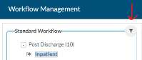
- Cleaner/Sleeker Look and Feel: We have focused on creating a cleaner and sleeker design to
enhance the overall user experience.
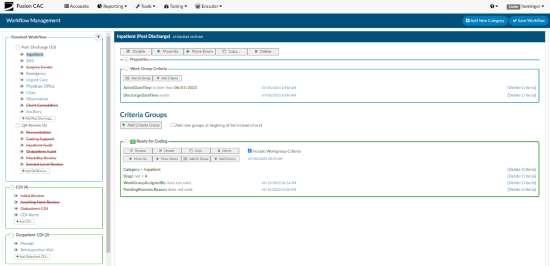

## Classic Workflow Editor

### Workflow Categories

The categories are defined as:

#### AutoClose

This is a process by which an ancillary patient chart can be auto closed based upon a set of rules without
coder intervention. Autoclose is a process that takes somewhat “simple” outpatient visits and
automates the coding process by submitting the chart directly to billing. You may also know this as the
industry term autonomous coding.

This automation allows for the handling of a lot of the simple high volume outpatient visits with little to
no human intervention. Many organizations are turning towards AutoClose to ensure they can capitalize
on the low hanging fruit of these ancillary chart types while not sacrificing the staff they have.

Patient charts that pass AutoClose criteria are coded and submitted to billing, while those that fail
AutoClose are rejected and routed to a worklist for coder intervention. Charts rejected are presented to
the coder with a failure reason.

You can start AutoClosing charts right away. However, many organizations want to see how the engine
functions before AutoClose is enabled. Autoclose has a test mode which allows you to simulate what
would have AutoClosed had it been turned on in production. This allows users to review and determine
if AutoClose is ready for production.

No matter when you start, it is recommended to begin with specific accounts. The best early candidates
are lab, screening mammogram, outpatient therapies (physical, occupational, or speech therapy) and
other accounts that do not require an interpretive report.

The types of accounts will depend on your organization, the type of services you offer, your payor, and
state requirements. Common outpatient service lines to implement in addition to the early adapters
listed above include:

- Screening Mammogram
- Sleep Lab
- Labs
- Chest X-rays
- ED Left Without Being Seen
- Canceled Accounts
- Cardiac rehab
- Dietary or nutritional counseling
- Esophageal motility studies
- Outpatient dialysis
- Pulmonary function tests
- Vaccine visits

As you expand your AutoClose capabilities we recommend you conduct regular audits to make sure your
system captures and codes everything correctly.

With AutoClose, charts can be processed within seconds and the total turn-around time can be a little as
a few minutes. Charts are processed 24 hours a day, 365 days a year with AutoClose. This allows you to,
essentially, gain a coder that doesn’t have sick days or take vacations. This means that charts can be
submitted to payors sooner which accelerates time-to-cash.

The impact AutoClose can have on revenue is one of the best benefits of this feature. Many
organizations AutoClose, on average, 10,000 or more charts per month. This equals out to about
120,000 outpatient visits AutoClosed per year without coder intervention. That is an estimate of 2.5
FTEs.

##### CDI/Concurrent

This type of workflow is ONLY valid if a patient chart does not have a discharge date and has a status of
unbilled.

##### Post Discharge

This type of workflow is ONLY valid if patient chart has a discharge date and has a status of unbilled.

##### QA Review

This type of workflow is available for any charts you may wish to QA. This is also used for reconciliation
workflow.

##### Custom

This type of workflow was designed to allow custom categories to meet unique client requirements.

##### Audit

This type of workflow is available for any charts you wish to audit. This workflow can be used to define
certain days for when charts would get added to the Auditor worklist(s).

Example: Select that workflow automatically adds charts to the worklist on the first day of every month
and last day of the month.

On these designated days every month, 5 charts (the number of charts can be changed) from every
coder (First Submitter) will be automatically routed to the auditor’s worklist. You can define the
auditor’s worklist by specific patient type (category) and/or service to automatically route into the
worklist for a designated date range.

For example, on the 1st of the month auditors would want charts from the previous month from the
15th day to the last day of the month. Those 5 charts from each coder should be from different dates
within the date range defined so that all of them don't come from the same date. Then on the 15th day
of the month it would pull from the 1st day from the 14th day to the last day of the month.

"Audit" is a default workgroup category to appear above AutoClose (keep the default categories
alphabetical). Like all other workgroup categories, the "Audit" workgroup category will have workgroups
containing criteria groups. In Workflow Management the "Audit" default workgroup category is identical
to all other workgroup categories, but Audit workflow is triggered on a schedule instead of in real-time.

When Audit workflow is activated based upon the schedule configured within the workflow, it will grab
accounts based on the criteria filters, group them by one or more fields, then select x number of
accounts from each workgroup.

### Workflow Management

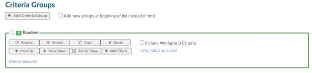

### Workflow Management (Classic)

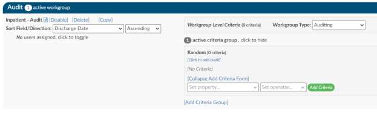

Each criteria group of an "Audit" workgroup will have additional data elements to record

### Schedule

The schedule on which Audit workflow will run (Daily, Weekly, or Monthly).

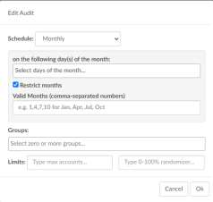

### Groups

One or more single fields to perform the grouping. For example, a grouping of "Last Submitter" and "Is
Inpatient" would tell Audit workflow that after gathering the list of accounts, group them by unique Last
Submitter + Is Inpatient.

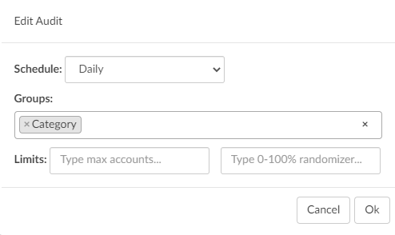

### Limits

The number of accounts to assign from each grouping. This value can be a maximum number, a
percentage, or both. Using the example grouping above:

Setting the selection to 10 maximum with no percentage means that for each unique group of "Last
Submitter" and "Is Inpatient" accounts, assign randomly up to 10 accounts.
Setting the selection to 50 percent and 10 maximum means that for each unique group of "Last
Submitter" and "Is Inpatient" accounts, assign randomly 50% of the accounts but up to 10 maximum.
Setting the selection to 50 percent with no maximum means that for each unique group of "Last
Submitter" and "Is Inpatient" accounts, assign randomly 50% of the accounts.

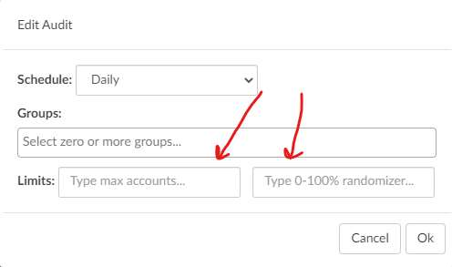

### Custom Category

The “Add Category” button is located on the Workflow Management page to allow for the addition of
custom workflow categories.

The default categories will continue to work as they currently do; an account can only be in one default
category (AutoClose, CDI/Concurrent, Post Discharge, QA Review).

With the addition of the new custom categories, an account can exist in one default workgroup and can
co-exist in any of the custom workgroups. An Add New Category button appears at the top of the
screen.

Upon clicking this, the box will open for the use to type in the category name. Once a name is typed in
and OK is clicked, the Add New Category and Create New Workgroup buttons will disappear, the new
category name will then appear in the Category box, and next to that will be the usual box and button to
create a workgroup

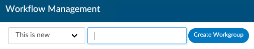

Custom categories will appear in their own section on the Workflow Management page, below the
default categories. Custom categories allow an account to be in multiple custom categories at the same
time.

### Steps to Add Workflow in Classic mode

1. Start by clicking on “Create New Workflow”

2. Select Category of “Post Discharge”
3. Name your Workgroup something short and that will be meaningful to the end user such as
“Inpatient” or “Inpatient with Charges”. This tells the user what the workgroup contains.
4. Select “Create Workflow”

5. Add yourself for testing purposes to the work group in the “Users” field.
6. Then click Add Criteria Group. Name your Criteria a short phrase in which describes the reason
this criterion will move charts into the workgroup then hit enter. This will help with
troubleshooting in the future.
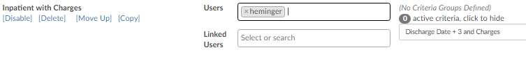
7. Then click on the criteria name and click “Add Filter” and select “Set Property…”. The property
are database fields. Add as many properties as needed to ensure you filter the data down so the
appropriate charts make it into each queue. One you add a property you will be presented with
a set of operators; depending on the property you select the operators can be different.
8. Assign workgroup type, this will signify if it’s Coding, CDI, Auditing, Quality or Support. This helps
to classify the worklist charts are sitting in for the chart status report.

### Steps to Add Workflow

1. Start by clicking on “Create New Workflow”

2. Select Category of “Post Discharge”
3. Name your Workgroup something short and that will be meaningful to
the end user such as “Inpatient” or “Inpatient with Charges”. This tells
the user what the workgroup contains.
4. Select “+ Add Post Discharge” the name may be something different
than post discharge that is the name of the workflow category
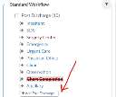
5. Add yourself for testing purposes to the work group in the “Users” field.
This can be found in the properties section
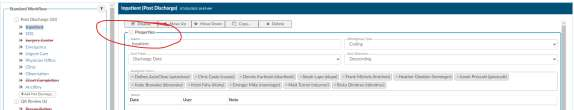
6. Assign workgroup type, this will signify if it’s Coding, CDI, Auditing, Quality or Support. This helps
to classify the worklist charts are sitting in for the chart status report.
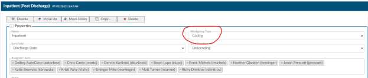
7. Then click Add Criteria Group. Name your Criteria a short phrase in which describes the reason
this criterion will move charts into the workgroup then hit enter. This will help with
troubleshooting in the future.
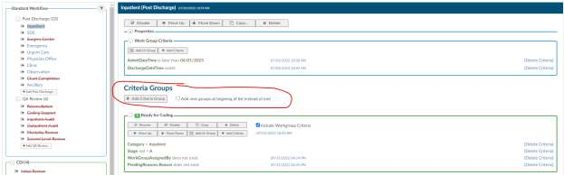
8. Then click on the criteria name and click “Add Filter” and select “Set Value…”. The property are
database fields. Add as many values as needed to ensure you filter the data down so the
appropriate charts make it into each queue. One you add a property you will be presented with
a set of operators; depending on the property you select the operators can be different.
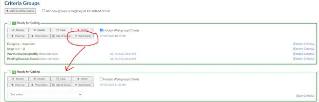

### Workgroup Level Criteria

A new option for workgroup level criteria has been added to Workflow. It works like all other criteria. When you
click on it, it allows you to add criteria that will be used for every group under that workflow. This will alleviate the
need for the user to add the same criteria to all of the workgroups.

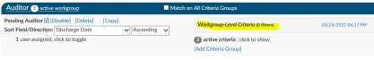

As an example; the user has created 3 criteria under the workflow name Auditor. A Workgroup level criteria of
admit date is created.

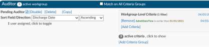

The user can click on every criteria in that Workflow name of auditor and check the box to use the workgroup level
criteria.

With the box checked, workflow will now apply that Admit date time to that particular filter’s criteria.
This will help keep repetitive criteria creation to a minimum.

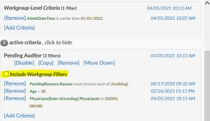

### AND/OR Criteria

Workflow has two different options to build workflow.

1. AND criteria
2. OR Criteria.

##### Example of AND Criteria

At the end of each criteria you add an “AND” (see below). This criterion will cause the chart to fall into
the Inpatient Surgery worklist if the has a patient type of Inpatient AND the patient has been discharged
AND the patient has a hospital service of SUR.

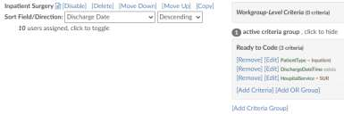

##### Example of OR Criteria

At the end of each criteria you will add an ADD or an OR see below). This criterion will cause the chart to
fall into the Inpatient Surgery worklist if the has a patient type of Inpatient AND the patient has been
discharged and the patient has EITHER a hospital service of SUR OR the Documents must include an
Operative Report or OP Note. The OR criteria is listed in blue to call attention.

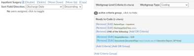

#### Workflow History Edits

The display for Workflow Management has been changed to allow for an onscreen running history of
edits. Users and Linked Users will now be seen under the name of the workgroup and will be defaulted
as collapsed. Clicking on the link will toggle the box open.

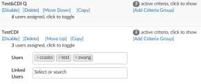

Any change made to criteria will show as a time
stamp on the criteria bar next to the specific criteria
that was changed. The date on the criteria bar will
always be the latest change date.

Hovering over the date will give detailed data for
that specific date change. If multiple changes have
been made to a workgroup, clicking on the date in
the criteria bar will open a box listing all changes for that workgroup.

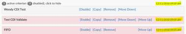

### Workflow Operators

| Operator             | Description |
| -------------------- | ----------- |
| Equals               | This is used if you have one value, and it must equal the value. This is case sensitive. |
| >                    | This sign means that the value must be less than the value noted. |
| <                    | This sign means that the value must be greater than the value noted. |
| >=                   | This sign means that the value must be less or equal to than the value noted. |
| <=                   | This sign means that the value must be greater or equal to the value noted. |
| In List              | If you have more than one value, it could be any of the following. |
| Not In List          | If you have more than one value, you do not want it to equal. |
| Contains             | If you have a word, phrase or value that can contain it must have what you added exactly. This is common when including payors. |
| Only Contains        | Any one of the codes it is not needed to do all 3. |
| Exists               | This will search to see if anything “exists” in this field, if it’s not blank it will match. No value is needed after the operator. |
| Does not Exist       | This will search to see if anything “does exists” in this field if it’s blank it will match. No value is needed after the operator. |
| More Than            | This operator is only used with date fields, you will need to define “more than” how many days ago. You cannot add a date into the field as this field will need to be dynamic therefore days ago is used. |
| Less Than            | This operator is only used with date fields, you will need to define “less than” how many days ago. You cannot add in a date into the field as this field will need to be dynamic therefore days ago is used. |
| Later Than           | This operator is only used with date fields, you will need to define the exact date you do not wish to exceed. |
| Is On                | This is for an exact date, this is uncommon to use for workflow. |
| Includes Each Of     | If you have more than one value, it must contain all of the following. However, note the chart must have each of the values but can also have other values. |
| Includes Any Of      | If you have more than one value and it could be any of the following. |
| Does not Include     | If you have more than one value, you do not want it to equal you must use “Not In List” |

### Random Audit

The criteria filter, "Random Percentage" is included in the workflow criteria options. When set to a number
between 0 and 100 and detected in the workflow engine, a random number will be generated. If the
random number is less than or greater than the number in the filter criteria, the Criteria will match.

Random Inclusion Factor that is less than 20 will pass a theoretical 20% of accounts through the filter.
You don't want to use this with equals (=) because it would always cause a ~1% result, and you don't
want to use it with greater than (>) because it will pass an inverse percentage.

As noted, this is not going to be an exact percentage, only a theoretical one. In edge cases, you could
ask for "20% of accounts" and end up getting zero, or you could end up getting all of them, but most of
the time, you should get ~20%.

This field is intended to be used with QA Workflow, although the application won't prevent an
administrator from using it in other types of workflow. Valid values for this field are from 1 to 99; any
other values in this field won't work.

Do not think of this field as a percentage, but rather as a 100-sided die. When workflow examines this
filter, it'll "roll the die". The common use case for this filter is "Random Inclusion Factor --> less than -->
10".

