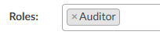
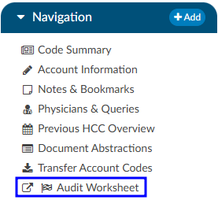

+++
title = 'Auditor'
weight = 23
+++

The Audit module provides comprehensive functionality designed to streamline and enhance the coder audit
process. With its automated functionality, this tool efficiently compares Coder-assigned codes to
Auditor-assigned codes, generating audit outcomes for various aspects including code accuracy, POA
(Present on Admission) changes, abstraction correctness, and DRG (Diagnosis-Related Group)
adjustments.

Beyond auditing, the module facilitates tracking of training recommendations, enabling continuous
improvement in coding accuracy and proficiency. Additionally, its built-in section for rebuttal workflow
tracking ensures transparent communication and resolution of discrepancies between Auditors and
Coders, ultimately fostering a collaborative and quality-driven coding environment.

The audit component serves as an invaluable additional module within the coding infrastructure, offering
advanced capabilities to streamline and optimize the audit process. For those interested in exploring its
functionalities further, please reach out to Dolbey's Subject Matter Expert (SME) Team (smeteam@dolbey.com). The
SME Team stands ready to provide comprehensive insights and guidance on how this module can
enhance coding efficiency, accuracy, and overall workflow management within the organization.

## Auditor Role

The Audit module introduced the role of an Auditor. The Auditor role has the same privileges
as a Coder role when it comes to account editing. In fact, an Auditor is editing the final codes. If an Auditor
or Coder submits the account with an open audit, the audit will automatically be closed. The Auditor can
route an account directly to the Coder that last submitted (triggering a save and close), and the
Coder can rebut and route an account back to the Auditor (also triggering a save and close).

This role allows for the end-user to have a separate code tree while importing the coder-assigned codes
so that they have something to start with. The Auditor role has a companion viewer in the Navigation
tree. This viewer allows the Auditor to document the findings of an audit.

The pre-audit codes and DRG are displayed for easy reference by the Auditor. The Auditor conducts the
review and makes changes to the codes in the Assigned code tree. When finished, the Auditor computes
for the DRG. This displays post-audit results next to the pre-audit results for easy comparison. The
changes made by the Auditor during the review are automatically recorded within the statistics section
of the viewer.

## Viewer Privacy

The Auditor will need to add the Coder of Record so that the Coder of Record, any Auditor, or other user
role that has been given access can view the audit worksheets.

The data on the audit worksheet(s) is *only* intended for coder education and Administrative staff to score how the Coder is doing in a report card. The Coder will be able to view the audit viewer and add notes/comments back to the Auditor, but the Coder will not be able to make any changes to the audit worksheet.

## Custom Content

The Audit Type and Training Topics drop downs can be customized per orgranization. The AuditType and AuditTrainingTopics mapping tables can be added to override the default mappings. Users who would like to customize these can find more information on creating a new mapping from the [Mapping Configuration](https://dolbeysystems.github.io/fusion-cac-web-docs/administrative-user-guide/tools/mapping-configuration/) section of this user guide.

{}
