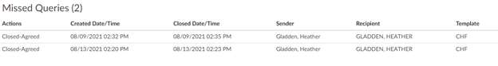
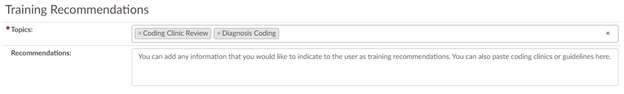
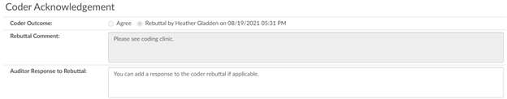

+++
title = 'Audit Worksheet'
weight = 50
+++

*Below are the sections of the audit worksheet and the definition of the fields , including how it was
calculated. If the auditor disagrees with any of the auto-calculated fields below, they can choose to
override the field by entering in the value that makes sense per the audit. The system will provide an
audit trail to show what the value was changed from and to for transparency along with the user that
made the change and the date/time the change was performed.*

## Diagnosis Codes Section

| Field                             | Definition |
| --------------------------------- | ---------- |
| Diagnosis Codes Pre-Audit         | The total is the number of diagnosis codes including principal, admit and secondary **at the time the audit is started.** This total does not include Reason for Visit as they are calculated separately. |
| Visit Reasons Pre-Audit           | The total is the number of reason for visit diagnosis codes **at the time the audit is started.** This will only display on an outpatient chart. |
| Diagnosis Codes Post-Audit        | The total is the number of diagnosis codes including principal, admit and secondary **at the time the auditor selects the Update Codes button.** This total does not include Reason for Visit as they are calculated separately. |
| Visit Reasons Post-Audit          | The total is the number of reason for visit diagnosis codes **at the time the auditor selects the Update Codes button.** This will only display on an outpatient chart. |
| Diagnosis Codes Edited            | This is the count of any diagnosis code that has changed after counting the codes that have been added or deleted |
| Diagnosis Codes Unassigned        | This is the count of the **total of deleted or unassign actions** by the auditor for admit and secondary codes once the auditor selects the update codes button. The unassign action is defined by right clicking on a code from the assigned code tree and selecting one of the unassign diagnosis code, unassign as secondary, unassign as admit or by selecting edit diagnosis code and deleting the code. This total does not include Reason for Visit as they are calculated separately. |
| Diagnosis Codes Added             | This is the count of the **total of added or assign actions** by the auditor for admit and secondary codes once the auditor selects the update codes button. The assign action is defined by right clicking on a code from the unassigned code tree and selecting assign as admit or secondary, right clicking on a code to validate from a document or adding a code that did not exist previously. This total does not include Reason for Visit as they are calculated separately. |
| POA Changes                       | This is the count of the **total of POA changes** only on unchanged codes (Edited or Added) to prevent double counting errors once the auditor selects the update codes button. If a code was edited, assigned/added or unassigned/deleted it will not be counted within this total. This will only display on an inpatient chart. |
| CC Added                          | This is the count of the **total of added codes that has a classification of CC** (complication or comorbidity) by the auditor on secondary codes once the auditor selects the update codes button. The added action is defined by right clicking on a code from the unassigned code tree, right clicking on a code to validate from a document or adding a code that did not exist previously. These are not counted in the total error rate to prevent duplication of errors. This will only display on an inpatient chart. |
| CC Removed                        | This is the count of the **total of removed codes that had a classification of CC** (complication or comorbidity) by the auditor on secondary codes once the auditor selects the update codes button. The unassign action is defined by right clicking on a code from the assigned code tree and selecting one of the unassign diagnosis code, unassign as secondary, unassign as admit or by selecting edit diagnosis code and deleting the code. These are not counted in the total error rate to prevent duplication of errors. This will only display on an inpatient chart. |
| MCC Added                         | This is the count of the **total of added codes that has a classification of MCC** (major complication or comorbidity) by the auditor on secondary codes once the auditor selects the update codes button. The added action is defined by right clicking on a code from the unassigned code tree, right clicking on a code to validate from a document or adding a code that did not exist previously. These are not counted in the total error rate to prevent duplication of errors. This will only display on an inpatient chart. |
| MCC Removed                       | This is the count of the **total of removed codes that had a classification of MCC** (major complication or comorbidity) by the auditor on secondary codes once the auditor selects the update codes button. The unassign action is defined by right clicking on a code from the assigned code tree and selecting one of the unassign diagnosis code, unassign as secondary, unassign as admit or by selecting edit diagnosis code and deleting the code. These are not counted in the total error rate to prevent duplication of errors. This will only display on an inpatient chart. |
| HAC(s) Added                      | This is the count of the **total of added codes that has a classification of HAC** (Hospital Acquired Condition) by the auditor on secondary codes once the auditor selects the update codes button. The added action is defined by right clicking on a code from the unassigned code tree, right clicking on a code to validate from a document or adding a code that did not exist previously. These are not counted in the total error rate to prevent duplication of errors. This will only display on an inpatient chart. |
| HAC(s) Removed                    | This is the count of the **total of removed codes that had a classification of HAC** (Hospital Acquired Condition) by the auditor on secondary codes once the auditor selects the update codes button. The unassign action is defined by right clicking on a code from the assigned code tree and selecting one of the unassign diagnosis code, unassign as secondary, unassign as admit or by selecting edit diagnosis code and deleting the code. These are not counted in the total error rate to prevent duplication of errors. This will only display on an inpatient chart. |
| Principal Dx Changed              | This is a true or false field. If the principal diagnosis was changed from the previous code assignment the field will result in true which is counted as one error and if it was not changed it will result in false which is not counted as an error. N/A is available in the event the auditor wants to list it as not applicable to the audit. |
| Visit Reasons Edited              | This is the count of any visit reason code that has changed after counting the codes that have been added or deleted. |
| Visit Reasons Unassigned          | This is the count of the **total of deleted or unassign actions** by the auditor for reason for visit codes once the auditor selects the update codes button. The unassign action is defined by right clicking on a code from the assigned code tree and selecting one of the unassign diagnosis code, unassign as visit reason or by selecting edit diagnosis code and deleting the code. This will only display on an outpatient chart. |
| Visit Reasons Added               | This is the count of the **total of added or assign actions** by the auditor for reason for visit codes once the auditor selects the update codes button. The assign action is defined by right clicking on a code from the unassigned code tree and selecting assign as visit reason, right clicking on a code to validate from a document or adding a code that did not exist previously. This will only display on an outpatient chart. |
| Diagnosis Errors                  | This is the total codes that appear in the above boxes the formula is as followed: `Diagnosis Errors = Diagnosis Codes Added + Diagnosis Codes Edited + Diagnosis Codes Unassigned + POA Changes + Principal Dx Changed` |
| Diagnosis Error Rate              | This is the total codes that appear in the above boxes the formula is as followed: `Diagnosis Error Rate = Diagnosis Codes Added + Diagnosis Codes Edited + Diagnosis Codes Unassigned + POA Changes + Principal Dx Changed/ Diagnosis Codes Pre-Audit` |
| Diagnosis Accuracy Rate           | This is the total codes that appear in the above boxes the formula is as followed: `Diagnosis Error Rate = (Diagnosis Codes Added + Diagnosis Codes Edited + Diagnosis Codes Unassigned + POA Changes + Principal Dx Changed/ Diagnosis Codes Pre-Audit) – 100%` This line will be highlighted in blue so the data stands out. |
| Visit Reason Errors               | This is the total codes that appear in the above boxes the formula is as followed: `Visit Reasons Errors = Visit Reasons Added + Visit Reasons Codes Edited + Visit Reasons Codes Unassigned` This will only display on an outpatient chart. |
| Visit Reason Error Rate           | This is the total codes that appear in the above boxes the formula is as followed: `Visit Reasons Errors = Visit Reasons Added + Visit Reasons Codes Edited + Visit Reasons Codes Unassigned/Visit Reasons Pre-Audit` This will only display on an outpatient chart. |
| Visit Reason Accuracy Rate        | This is the total codes that appear in the above boxes the formula is as followed: `Visit Reasons Errors = (Visit Reasons Added + Visit Reasons Codes Edited + Visit Reasons Codes Unassigned/Visit Reasons Pre-Audit) – 100%` This will only display on an outpatient chart. This line will be highlighted in blue so the data stands out. |

## PCS Codes Section

> [!info]
> This section will only display if there is at least one PCS on the Coder Outcome (Pre-Audit) or the Auditor
> Outcome (Post-Audit).

| Field                             | Definition |
| --------------------------------- | ---------- |
| Procedure Codes Pre-Audit         | The total is the number of procedure codes including principal and secondary **at the time the audit is started.** |
| Procedure Codes Post-Audit        | The total is the number of procedure codes including principal and secondary **at the time the auditor selects the Update Codes button.** |
| Procedure Codes Edited            | This is the count of any procedure code that has changed after counting the codes that have been added or deleted. |
| Procedure Codes Unassigned        | This is the count of the **total of deleted or unassign actions** by the auditor for principal and secondary codes once the auditor selects the update codes button. The unassign action is defined by right clicking on a code from the assigned code tree and selecting one of the unassign principal code, unassign as secondary, unassign all episodes or by selecting edit procedure code and deleting the code. |
| Procedure Codes Added             | This is the count of the **total of added or assign actions** by the auditor for principal and secondary codes once the auditor selects the update codes button. The assign action is defined by right clicking on a code from the unassigned code tree and selecting assign as principal or secondary, right clicking on a code to validate from a document or adding a code that did not exist previously. |
| Principal PCS Changed             | This is a true or false field. If the principal PCS was changed from the previous code assignment the field will result in true which is counted as one error and if it was not changed it will result in false which is not counted as an error. N/A is available in the event the auditor wants to list it as not applicable to the audit. |
| Procedure Errors                  | This is the total codes that appear in the above boxes the formula is as followed: `Procedure Errors = Procedure Codes Added + Procedure Codes Edited + Procedure Codes Unassigned + Principal PCS Changed` |
| Procedure Error Rate              | This is the total codes that appear in the above boxes the formula is as followed: `Procedure Error Rate = Procedure Codes Added + Procedure Codes Edited + Procedure Codes Unassigned + Principal PCS Changed/ Procedure Codes Pre-Audit` |
| Procedure Accuracy Rate           | This is the total codes that appear in the above boxes the formula is as followed: `Procedure Error Rate = (Procedure Codes Added + Procedure Codes Edited + Procedure Codes Unassigned + Principal PCS Changed/ Procedure Codes Pre-Audit) – 100%` This line will be highlighted in blue so the data stands out. |

## CPT Codes Section

> [!info]
> This section will only display if there is at least one CPT on the Coder Outcome (Pre-Audit) or the Auditor
> Outcome (Post-Audit).

| Field                             | Definition |
| --------------------------------- | ---------- |
| CPT Codes Pre-Audit               | The total is the number of CPT codes including principal and secondary **at the time the audit is started.** |
| CPT Codes Post-Audit              | The total is the number of CPT codes including principal and secondary **at the time the auditor selects the Update Codes button.** |
| CPT Codes Edited                  | This is the count of any CPT code that has changed after counting the codes that have been added or deleted. |
| CPT Codes Unassigned              | This is the count of the **total of deleted or unassign actions** by the auditor for principal and secondary codes once the auditor selects the update codes button. The unassign action is defined by right clicking on a code from the assigned code tree and selecting one of the unassign principal code, unassign as secondary, unassign all episodes or by selecting edit procedure code and deleting the code. |
| CPT Codes Added                   | This is the count of the **total of added or assign actions** by the auditor for principal and secondary codes once the auditor selects the update codes button. The assign action is defined by right clicking on a code from the unassigned code tree and selecting assign as principal or secondary, right clicking on a code to validate from a document or adding a code that did not exist previously. |
| Principal CPT Changed             | This is a true or false field. If the principal CPT was changed from the previous code assignment the field will result in true which is counted as one error and if it was not changed it will result in false which is not counted as an error. N/A is available in the event the auditor wants to list it as not applicable to the audit. |
| Total Modifiers                   | This field reflects the total number of modifiers on codes that have not changed, and whether you deleted or added modifiers, the CPT Score and Error Rate should be adjusted accordingly. |
| Total Modifiers Added             | This is the count of the **total of added modifiers on a CPT** by the auditor where the code previously existed. If the code was already counted within the CPT Codes Added section to prevent duplication of errors. The added action is defined by right clicking on a code from the assigned code tree and selecting to edit to add a modifier. |
| Total Modifiers Removed           | This is the count of the **total of removed modifiers on a CPT** by the auditor where the code previously existed. If the code was already counted within the CPT Codes Added section to prevent duplication of errors. The removed action is defined by right clicking on a code from the assigned code tree and selecting to edit to remove an existing modifier. |
| CPT Errors                        | This is the total codes that appear in the above boxes the formula is as followed: `CPT Errors = CPT Codes Added + CPT Codes Edited + CPT Codes Unassigned + Principal CPT Changed` |
| CPT Error Rate                    | This is the total codes that appear in the above boxes the formula is as followed: `CPT CPT Error Rate = (Added CPT + Edited CPT + Unassigned CPT + Principal CPT Changed + Modifiers Added + Modifiers Removed /Pre-Audit CPT + Modifiers` |
| CPT Accuracy Rate                 | This is the total codes that appear in the above boxes the formula is as followed: `CPT Error Rate = (CPT Codes Added + CPT Codes Edited + CPT Codes Unassigned + Principal CPT Changed/CPT Codes Pre-Audit) – 100%` This line will be highlighted in blue so the data stands out. |

## DRG Outcome

> [!info]
> This section will only display on an inpatient chart.

| Field                             | Definition |
| --------------------------------- | ---------- |
| MS-DRG Change?                    | This is a yes or no field. If the billing DRG was changed from the previous DRG assignment. N/A is available in the event the auditor wants to list it as not applicable to the audit. Note if the Billing DRG and the APR-DRG as the same there could be duplication of changes reported on this field and the APR-DRG Change field. |
| Reimbursement Change?             | This is a field that indicates if the billing DRG change resulted in a increase, decrease or no reimbursement change. N/A is available in the event the auditor wants to list it as not applicable to the audit. |
| Reimbursement Change Amount       | This is a field that indicates if the billing DRG change resulted in a change the amount will be displayed. |
| APR-DRG ROM Change?               | This is a yes or no field. If the APR-DRG changed resulted in an ROM (Risk of Mortality) change. N/A is available in the event the auditor wants to list it as not applicable to the audit. |
| APR-DRG SOI Change?               | This is a yes or no field. If the APR-DRG changed resulted in an SOI (Severity of Illness) change. N/A is available in the event the auditor wants to list it as not applicable to the audit. |
| APR-DRG Change?                   | This is a yes or no field. If the APR-DRG was changed from the previous DRG assignment. N/A is available in the event the auditor wants to list it as not applicable to the audit. Note if the Billing DRG and the APR-DRG as the same there could be duplication of changes reported on this field and the MS-DRG field which is the Billing DRG. |

## Abstracting Section

| Field                             | Definition |
| --------------------------------- | ---------- |
| Discharge Disposition Changed?    | This is a true or false field. If the Discharge Disposition was changed from the previous Disposition assignment the field will result in true which is counted as one error and if it was not changed it will result in false which is not counted as an error. N/A is available in the event the auditor wants to list it as not applicable to the audit. |
| Abstracting Pre-Audit             | The total is the number of abstracting components there were **at the time the audit is started.** Abstractions Pre-Audit = (Total Procedure and CPT Codes x 2) + 1 for Discharge Disposition + 1 for Consulting Providers if Present). Procedure and CPT Codes are multiplied by two since there are to abstraction opportunities which is date of service and preforming provider. |
| Abstracting Errors                | This is the total codes that appear in the above boxes the formula is as followed: `Abstracting Errors = Procedure (PCS/CPT) Date Changes + Procedure (PCS/CPT) Provider Changes + Discharge Disposition Changes + Consulting Provider Changes` |
| Abstracting Error Rate            | This is the total abstracting error rate as a percentage the formula is: `Abstracting Errors = Procedure (PCS/CPT) Date Changes + Procedure (PCS/CPT) Provider Changes + Discharge Disposition Changes + Consulting Provider Changes/Abstracting Pre-Audit` |
| Abstracting Accuracy Rate         | This is the total abstracting accuracy as a percentage the formula is: `Abstracting Error Rate = (Procedure (PCS/CPT) Date Changes + Procedure (PCS/CPT) Provider Changes + Discharge Disposition Changes + Consulting Provider Changes/Abstracting Pre-Audit) – 100%` This line will be highlighted in blue so the data stands out. |

## Overall Statistics Section

| Field                             | Definition |
| --------------------------------- | ---------- |
| Total Pre- Audit                  | The total pre-audit count at the time the audit is started. `Total Pre-Audit = Diagnosis Pre-Audit + Visit Reason Pre-Audit + Procedure Pre-Audit + CPT Pre-Audit` |
| Total Errors                      | This is the total overall errors that appear in the above boxes the formula is as followed: `Total Errors = Diagnosis Errors + Visit Reason Errors + Procedure Errors + CPT Errors` |
| Total Error Rate                  | This is the total overall error rate as a percentage the formula is: `Total Errors = Diagnosis Errors + Visit Reason Errors + Procedure Errors + CPT Errors/Total Pre-Audit` |
| Total Accuracy Rate               | This is the total overall accuracy as a percentage the formula is: `Total Errors = (Diagnosis Errors + Visit Reason Errors + Procedure Errors + CPT Errors/Total Pre-Audit) – 100%` This line will be highlighted in blue so the data stands out. |

## Missed Queries

> [!info]
> This section will only be available if queries were initiated after the audit began. The query does not have
> to be initiated by the auditor to be attributed to the audit as a missed opportunity.

## Training Recommendations

At the end of the audit if there are training recommendations from the auditor they can list any topics, if
there are no topics there is a none necessary if there are no topics to recommend. To note these topics
can be changed from the mapping table. The auditor also has a space to add in addition details as
needed.

## Coder Acknowledgement

If there are auditor changes the auditor will route the chart back to the coder by selecting Route to
Coder, this section gives the coder the opportunity to either agree with the audit or to provide a
rebuttal. If the coder selects the outcome to be a rebuttal the coder must provide a comment for the
auditor. Once the coder provides these, they can route the chart back to the auditor by selecting Route
to Auditor.

Once the chart is returned the auditor the auditor has an opportunity to review the rebuttal and provide
a response to the rebuttal or they can escalate the audit where the manager that receives the escalation
can add a comment in the Auditor Response to Rebuttal.

