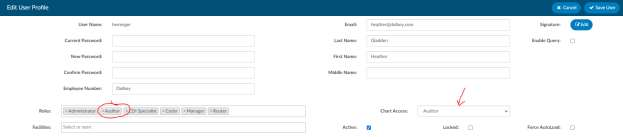

+++
title = 'Auditor Role'
weight = 10
+++

The audit module introduces a new role of an auditor. The role of an "Auditor" has the same privileges
as a "Coder" when it comes to account editing. In fact, an auditor is editing the final codes. If an auditor
or coder submits the account with an open audit, the audit will automatically be closed. The auditor can
route an account directly to the coder that last submitted (which triggers a save and close), and the
coder can rebut and route an account back to the audit (which also triggers a save and close).

This role allows for the end-user to have a separate code tree while importing the coder-assigned codes
so that they have something to start with. The auditor role has a companion viewer in the Navigation
Tree. This viewer allows the auditor to document the findings of an audit.

The pre-audit codes and DRG are displayed for easy reference by the auditor. The auditor conducts the
review and makes changes to the codes in the Assigned code tree. When finished, the auditor computes
for the DRG. This displays post-audit results next to the pre-audit results for easy comparison. The
changes made by the auditor during the review are automatically recorded within the statistics section
of the viewer.
