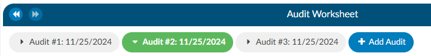

+++
title = 'Audit Worksheet'
weight = 20
+++

## Starting an Audit

1. Ensure the current user role is set to have the Auditor role as well as Chart Access of Auditor.
   

2. Open a chart that has been submitted by a Coder. This may come from a worklist or by manually typing in an account number.

3. On the Navigation tree there will be a viewer called “Audit Worksheet”, click the {}+Add Audit{} to begin .

>[!info]DRG Required
> A DRG must be computed by a user before an audit can be started.

4. Select the appropriate audit type from the dropdown. This will be used for reporting on the types of audit performed and can also be used for workflow purposes. 
   
5. The codes in the Assigned code tree are the same codes initially submitted by the
Coder, allowing the Auditor to start the audit with the codes from the Coder. The Audit
viewer can be popped out onto a separate screen, allowing the Auditor to have a screen
for reviewing the chart. Selecting “Show All” codes in the Unassigned code tree and then clicking on the codes assigned, the
Auditor will load the documentation supporting that code. This will help streamline the audit process. 

6. Once the Auditor has made changes and is completed with the audit, they can click “Update Codes”
  which automatically calculates and populates the audit statistics section. There is a comment bubble
  next to each code as well as the DRG for the Auditor to enter any comment(s). A symbol may display next to the codes.
    - A green ‘plus’ sign will show if the code was added. 
    - A red ‘minus’ sign will show if a code was deleted. 
    - A orange up or down ‘arrow’ sign will appear if the code location has been changed, as
    in a primary and secondary are swapped. 

7. Although audit statistics have been automatically calculated and populated, the Auditor must 
manually enter in the “Total Errors” which then automatically calculates the “Error Rate”.

>[!note]
>Because of its importance, and to include principal diagnosis changes in the error rate, changing the principal diagnosis counts as **two errors intentionally**. 
>- One error for changing a diagnosis code.
>- A second error if the principal diagnosis is incorrect.
>
>For an account with only two diagnosis codes, the error rate when the principal code is changed is 2 out of 3.
>If on the same account the Auditor says the principal is correct and only changes the secondary code, the error rate is 1 out of 3.

8. Complete the additional sections, (abstracting and training recommendations) if applicable.

9. The Auditor can then re-submit the chart or route it back to the Coder of Record by using the
{}Route to Coder{} button in the top right corner of the audit worksheet. This will route the chart to
the Coder’s **You** worklist for them to review and re-submit.

## Multiple Audits per Account

An account can have one or more audits added to it. Clicking {}+Add Audit{} will create a new, blank audit worksheet. These worksheets are numbered and displayed at the top of the Audit viewer, along with a date stamp indicating when each worksheet was opened. The worksheet currently being viewed will be highlighted with a green background.

