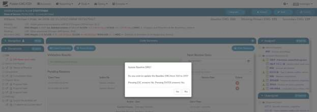

+++
title = 'Baseline DRG'
weight = 70
+++

The baseline DRG is used for reporting program impact, some organizations do report like this, and
others do not the choice is yours our system accommodates for it if you choose to use it. There are two
styles of impact that can be reported which are:

1. **Chart Impact**
2. **Query Impact**

These are both reporting separately as you could be query positive impact regardless of if the chart has
a positive, negative or neutral impact. The baseline is defined as the DRG that would have been coded
and billed if no CDI specialist reviewed the chart.

You can report the impact of a CDI specialist by measuring the difference between the baseline DRG and
the billed DRG because of your organizations policy that the last know working and final DRG always
match, I we measure impact on last known working and final your impact would always be neutral if we
measure baseline which by default is the first DRG you calculate unless the baseline is readjusted you
may claim to much impact therefore the baseline throughout the patients stay is commonly readjusted.
While the baseline DRG may seem like a simple concept, it can at times be difficult to determine. Here is
an example:

1.  A patient is admitted through the ER after presenting with *undiagnosed abdominal pain*, which
would result in {} with an estimated reimbursed of {}.
2. After further testing, it is revealed the abdominal pain is the result of *acute cholecystitis*; this
changes the {} (disorders of the biliary tract **without complication**) with an estimated
reimbursement of {}.
3. CDI documents an increased creatinine and a decreased glomerular filtration rate and queries
the physician regarding the patient’s renal status. If the doctor provides proper documentation,
it could be possible to assign a code indicating a *complication for Stage IV chronic kidney disease*, which would
result in {} (disorders of the biliary tract **with CC**) with an estimated reimbursement of {}.
4. The patient undergoes a *laparoscopic cholecystectomy*, changing the DRG to {} (laparoscopic
cholecystectomy with CC) with an estimated reimbursed of {}.
5. Next, the patient develops shortness of breath, and the consulting cardiologist documents
*acute-on-chronic congestive heart failure*, changing the DRG to {} (laparoscopic
cholecystectomy **with MCC**) with an estimated reimbursed of {}.

Normally, instead of the Baseline being {} which is the first listed, would adjust to
would be readjusted to {} once the patient goes to surgery. If the patient had not gone in for surgery the baseline
would have remained {}. 

However, none of the CDI impact is lost though because queries are counted separately if you run the query report that CDI would:

- **Query Impact** (Difference between {} and {}= $2289)
- **Chart Impact** (Difference between Baseline {} and Final {} = $0

What I listed above is how some organizations do report not all of them through do this, the choice is up
to your organization. To remind you that your baseline may need updated you can turn on a feature that
upon save it displays a message asking the CDI user if they would like to update there baseline DRG if
the last computed working DRG is different than the baseline. Remember you only want to move the
baseline when the baseline needs reset such as a patient going in for surgery, if you constantly update
the baseline you will show no or little impact. The goal is to show the impact of your work.

