+++
title = 'CDI/Clinical Alerts and Chart Prioritization'
weight = 20
+++

The software has a feature called CDI/Clinical Alerts which are automated messages generated by the software
that can be used to prioritize CDI workflow. CDI/Clinical Alerts are used to detect potential inaccuracies,
inconsistencies, and/or discrepancies in clinical documentation. These Alerts help CDI teams to prioritize
the charts based on potential query opportunities available.

The software provides real-time Alerts when potential query opportunities are identified. Which will
then allow CDI staff to prioritize charts based upon those potential opportunities.

## What is a CDI/Clinical Alert Topic?

CDI/Clinical Alert Topics are the diagnosis that is being targeted by the Alert. The Topic encompasses a broad
range of diagnoses that address various issues being targeted by the system. These diagnoses then
branch out into more specific types known as Alerts. These are based on the type of issue being
targeted.

## What is a CDI/Clinical Alert Message?

The Alert message is a specific message that details what is missing, incomplete, and/or inaccurate
documentation that is missing with the Diagnosis/Topic that is being targeted.

## CDI/Clinical Alert Types

CDI/Clinical Alerts branch out into four (4) types of Alerts.

| Alert Type                                      | Description |
| ----------------------------------------------- | ----------- |
| No Documentation but, Clinical Indicators   | This Alert type is when the provider did not document a diagnosis but, there are clinical indicators that support “Possible Diagnosis”.|
| Documentation but lack of Clinical Indicators   | This is where the provider documented the diagnosis but there is a lack of clinical indicators that support the diagnosis. For example, Sepsis was documented by the provider but it's not supported by clinical indicators. This Alert helps to ensure that diagnoses are audit proof, ensuring that the supporting evidence requiered for a proper diagnsosis validation is present within the patient's chart. |
| Documentation but Not Fully Specified           | This is where the provider documented a diagnosis but, it was not documented to its full specificity. For example, Heart Failure Unspecified: the diagnosis is not documented to the full specificity. This CDI/Clinical Alert is helpful for ensuring that diagnoses are documented to their full extent in order to combat denials. |
| Conflicting Diagnosis                           | This alert detects instances where two or more fully specified versions of a diagnosis may conflict. For example, if one provider documents Acute Diastolic Heart Failure in one section of a patient’s record, while another records Acute on Chronic Systolic Heart Failure elsewhere, the alert flags the discrepancy. By ensuring diagnostic consistency, this alert helps maintain an accurate clinical picture, enabling all care providers to deliver the best possible care. |

## Setting up CDI/Clinical Alerts

In order to set up CDI/Clinical Alerts, reach out to the SME Team (smeteam@dolbey.com) for
assistance. There is a module that must be deployed in conjunction with set up within the workflow
management editor.

## Workgroup Prioritization

Once CDI/Clinical Alerts are enabled, within the workgroup there is a column named “Criteria
Group”. The name of this field may vary depending on the organization's setup. If it is not visible, review [Grid Column Configuration](https://dolbeysystems.github.io/fusion-cac-web-docs/administrative-user-guide/tools/grid-column-configuration/) to determine whether it is displayed or labeled differently.

These criteria groups identify potential query opportunities based on algorithmic analysis. Once the algorithms meet the necessary criteria to trigger a CDI Alert, the alert is matched within the workflow. If it is the only alert present, it will be displayed as the “Criteria Group.”

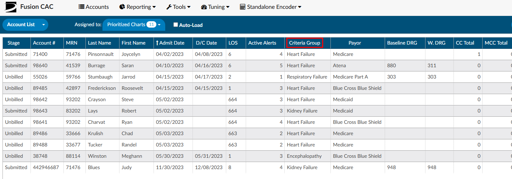

In cases where multiple Alerts match during workflow execution, the displayed Criteria Group name will
be determined by the hierarchical list. This hierarchical list is established by an organization's management team
using the workflow management editor. The management team has the ability to rearrange the order of
the Alerts based on priority and initiatives at each organization, ensuring the Alerts are organized from
highest to lowest priority.

There is also a second grid column called “Active Matched Criteria Groups”. This column will display the
actual number of active CDI/Clinical Alerts on each account, regardless of the Alert being matched to something first as it goes thorugh workflow list. This column represents the total number of “potential” query opportunities in a patient chart.

The columns “Criteria Group” and “Active Matched Criteria Groups” are available for prioritizing the worklist. Of these, “Active Matched Criteria Groups” is particularly valuable, as it helps focus efforts on charts that require the most significant improvement. Utilizing this column allows for more effective resource allocation and workflow prioritization.

It’s important to note that the only Alerts that affect the Priority Criteria Group name and number of
Active Matched Criteria Groups are Active Alerts. Once an Alert is closed it will not be used in these
columns for prioritization. This helps to make sure charts with the most priority are getting in
front of the CDI Team. As Alerts are closed these numbers will be updated in real time.

## Viewing CDI/Clinical Alerts

To access and view CDI/Clinical Alerts within a patient's chart, locate them in the 
[Navigation](https://dolbeysystems.github.io/fusion-cac-web-docs/general-user-guide/account-screen/) tree and click on the "CDI/Clinical Alerts" viewer. This will make the viewer display in the middle of the screen. There is also a box with an arrow next to "CDI/Clinical Alerts" that will allow the user to pop-out the viewer in a different tab. Doing this gives the user the ability to move the tab to a different monitor, if desired. 

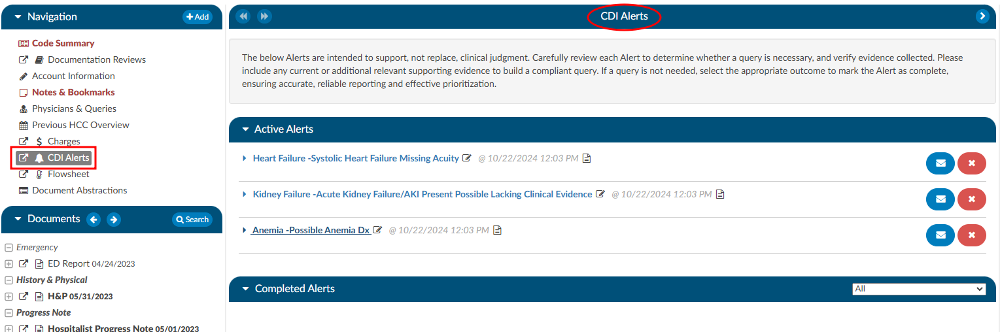

## Navigating the CDI/Clinical Alerts Viewer

In the CDI/Clinical Alerts viewer there are two headings in the dark blue bars which include:
1. [Active Alerts](https://dolbeysystems.github.io/fusion-cac-web-docs/cdi-user-guide/chart-prioritization/#active-alerts); and
2. [Completed Alerts](https://dolbeysystems.github.io/fusion-cac-web-docs/cdi-user-guide/chart-prioritization/#completed-alerts) 

Clicking on either of these headings will expand or collapse the section. Within each section are the actual Alerts that were triggered for the current account that is opened.

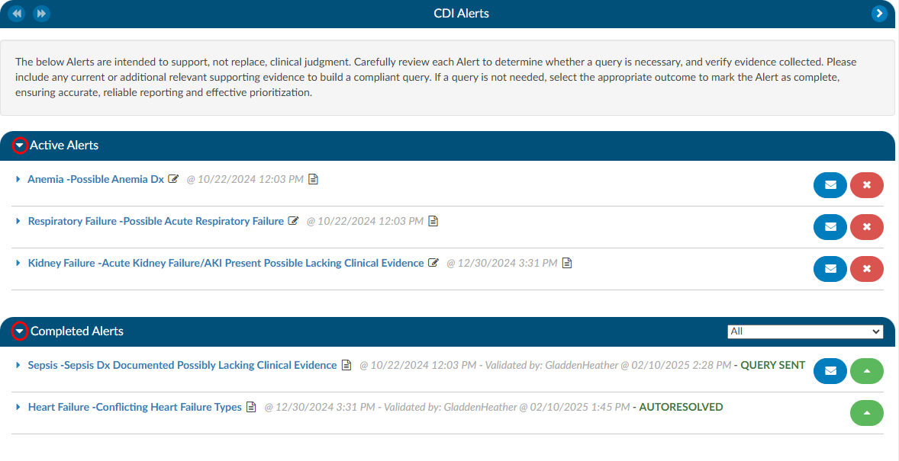

### Active Alerts

The section “Active Alerts” are Alerts that the system found and no action has been taken to resolve them. 

There are three parts to an Alerts title to observe:
1. **Alert Topic** - This corresponds to a diagnosis.
2. **CDI/Clinical Alert Message** - This is a brief description of what the system found to be missing, incomplete, or possibly inaccurate and corresponds to the Topic.
3. **Date and Time** - This is the date and time when the system found evidence for the alert to trigger. This information is tracked for reporting to see how quickly the system is triggering an alert.

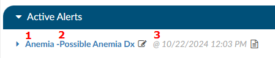

### Completed Alerts

The section “Completed Alerts” are Alerts that have been closed in one of the following manners:
1. Auto-Resolve by the system
2. CDS initiates a query
3. CDS clicks on the **RED X ** next to the Alert
 
When choosing to close the Alert, the CDS will be presented with a "Close Alert" diaglouge box to select why they are closing the alert.

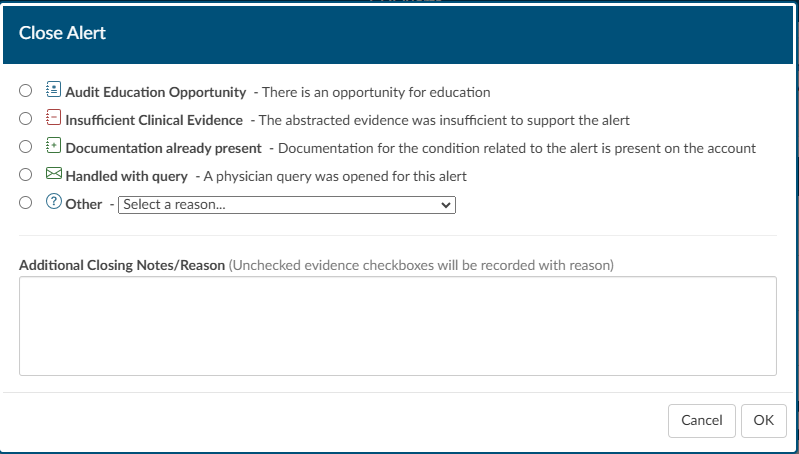

The date and time stamp in the title of the Alert will indicate when the Alert was closed, and by whom. The title will also display **GREEN** text that depicts how the Alert was closed. 

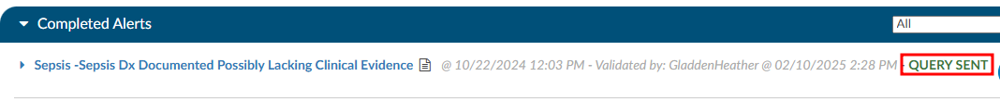

### CDI/Clinical Alert Notes

Next to each of the Alerts in either the Active or Completed Alerts section is a paper icon.

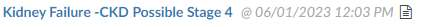

When clicked, this icon will launch a notes page. This can be used by a CDS to leave a note if they do not feel the Alert currently has enough evidence to build a query, but also shouldn't be ruled out as it could trend towards the diangosis alerted. Once a note is typed in it will leave the date and time as well as the CDS name so if another CDS enters the chart, they will be able to clearly see who chose to monitor the Alert at this time and why.

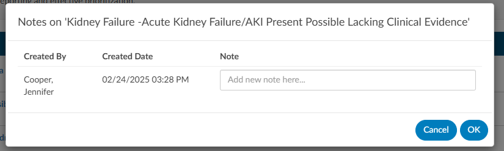

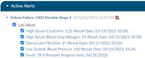

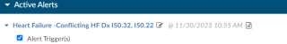

Once a note is typed in it will leave the date and time as well as the CDS name so if another CDS enters the chart, they will be able to clearly see who chose to monitor the Alert at this time and why. Upon adding the note the paper icon will turn red, notifying the next user that is reviewing the CDI/Clinical Alerts that there is a note present on the Alert.

### CDI/Clinical Alert Editor Function

Adjacent to the Alert message, you'll find a pencil icon. Clicking on it will open an editor,
enabling you to rearrange and customize the placement of evidence using a drag-and-drop functionality.
This feature empowers CDIS professionals to organize their items in a personalized manner, aligning
with their specific querying requirements.

### Reviewing Clinical Evidence

Each CDI/Clinical Alert contains clinical evidence extracted from the patient's chart. There are four different
types of evidence you will see. First are words and phrases within documentation such as signs and
symptoms, and medications. Second are value abstractions from the documentation such as vital signs
or laboratory findings within physical documents. The third are code abstractions from the
documenation. Fourth are discrete values such as laboratory studies and vital signs found in the
flowsheets, medications from the medication viewer and other flowsheet data. Finally, there are links to
documents. These links consist of the document name and connect directly to the respective document.
This feature proves valuable when referencing specific CT Scan documents that may be pertinent to a
particular Alert. This evidence is categorized into sections such as Laboratory Studies, Clinical Evidence,
Vital Signs, and Intake and oOutput Data.

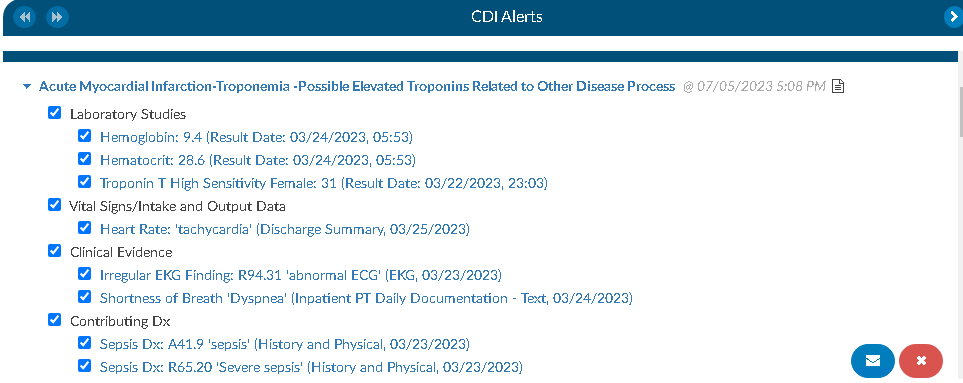

The blue text serves as a hyperlink. Furthermore, following the abstraction, you will observe word for
phrase in quotes. That is the words or phrases that then engine found in the documentation or values.
Subsequently, either the document name and document date are considered if derived from a
document, or the result date and time are used if obtained from flowsheets. In the case of medication
discrete abstraction, the medication name, dosage, route, and the date and time of administration are
presented.. This helps provide the necessary context. When evidence with a document type and date is
selected it will hyperlink you to the place in the document that abstraction was found and highlight that
yellow. You will also note that there is green highlights with words or phrases in the documentation.
Those are abstractions that are specific to CDI/Clinical Alerts. They are just like code abstraction, but are what
we use for CDI rules. When you hover your mouse over the green abstraction it will provide you with an
understanding of which Alert the evidence is being used for if there are multiple Alerts present.

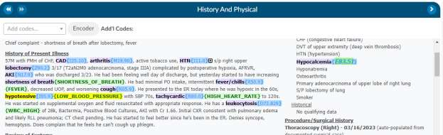

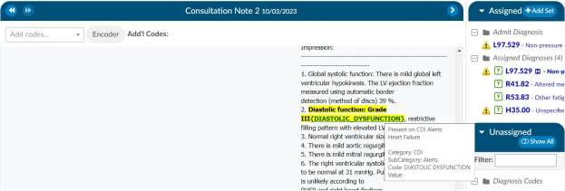

When you click on a hyperlinked evidence that is folled by result date and time, indicating a discrete
value abstracted from the flowsheets, it will automatically take you to the corresponding location in the
flowsheets and highlight the respective row.

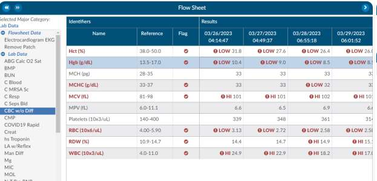

Another noteworthy capability within Clinical Evidence is the ease with which a CDIS can incorporate
additional evidence. While reviewing documentation and flowsheets, if CDIS identifies items deemed
crucial for inclusion in the CDI/Clinical Alerts as supporting evidence for a query, they can effortlessly highlight
words or phrases in a document, up to a maximum of 1000 characters, and perform a right-click. This
action triggers a menu presenting various options, including one that reads "Copy to CDI Alert." Clicking
on this option reveals a pop-out menu displaying available Alerts to which the evidence can be added

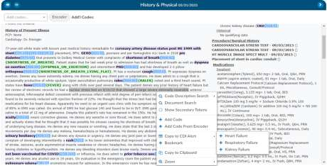

Upon selecting the desired Alert, the system opens the Evidence Editor, allowing the CDIS to specify
where the evidence should be attached. If the CDIS clicks on existing evidence, the new evidence will be
attached below it. Therefore, it is crucial to ensure that, when determining the placement, the CDIS
selects the appropriate location by clicking above. Once the evidence is copied over, the system
provides details such as the evidence itself, the name of the document, and the date. For Laboratory
Studies, it includes the result date and time.

After incorporating the evidence into the designated alert, any highlighted evidence will be displayed in
the document in purple, accompanied by the phrase "MANUALLY_ADDED" in green at the end. This
informs the user that the evidence was added manually. Similar to other evidence, hovering over the
green-highlighted section will provide information about the CDI/Clinical Alert to which the item was applied.

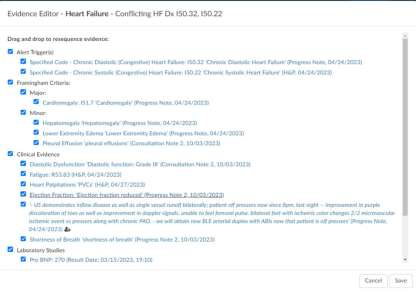

Next when going back to the CDI/Clinical Alerts viewer you will notice check boxes present next to the evidence
which serves two purposes. Firstly, if you initiate a query, any evidence marked with a check mark will
be automatically be copied to your clipboard, enabling you to conveniently paste it into your query. This
copying action occurs when you click on the envelope icon

Secondly, unchecking any of the clinical evidence will put a strike through the text and it will prevent it
from being copied over. Additionally, any unchecked evidence will be reported back to Dolbey's clinical
team if an Alert is closed due to it having invalid clinical indicator, insuffiecient clinical evidence or
documentation is already present.

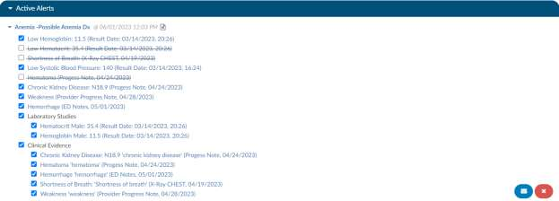

### How to initiate a Query

In the right hand corner of the Alert you will see a blue envelope icon next to a red x icon. When you
click on the blue envelope it will launch you into the query.

### Query

Once in the query you will notice that a template will autoload for the specific Alert. These autoloaded
templates can be set by the management staff templates specific to each site and what they use as
querys.

The evidence previously examined on the Alerts viewer page can now be effortlessly incorporated into
the query. When the query button is pressed, the selected evidence will be automatically copied to the
clipboard. You can then paste it using a simple process, either by pressing the "ctrl" and "v" keys, the
standard Windows keyboard shortcut for copying, or by performing a right-click and choosing the paste
option. After the query is submitted, the corresponding CDI/Clinical Alert will transition from the Active Alerts
section to the Closed Alerts section.

Once that query has been submitted that CDI/Clinical Alert will move from the Active Alerts section down to the
Closed Alerts section.

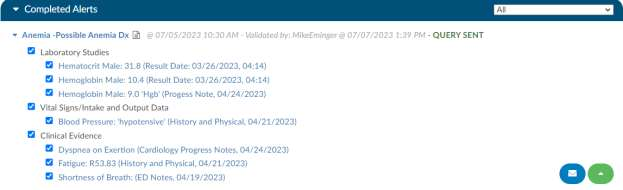

## Autoresolve

The Alerts have the ability to autoresolve themselves if documentation comes in that would satisfy the
Alert. Once an Alert is Autoresolved it will move to the Close Alert section. This will ensure that we are
only putting Alerts to the end-user that require attention. We don’t want them to have Alerts that need
no action.

## Closing Alert without Querying

If a CDIS chooses that an alert needs closed not by a query being initiated by the envelop button. This is
done by clicking the red x and it provides several choices for closing an Alert. There are several options
to state why an Alert is being close without query being sent or placed. There is a section at the bottom
for additional notes that we encourage the specialist to provide a deeper understanding of why the
closed.

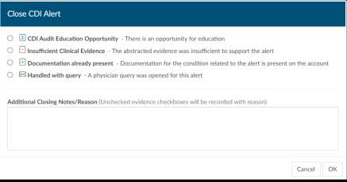

## Documentation Reviews

If your site does different styles of CDI reviews or want to track management reporting different than
how our default tracks, you can use the documentation review viewer to track reviews by topic. Other
organizations have used this if there CDI team would like to do a utilization management type review
and it doesn’t fit the typical initial or follow up review.

By default, documentation reviews by design have a free form text field however, you can also create
forms within the form designer for each of these reviews.

If your site does not have documentation reviews enabled, and you wish to track reviews different than
the default contact us at smeteam@dolbey.com we can show you a demonstration and discuss if this is a good fit
for your organization.

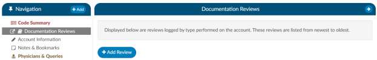

By clicking on “+ Add Review” you can select the type of review that you wish to complete. 

> [!tip] Review Type List Configuration
The list of review types presented here are configurable by a site administrator through
[Mapping Configuration.]

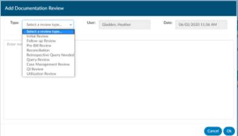

Then, type in your notes.  Finally, click Ok to save.

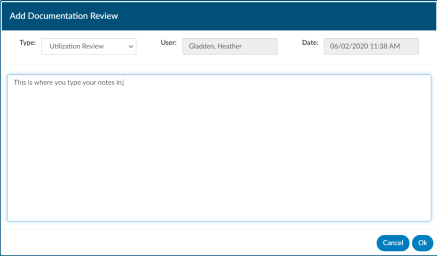

Each review is saved, there are custom management reports to report out specific reviews and the CDI
Management and CDI Personal Dashboard will all change to accommodate these custom reviews, if you
do not have this enabled custom review info will be hidden since its not appliable.

