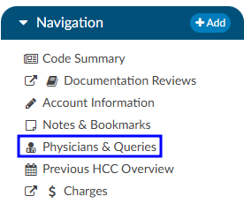
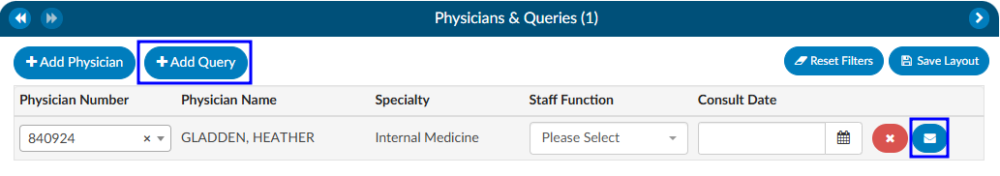
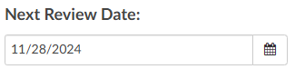

+++
title = 'Chart Reviews'
weight = 10
+++

Statistics can be tracked using the CDI Personal Dashboard. The CDI Dashboard includes data for Today and This Week only, and figures are all based on the current week. This also provides the CDI Specialist with DRG and reconciliation data.

## Initial Review

An initial review is a case that has never been reviewed by CDI user in Fusion CAC. A CDI review for inpatient charts must have a working DRG associated to be considered "reviewed". If there is no DRG then the patient is considered new.

When a CDI Specialist (CDS) creates a Baseline DRG (the first Working DRG), then edits the account (further
causing the Working DRG to be cleared), and then saves the account without computing a new
Working DRG, the creation of the Baseline DRG also counts as an initial review.

The CDS will review the patient chart documentation and assign any codes necessary to calculate a working and/or baseline DRG. The CDS may see more codes than are necessary to calculate the DRG(s). Codes displayed on the chart are all the suggested diagnosis and procedures codes to provide a better picture of how coding would look at this chart. Any codes that are not needed for calculation of the DRG can be ignored. 

>[!Note] 
>The **system does not take the place of a coder**; this is the computer’s best guess at how coders would have coded the chart

While reviewing, if the CDS has notes they wish to add to the chart they can add an ‘Initial CDI Worksheet’. The CDS worksheet cab be customized per organizational needs and preferences. This section outlines the initial default worksheet *prior* to customization.

The CDI worksheet *can* include any notes that are needed such as:

- Medical History
- Labs/Procedures
- Medications
- Clinical Indicators

If a physician query opportunity is identified, the CDS should query the physician by sending an electronic query through the Physicians & Queries viewer in the navigation pane. 

In the Physicians & Queries viewer, if the provider the user wants to query is listed on the page they can click on the blue
circle with the envelope icon. If the provider is not listed, they should click on Add Query. Either the Add Query or the Envelope icon will take the user to the same place, however selecting Add Query requires the user to manually enter in the provider they wish to query. 

##### Creating a Query:

- **Physician** - search for the desired physician using either the physican's last name or physican number
- **Template** - select the appropriate query template from the dropdown list
- **Reason(s)** - choose the appropriate reason(s) for sending the query
- **Query Body** - fill out the selected query template as needed
- **Finalize** - once completed, click send to send the query to the physician

>[!Info] 
>Finalizing a query may differ between organizations. Be sure to check with your {} manager for best practices observed by your facility. 

## Follow-up

A CDI follow-up is a case that has already been reviewed at least once by a CDI user withing Fusion CAC. A CDI review for inpatient charts must have a working DRG associated to be considered reviewed. If no DRG then the patient is considered new. A follow-up case can reoccur; the default interval is every 24hrs until the patient is discharged. However, CDI staff can override this interval by changing the next
review date on the Code Summary viewer.

## Reconciliation

After discharge, the coder will assign a Final DRG. How the organization has choosen to set up workflow will determine what happens after the coder clicks Submit. Commonly, organizations choose for charts to flow into a reconciliation queue for a CDI team member to review (if the last known working DRG and the final DRG do not match). When the coder clicks submit, the chart either
- is sent outbound and goes to the reconciliation queue. If the Coding DRG needs changed it will need to be resubmitted
- is **NOT** sent outbound until CDI reviews the chart and reconciles 

In the event the DRGs are not a match, the CDI Specialist will see an active Reconcile button instead of the usual grayed out Submit button.

Clicking on the Reconcile button will bring up a window displaying the DRG difference.

From here the CDI Specialist has 3 options.

- **Cancel** will take the user back to the account screen where they can make any coding adjustments or send a Physician Query
- **No** will result in the account being closed and the CDI Specialist being back in the Account List. *The user has not agreed with the code.* 
- **Yes** will result in the Working DRG being automatically changed to match the Final DRG. The account will close and the CDI Specialist will be back on the Account List

>[!Note] Outpatient CDI
>Organizations with users performing CDI on outpatient charts will meet with the Dolbey SME to set up outpatient specific  workflow for their CDI team.

