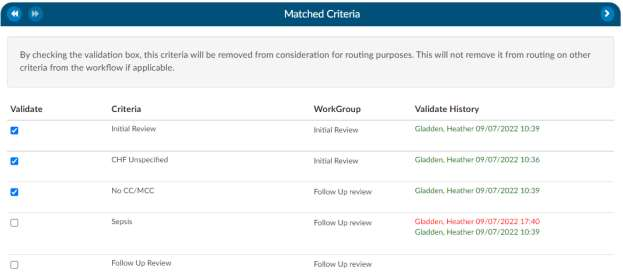

+++
title = 'Matched Criteria'
weight = 50
+++

> [!note] CDI Users Only
The Matched Criteria viewer is only shown if your current role is CDI.

Matched criteria allow you to see why the chart was routed to you. The matched criteria group is a list
of “criteria group” that the chart matched upon when it went through workflow. These criteria groups
are used to indicate a “possible” query opportunity based upon the criteria outlined in workflow.

### Prioritizing Workflow using Matched Criteria

Matched criteria can be used to prioritize workflow. There are two fields that can be used to prioritize
workflow one is “criteria group” this will tell you the name of the criteria that the workflow routed the
chart to the CDI users often times the field is renamed to “Routed Reason” because this field represents
why the chart was routed to the user. If the chart matches upon many criteria groups the criteria group
that is displayed in this field it the first one that it matched upon all others that it matched upon will
display within the matched criteria viewer when you open the chart.

There is another field named “Active Matched Criteria Groups” this is often renamed to be
“Opportunities” this is defined as the number of matched criteria groups the chart matched on which
reflects the total number of possible query opportunities currently present on the patient chart. This
field can be used by the CDI user to sort the worklist based upon the charts that have the most to least
possible query opportunities.

Once a CDI user validates a criteria group which can be done by checking the box next to the criteria
name. By checking the validation box, this criterion will be removed from consideration for routing
purposes. This will not remove it from routing on other criteria from the workflow if applicable.

If there are two worklist that have the same matched criteria group names the chart had a prior
matched criteria group with the same name already validated, it will not retrigger and display on the
matched criteria viewer.

