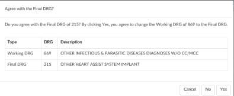

+++
title = 'Chart Reviews'
weight = 10
+++

There are 3 different types of reviews:

1. Initial
2. Follow-up
3. Reconciliation

## Initial Review

An initial review is a new case in terms of ‘CDI’ and is referred to as a case that has never been reviewed
by CDI. A CDI review for inpatient charts must have a working DRG associated to be considered
reviewed. If there is no DRG then the patient is considered new.

When a CDI Specialist creates a Baseline DRG (the first Working DRG), then edits the account further
causing the Working DRG to be cleared, and then saves the account without computing a new
Working DRG, the creation of the Baseline DRG also counts as an initial review.

The CDS will review the patient chart documentation and assign any codes necessary to calculate a
working and/or baseline DRG, the CDS may see more codes than are necessary to calculate these. The
codes not needed for calculation of the DRG can be ignored. The codes displayed are all the suggested
dx and procedures to provide a better picture of how coding would look at this chart (the system does
not take the place of a computer; this is the computer’s best guess at how coders would have coded the
chart).

While reviewing, if the CDS have notes they wish to add to the chart they can add an ‘Initial CDI
Worksheet’.

> [!info]
> Each site will have its own CDS worksheet, and they may be called something different, the initial
> worksheet is a default if the site has not added or change the worksheets.

This worksheet can include any notes that are needed such as:

- Medical History
- Labs/Procedures
- Medications
- Clinical Indicators

If a physician query opportunity is identified, the CDS should query the physician by sending an
electronic query through the navigation menu item listed as Physicians & Queries. When the CDS is in
Physicians & Queries if the provider they wish to query is listed on the page they can click on the red
circle with the envelope icon. If the provider is not listed, they click on Add Query. Either the Add Query
or the Envelope icon will take you to the same place, however if you select Add Query you will need to
manually enter in the provider you wish to query. To create a query, follow these simple steps.

1. Place your cursor in the field marked Add physician. Start by typing the physician’s last
name. The more you type the more relevant the choices are.
2. Select a query template from the drop-down menu.
3. Select a reason for the query.
4. Fill out the query template as needed.
5. Once completed, click send to send the query to the physician.

## Follow-up

A follow-up case in terms of ‘CDI’ is referred to as a case that has already been reviewed at least once by
a CDS. A CDI review for inpatient charts must have a working DRG associated to be considered reviewed.
If no DRG then the patient is considered new. A follow-up case can reoccur; the default interval is every
24hrs until the patient is discharged. However, CDI staff can override this interval by changing the next
review date.

## Reconciliation

After discharge, the coder will assign a Final DRG. Depending on how your organization has set up the
workflow will depend on what happens after the coder clicks Submit. Some organizations choose to (if
the last known working DRG and the final DRG do not match the charts) flow into a reconciliation queue
for a CDI team member to review. When the coder clicks submit it can either send the chart outbound
and go to the reconciliation queue and if the Coding DRG needs changed it will need to be resubmitted
OR you can choose for the chart to NOT go outbound until CDI reviews the chart and reconciles then
chart then it would go outbound. There are other options however, these are the two most common
workflow paths. If you are performing CDI on outpatient charts this workflow will not apply however, 
there are many different ways reconciliation can happen on outpatient charts please call Dolbey to
discuss.

If the DRGs are not a match, the CDI Specialist will see an active Reconcile button instead of the usual
grayed out Submit button.

Clicking on the Reconcile button will bring up a window displaying the DRG difference:

From here the CDI Specialist has 3 options. Clicking Cancel will take them back to the Account screen,
where they can make any coding adjustments or send a Physician Query. Clicking No will result in the
account being closed and the CDI Specialist being back in the Account List. They have not agreed
with the code. Clicking Yes will result in the Working DRG being automatically changed to
match the Final DRG. The account will close and the CDI Specialist will be back on the Account List.

The CDI Dashboard includes data for Today and This Week only, and figures are all based on the current
week. This also provides the CDI Specialist with DRG and reconciliation data.
