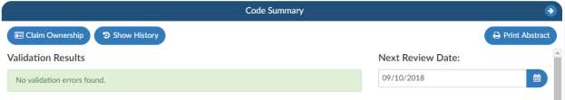

+++
title = 'Next Review Date'
weight = 40
+++

Next Review Date field can be changed to a different date other than the default which is every day.
A CDS can change the interval that the chart is routed back to a queue, when on the code summary page
changing the calendar date field from the date displayed to a future date. This will tell the chart to not
route back to the “Follow-up Review” until the current calendar date matches the date you changed the
next review date to.

