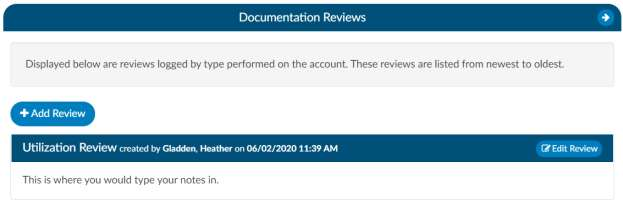

+++
title = 'Receiving Credit for Reviews'
weight = 30
+++

## Receiving Credit for Reviews

| Review Type               | Details |
| ------------------------- | ------- |
| **Initial Review**        | For Inpatient charts this is the first time a working DRG is computed and saved on a chart by a user with the role of CDI. For outpatient this is the first time a chart is opened and saved by a user with the role of CDI.
| **Follow-up Review**      | For Inpatient charts this any subsequent time after the initial a chart is accessed a working DRG is computed and saved on a chart by a user with the role of CDI however, a chart is only counted 1 time per day. For outpatient this is the first time a chart is opened and saved by a user with the role of CDI however, a chart is only counted 1 time per day |
| **Reconciliation**        | Reconciliation can only happen 1 time per chart, so pass back and forth do not count. |
| **Query Completion**      | This is counted as a Subsequent or Follow-up Review. |
| **Documentation Reviews** | If your site does different styles of CDI reviews or want to track management reporting there are reports for documentation reviews, different than how our default tracks, you can use the documentation review viewer to track reviews by topic. Other organizations have used this if there CDI team would like to do a utilization management type review and it doesn’t fit the typical initial or follow up review. |
