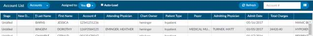
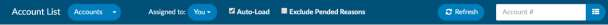
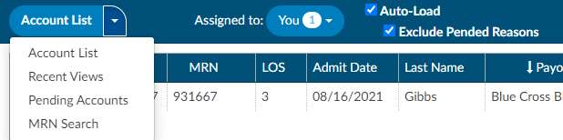
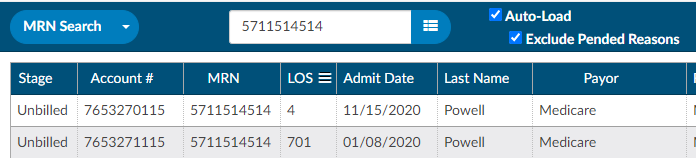

+++
title = 'Account List'
weight = 10
+++

## {} Accessing your Workgroups

A Workgroup is a list of work that needs to be completed by you or someone else who is assigned to the 
workgroup. Workgroups are set up by your administrator and are usually broken down by patient type or
hospital service. 

To access your Workgroups, start by clicking on the down arrow to the right of the 
{}Assigned to{} button to view a list of your assigned workgroups.

> [!note]
If you do not see any groups in your drop-down, ensure the
drop-down menu to the left of {}Assigned to{} says **Accounts**, if it does contact your {} supervisor.

> [!info] Why am I in this workgroup?
If you want more information on how your workgroups are set up or why you are assigned to a particular
workgroup, you should contact your Fusion CAC site administrator or {} supervisor.

## {} Sorting and  {}Filtering Accounts in a Workgroup

Once you have selected the Workgroup that you have been
assigned, a grid with charts should appear. You can customize
the visual presentation of account details using the column
menu settings to pin, auto size, sort, filter, and select columns to display.

> [!note] Column Settings are Per-User
> These settings will be retained on a per user basis for all future coding sessions until another
configuration is applied

## {} Selecting a Patient Account from a Workgroup

Click anywhere on the row of your selected account to open it for review and coding.
If you are working from a printed work list or want to look up a specific chart, you can access the chart
by typing the account number into the **Account #** field on the right side of the Account List bar. The
entered chart will open after you hit the {}Enter{} key or click the 
{} List icon.

## {} Recent Views

The {}Recent Views{} menu item allows you to quickly find the charts you recently accessed in sequenced
order.

## {} Pending Accounts

The {}Pending Accounts{} menu item displays all of the accounts that currently have
a **Pending Reason** set.

## {} MRN Search

The {}MRN Search{} allows you to search accounts by MRN.

