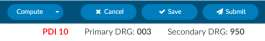
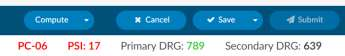
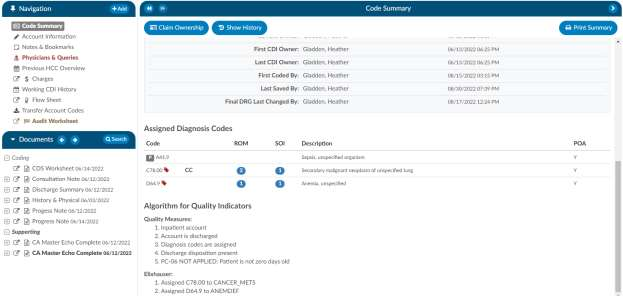
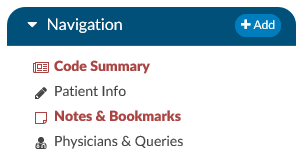

+++
title = 'Account Screen'
weight = 50
+++

## Banner Bar

Below the Accounts Action Bar is the Banner Bar.

From the Banner Bar, you can toggle between account demographic information and Primary DRG
information by clicking on the Primary DRG hyperlink. The DRG view displays information available from
the encoder for the computed DRG. You can also click on the Patient Name to expand collapse the
account demographic and DRG information. The Accounts Info bar includes information on the account
including:

- Gender Icon
- Patient Name – Last Name, First Name & Middle Initial
- Gender – Female or Male
- Age
- Date of Birth
- Medical Record Number

Below the account info bar, you will see 4 other sections including the following:

### Admit Info

- Admit Reason
- Admit Source
- Transferred From
- Attending Physician

### Discharge Info

- Discharge Disposition
- Discharged to

### Location

- Building (if applicable)
- Service Type

### Financial

- Primary Insurance
- Fin Class
- Total Charges

### DRG/APC

The DRG or APC information will appear on the Banner Bar after codes have been assigned and DRG or
APC computed and returned from the encoder.

### Quality Indicators Module

This module is an additional cost that adds on the ability to identify PSI, Quality Measure PC-06 and the
Elixhauser Measures. If you want to learn more about this quality module you can contact the SME team
for more details at smeteam@dolbey.com.

#### PSI Indicators

The PSI Module uses the PSI technical specification from Agency for Healthcare Research and Quality
U.S. Department of Health and Human Services from www.qualityindicators.ahrq.gov.

Fusion CAC uses the final codes assigned by coders along with other patient data that meet each PSI
guideline. Fusion CAC provides an indicator on the banner bar to a coder when codes coupled with
patient demographics meet a PSI guideline.

This PSI indicator displays in the banner bar under the compute button. The PSI is reported in one of two
fields CDI PSI Indicator or PSI Indicator if identified by a coder. The indicator can be used for workflow
and/or reporting.

#### PDI Indicator

The PDI Module uses the PDI technical specification from Agency for Healthcare Research and Quality
U.S. Department of Health and Human Services www.qualityindicators.ahrq.gov.

The Pediatric Quality Indicators (PDIs) focus on potentially preventable complications and iatrogenic
events for pediatric patients treated in hospitals and on preventable hospitalizations among pediatric
patients, taking into account the special characteristics of the pediatric population.

This PDI indicator displays in the banner bar under the compute button. The PDI is reported in one of
two fields CDI PDI Indicator or PDI Indicator if identified by a coder. The indicator can be used for
workflow and/or reporting.

The algorithm for the PDI on if it applied or not is within the code summary pane.

#### PC-06 Indicator

The Quality Measure Module supports the PC06 measure and uses the Joint Commission technical
specification https://manual.jointcommission.org/releases/TJC2018B/MIF0393.html.

Fusion CAC uses the final codes assigned by coders along with other patient data that meet each PC-06
guideline. Fusion CAC provides an indicator on the banner bar to a coder when codes coupled with
patient demographics meet a PC-06 guideline. The indicator can be used for workflow and/or reporting.

This field indicator displays in the banner bar under the compute button as shown below.

#### Elixhauser Comorbidity Measure Indicator

The Elixhauser Comorbidity Index is a method of categorizing comorbidities of patients based on the
International Classification of Diseases (ICD) diagnosis codes. The indicator can be used for workflow
and/or reporting. This field indicator displays in the banner bar under the compute button as shown
below.

The algorithm to determine the Elixhauser measure can be found on the code summary at the bottom
under the assigned codes.

## Navigation Pane

The Navigation Pane sits above the Documents Pane on the left-hand side of the Account Screen. 
The Navigation Pane includes hyperlinks to pages within the chart providing summary views of
coding information, demographic information, as well as clinical documentation, workflow, and 
worksheets.

Any Navigation link highlighted in **RED**
indicates action items  required to finalize the chart or  additional information available for review and reference. 
**When the Code Summary link displays RED, there are validation errors on the chart that must be 
resolved prior to submission.**

Click on the **Add Document** button to add a document configured based on your user role.

> [!note] Document Type Configuration
Document types available to be added are configured by system administrators.
