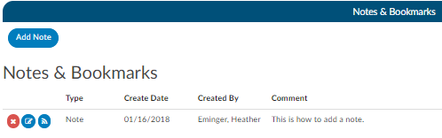
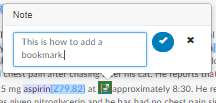
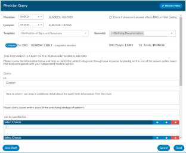
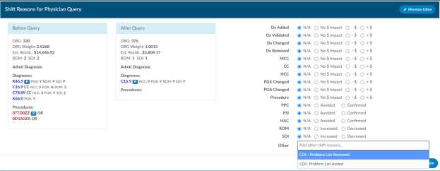
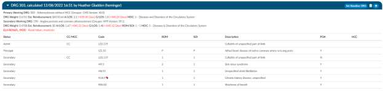
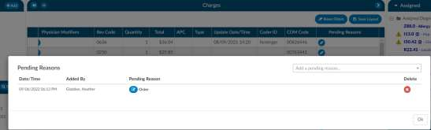
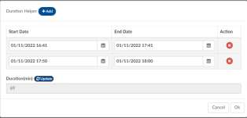
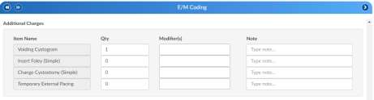

+++
title = 'Account Viewers'
weight = 60
+++

### Code Summary

The Code Summary screen shows a summary of activity on the account and provides activity buttons to
**Claim Ownership**, **Show History**, and **Print Abstract** (if a printer is configured).

This pane also provides information on **Current Owner**, **First Coder**, **Last Saver**, and **Last Submitter**.

You can expand the width of the Code Summary pane by clicking on the right-arrow in the top right of the pane.

### Review Validation Results/Errors

The Code Summary link in the Navigation Pane will be highlighted in
**RED**
when there are validation result errors for review and resolution.

Any errors preventing submission of the chart will be highlighted in the box under Validation 
Results on the Code Summary screen. **Validation Results** flag “errors” within the chart that should 
be reviewed and validated before the chart is finalized and submitted for billing. The **Submit** 
button will be grayed out until errors have been resolved, including pending reasons that have 
been assigned.

Once all validations results are resolved, the Code Summary link in the Navigation Pane will return to
black and you can hit the Submit button to complete the chart.

#### Coding Summary (Abstract)

Code Summary is the last pane to be reviewed prior to chart submission. The three main sections of the
Code Summary pane for review include:

- Validation Results
- Pending Reasons
- Assigned Diagnosis Codes
- Assigned Procedure Codes

#### Code Abstract

##### Assigned Diagnosis Codes

Below the Pending Reasons you will find the **Assigned Diagnosis Codes** in code sequence order. The
listing includes the diagnosis code, description, and POA assignment (Y/N).

##### Assigned Procedure Codes

Listed beneath Assigned Diagnosis Codes you will find the Assigned Procedure Codes in code sequence
order. The listing includes the procedure code, description, Service Date, and Physician.

##### Print Abstract

If a printer is configured for your computer, click on this button to print a copy of the abstract 
for this account.

##### Claim Ownership

Use the Claim Ownership feature based on your organization’s requirements and procedures. Consult 
your manager for more information on claiming ownership of a chart.

##### Show History

Show History button provides a timeline view of activity on the account along with an audit trail of
account activity from point of admission to the current date. 

It includes a visual timeline and below the timeline you will see an audit trail of account activity.

##### Timeline

When you open the show history button you will see the entire history from a birds-eye view. The user
has the options of using the *Zoom In* and *Zoom Out* buttons to expand or collapse the timeline.

The *Zoom Fit* will bring the visual timeline back to its original collapsed grid. Hover over any of the event
boxes and the contents will be displayed.

##### Timeline Legend

The legend can be found by clicking Show Legend to let the user know what the colors represent,
without having to hover over them. When clicked it will open the Legend and the button name will
change to Hide Legend. Click again to close.

##### Timeline Audit Trail

Click on an entry by date to view the changes that were made to the account on the date and time
indicated.

##### Validation Results

Within Code Summary pane, you can also view error messages in Validation Results. ERROR messages
should be reviewed and cleared in order to finalize and submit an account for billing.

##### Pending Reasons

A historical listing of Pending Reasons assigned to the account can be found within the Code Summary
Pane below Validation Results.

Pending reasons are used when a chart cannot be completed or routed to another Workgroup. The
number of pending reasons selected is unlimited. Pending reasons will be different for each facility
based on system configuration specifications. Please contact your system administrator for definition
and use of available pending reasons.

You can add a Pending Reason to the account by clicking on the drop-down menu and selecting the
applicable Pending Reason. If your organization has selected to allow a physician to be tied to a pending
reason, you will be prompted to assign a physician to the pending reason, and you will see an additional
physician field in the list of pending reasons, as illustrated below.

> [!info]
> If physicians have been turned on for pending reasons, not all pending reasons may be tied to a
> physician. This option is set within the mapping configuration.

If a pending reason is added to an account, the Submit button will be grayed out and unavailable. Click
on the Save button to save all changes and exit the chart. Charts with pending reasons will stay within
the existing Workgroup until the Pending Reason is removed. Pending Reasons can also be
deleted/removed from accounts by clicking on the next to the Pending Reason to be removed.

##### Pending Reason Notes

On any account, an edit button will now appear to the left of the pending reason. Clicking that button
will drop down a note entry where the user can record a note. Pressing ENTER will record the note. Keep
in mind that a note can be deleted by clicking a trash can symbol to its left. In Account Search, the
"Pending Reasons" drill down will now include the "Note" field.

### Account Information

The **Account Information** pane summarizes patient demographic information (based on system
configuration) with data captured for purposes of state and/or registry reporting.

You can expand the width of the Code Summary pane by clicking on the right arrow in the top right 
corner of the pane. To update data fields in the Account information pane, click on the blue button 
and select the appropriate selection from the drop-down menu.

#### Unspecified Code Edit Flag

On
[April 1, 2022 CMS made the Unspecified Code Edit](https://www.cms.gov/files/document/mm12471-april-2022-update-java-medicare-code-editor-mce.pdf)
effective. This new edit is triggered when a code from the unspecified code list is assigned by a coder.
It is the provider’s responsibility to determine if a more specific code from that subcategory is available
in the medical record documentation by a clinical provider.

If additional information to identify the laterality from the available medical record documentation by any
other clinical provider is unable to be obtained or there is documentation in the record that the physician
is clinically unable to determine the laterality because of the nature of the disease/condition, then the
provider must enter that information into the remarks section.

Specifically, the provider may enter **“UNABLE TO DET LAT 1”** to identify that they are unable to obtain
additional information to specify laterality or they may enter **“UNABLE TO DET LAT 2”** to identify that the
physician is clinically unable to determine laterality. If not entered, the claim will be returned.

Dolbey can support the addition of this field to your account information viewer and send the necessary
information, known as the billing note, downstream if required. If this is something that you need, please
reach out to the Dolbey SME Team at smeteam@dolbey.com. Below is an example of what it could look
like in the account information viewer.

### Notes & Bookmarks

The Notes & Bookmarks becomes visible in the center pane after clicking on the hyperlink from the
Navigation Pane. This pane presents a summary and chronological history of all notes and bookmarks
added to this account.

#### Add Note

Notes can be added to the patient chart by clicking on the **Add Note** button within the Notes &
Bookmarks Pane.

When notes or bookmarks are applied to the chart, the Notes and Bookmarks link in the Navigation
pane will turn red.

#### Adding formatting

Account Notes also have formatting options for text. Once you type something you can highlights and a
popup with formatting options displays. A user can now select text in those areas and can change the
styles of text.

#### Publicly Visible Note

After clicking the add note button, enter the account note Comment in the Comment window. You have
the option to make this note publicly visible among all users by clicking on the checkbox.

To keep your Comment box open while continuing to work on the chart, click on the Minimize Editor
button. This will move a placeholder to the **Accounts Action Bar**.

#### Note Icons

#### Setting a Note/Bookmark to Private

If an end user puts a note on the account, they can make it public or private. Even if an end user marks a
note/bookmark as private users that have a role of administrator or manager can still see private
messages. The private note/bookmark is simply marked private from all other users that do not have the
role of administrator or manager. This feature allows for a manager to review a patient chart and if they
do not want the existing public note to show in the account note, they can change an existing note
private without putting in a new note. Then they have to make it public, then switch it to private in
order to have the account note blank.

#### Add Bookmark to a Text Document

You can add a bookmark to a document by highlighting the relevant word(s), phrase or location within
the text and then right-clicking to open the Bookmark menu.

Left-click the location within the selected document or specific text for bookmarking, then right-click to
open the Bookmark window. From the Bookmark menu, select Bookmark to open the Note window to add your note 
for this bookmark.

Add the note for your bookmark in the Note text box, then click the checkmark button to save the bookmark 
with your note for future reference. Bookmarks within documents will have the bookmark icon. To view 
bookmarks from within a document, click on the green list icon to open and view the bookmark note.

To review all bookmarks within a chart, go to Notes & Bookmarks in the Navigation Pane. All of the 
bookmarks within the chart are listed in the Notes & Bookmarks pane.

You can take further action on bookmarks within the Notes & Bookmarks pane using the following icon
action buttons

| Icon                   | Description |
| ---------------------- | ----------- |
|  | Click on this button to delete the selected bookmark. |
|  | Click on this button to edit a previously added bookmark. |
|  | Click on this button to jump to the location where the bookmark was created. |

> [!info]
> Bookmarks cannot be added to images/scanned documents.

### Physicians & Queries

Within this page you can add physicians and change the staff function. if it is not correct.

#### Adding & Editing Physicians

The bottom portion, ‘Account Physicians’, is pre-populated by your registration system. Physicians can
be added, changed, or removed if incorrect or missing. To add a physician, click on the ‘Add Physician’
button and begin typing in the physician’s last name to populate a list to choose from, then click add.
Choose the staff function that fits the physician you choose. If it is a consulting physician enter in the
consultation date.

#### Removing a Physician

To remove a physician that either you added or was sent incorrectly from the registration system click
on the red ‘X’ button to remove the physician.

#### Save Layout and Reset Filters

When moving around the columns in the Physician Queries grid and then clicking the Save Layout
button, the columns and order will be saved for the Queries grid for all future accounts for that user.
Any other user will see the default layout. Next to the Save Layout button is a Reset Filters button, this
will take any custom layout and change it back to the default fields.

#### Adding a Query

You can also add a physician query if your facility has chosen to use this feature. To add a query to a
physician that is listed, click on either the envelope icon next to the physician or if the physician is not
listed then click on ‘Add Query’.

Add a physician if the physician did not auto fill by clicking on the ‘add physician’ button and begin typing
in the last name. Then click on ‘Select Template’ to choose the query template you wish to use

#### Adding a Cosigner

If configured, you will be able to see a co-signer field that allows you to assign a cosigner. The cosigner
field is a field that can be sent in the outbound interface for the query. The receiving system can
choose to use this process if the co-signer needs to receive the query after the main user answers,
but before it gets returned to Dolbey.

When a physician query is created, a new "Cosigner" physician dropdown appears below the existing "Physician"
dropdown. Filling in this field is optional. When the query is saved as a draft or sen outbound, the cosigner
field will be saved with the query and sent as an additional recipient.

In the grid inside the Physicians & Queries, the user may also choose to add "Cosigner" as a visible
column.

#### Creating the Query

Write the query or fill out details as needed. Please refer to your manager for details as each organization
has custom query templates and additional details surrounding queries. Once completed, select from the
reason dropdown why you are sending the query and above that field check the box if the query will affect
final coding.

Click “Send” to complete and send the query or click “Save Draft” if you are not ready to send. If you save
the query as draft, you will notice there is now a draft query section that is separated from sent or closed
queries. If a user has at least one draft, but no sent queries, the total drafts count on their personal
dashboard will display as zero.

Alternatively, for organizations who do not have a physician query interface AND do not create a physician
query until a response is received, a query can be created and not sent. When enabled, a physician query
will show a “Continue” button in place of “Send”. Clicking the “Continue” button will refresh the query to
open the physician response fields so that the query can then be closed.

If you want an automatic signature to be addended to the query you can add it within each users profile.

#### Placeholder Queries

Some customers create a physcian query and then copy and paste it into a different system rather then
send them through and interface this is called a place holder query for reporting and transparence of
other users. There is a feature that can be activated within the 2.52 release that allows text entered into
field will no longer display in bold if you want to activate the non-bold text option please contact CAC
Support. The bolding was intially added as an option for those sites to be able to tell what was keyed in
by the end user appart from the template.

#### Query Status

You can see the status of the query in the actions column on the query grid. The following are status
options:

| Status    | Defined |
| --------- | ------- |
| Open      | This is a query that has been sent but not yet responded to by the provider.
| Answered  | This is a query that has been sent and has received a response but, it has yet to be closed by the end user.
| Cancelled | This is a query that has been cancelled by the end user, you will see in the status column cancelled followed by the reason for the cancel such as created in error, wrong account, or others.
| Closed    | This is a query that has been closed by the end user, you will see in the status column closed followed by the outcome of the query such as agree, disagree, no option or no response.

#### Closing a Query

When you are ready to close a query, whether that be to review a response and update the outcome or
to cancel a query, you can click on the envelope icon.

Upon clicking on this icon, you would open the query to see the response from the provider if they 
answered.

#### Query Response Show Diff

The physician query has a "Show Diff" toggle above physician query responses in the Physician Query
dialog

Clicking it will show additional text in blue highlighting and deleted text in red highlighting. When the
diff is shown, the button changes to "Hide Diff," which when clicked will show the unaltered response.

> [!info]
> If you have an interface that imports the physicians response the diff logic may report false
> positives and false negatives, like changes from double quotes to single quotes or the addition/deletion
> of blank lines.

After reviewing the response, you can then close the query as agree, disagree, no opinion, no response
or cancel if needed.

#### Documenting Shift Reasons

Shift reasons can be categorized as either automatic or manual. In the case of automatic shift reasons,
the following dialog box will not be visible. However, if you have enabled manual shift reasons, you will
encounter the dialog box below. If you wish to enable or disable this feature, please contact CAC
Support.

Upon selecting an outcome for the query, such as "agreed," and if your site has chosen to collect shift
reasons, a dialog box will appear. This dialog box will display the pre and post-query DRG (if applicable)
along with options for shift reasons. These shift reasons can be chosen by the end user to explain the
rationale behind the change in the DRG. It's important to note that changes in the DRG might occur for
reasons unrelated to the query outcome. Please be aware that the shift reasons dialog is customizable,
so your site may offer different options than what is shown in the screenshot below.

#### Query Impact

Upon initiation of the query you will see a ‘Compute Button’ below the template name. Click to
compute your Pre-Query DRG if there isn’t one already showing. By clicking this button, it will take
whatever ‘Assigned Codes’ you have currently added to the chart to compute a DRG.

Once the pre-query DRG is completed you would follow the same process to send the query. Once the
query has been responded to you would then open the query to complete and since we are capturing
impact, you will now compute a post-query DRG. Likely the previous DRG would auto-populate unless
you made changes to added, deleted, or changed any codes, re-sequenced or changed the discharge 
disposition. If there is no DRG then follow the same process you did pre-query.

Post Query you will see a ‘Compute Button’ below the template name.

Click to compute your Pre-Query DRG. By clicking this button, it will take whatever ‘Assigned Codes’ you
have currently added to the chart to compute a DRG you can minimize the query and added, deleted, or
changed any codes, re-sequenced or changed the discharge disposition then recalculate.

#### Quick Complete

The Quick Complete button is designed for sites that create placeholder queries ONLY. This feature
allows a user to log a query without sending it externally. The query logging allows the user to assign a
provider, template, reason, and both pre and post-DRG information along with closing the query with
shift reasons all in one session. This quick complete button aims to streamline these actions into a
single, integrated process. This feature is a new opt-in feature that needs to be turned on. Contact CAC
Support to enable this feature.

Once enabled, create a new physician query, and notice a new "Quick Complete" button in the footer.
Clicking it will automatically save the query and reopen it with "Record Physician Response" expanded to
record a physician's response. The "Quick Complete" button only appears on new queries, including
queries opened from drafts. It will not appear if a query is edited or if a query's physician is changed.

#### Physician Query Grid

At the bottom of the Physicians & Queries page any query that was created will display whether you
were the sender or not. If there is data in the table then there are queries that have been sent. If there
are queries you will see the below grid. This grid will display information about when the query was
created by whom, who it was sent to and if there was a reply and when. The actions column has 3 main
actions; open which means that the query has not been answered, replied meaning that the physician
has replied but the coder has yet to close the query, and Closed – meaning the coder has closed with an
agreed, disagreed or no opinion status.

#### Change Physician Queried

This button allows you to change the physician if you sent the query to the wrong physician. Click on the
Change Physician button and select the new physician. This will change the physician and open a Send
New Query button next to the new name. Clicking this will cancel the original query and send the query 
out to the new physician you selected.

> [!info]
> Your site may not support canceling physician queries. If you redirect the query you may still have
> to cancel the query within the EMR; consult your manager to know if additional steps need to be taken
> to cancel the query in total to the originating physician.

#### Change Physician and Date/Time on Query

You can change the responding Physician since more and more are taking the "team" approach so that a
patient can get quicker care without taxing a single provider. Whomever is on call will take care of the
patient on behalf of the other provider and since the turn around reports are commonly tied a provider
we want to ensure the correct responding provider will get the credit for a quick turnaround.

**How can i change the responding provider?**

Once a query is opened and responded or you decide to record the physician’s response on behalf of the
physician you will see to by the provider you will see a section to select a physician and you can also
update the date in time if you are manually closing queries so that the management reports reflect
accurate turnaround times.

### Physician Coding Summary

The physician code summary will display if the physician coders are also coding within Fusion CAC, and
they submit the chart. This provides transparency between the facility and physician coding teams as to
what was coded.

By clicking on the header, it will expand the selection so you can see the codes that were coded. If you
see any codes with a plus (+) sign it means that you have not added this code to the account. The plus
(+) sign does not indicate that you need to add this code, it just allows you to quickly add the code if you
have determined you want to use this code using your coding judgment and supporting documentation.

### Final Coding Summary

The code summary will display if the facility coders submit the chart. This provides transparency
between CDI and your physician coding teams if they are using Fusion CAC as to what was coded.

By clicking on the header, it will expand the selection so you can see the codes and DRG/APC if
applicable. If you see any codes with a plus (+) sign it means that you have not added this code to the
account. The plus (+) sign does not indicate that you need to add this code it just allows you to quickly
add the code if you have determined you want to use this code using your coding judgment and
supporting documentation.

### Working CDI History

The working CDI History can be used to look at historical working DRG calculations. The coders cannot
edit this information, but they can review the data.

The first calculated DRG will assume the Baseline DRG role, which is used to calculate the CDI impact on
a chart. If you wish to change the Baseline DRG, you can click the "Set Baseline DRG" button.

#### Adding an Alternative Working DRG

You can also indicate which Working DRGs are an alternative DRG for reconciliation. By checking the box
next to each DRG, you are approving it as an alternative DRG to auto-reconcile the chart. You can
manually add an additional DRG if it does not appear in the list.

By clicking on the arrow prior to the DRG information it will expand the selection so you can see the
codes that went into the DRG and the sequence. If you see any codes with a plus sign it means that you
have not added this code to the account. The plus sign does not indicate that you need to add this code
it just allows you to quickly add the code if you have determined you want to use this code using your
coding judgment and supporting documentation. If applicable, the code’s HCC designation will show the
HCC number and its version.

### Suggested DRG

Fusion CAC suggests a DRG on inpatient charts. This Suggested DRG is computed by the system within a
set interval (typically every six hours of the patient’s admission provided there is enough documentation
to suggest codes used to compute a DRG).

The Suggested DRG is then re-calculated every six hours until discharge or a CDI Specialist or Coder
computes a DRG. At that time the Suggested DRG is discontinued. The Suggested DRG along with other
data elements are not commonly used within Fusion CAC, rather this data is sent outbound to be used
by other healthcare professionals ,such as physicians and case managers, to predict the number of days
that the insurance (payor) will pay for the patient to stay within the hospital based upon the current
diagnosis of the patient. The common data element used by case management and physicians is called
the GMLOS (Geometric Means Length of Stay).

#### How does suggested DRG work?

The suggested DRG module leverages the codes that are suggested by the FAE engine. The FAE engine
collects all codes suggested along with the section header that it was extracted from. The diagnosis
codes are then compared against a configuration file called “Invalid Headers”. If the diagnosis came
from a section header within this file it is discarded from consideration for the principal diagnosis. The
principal diagnosis code commonly is the driver of the DRG category; thus, the section of what diagnosis
is named principal is crucial in the success of the Suggested DRG. Once the codes have been picked
through for candidates, the codes are then passed through a modeling system to select the principal
diagnosis based upon historical data that the model has been trained upon.

#### Why do we discard diagnosis from being candidates for a principal diagnosis?

A patient’s chart contains a lot of information including historical information that is relevant for the
patient’s chart, but should not be considered as a principal diagnosis. The principal diagnosis can be
defined as primary diagnosis to which the majority of the resources were applied or the main reason the
patient was admitted. The “invalid headers” that are thrown out include medical history, problem list,
social history, and family history, among others.

#### How is Suggested DRG displayed with Fusion CAC?

It is displayed within a viewer called Suggested DRG. This is housed under the navigation tree and
displayed for users to see the timeline of the suggested DRG and how it evolved overtime. Below is a
screenshot of what the suggested DRG viewer looks like within the navigation tree. By clicking on the
blue header the tree will expand and show the coder along with the principal diagnosis that was
selected.

### Discrete Values and Flow Sheet Viewers

> [!info]
> This is a viewer that not all customers have access to. This an optional feature and may not be
> supported by your EMR vendor. The discrete values show trending data or data that has values. The most
> common examples of discrete values are lab values and vital signs.

Once you have clicked on Discrete Values or the Flow Sheet Viewer from the navigation tree you will be
presented with one of the two views depending on your desired configuration during the project.

#### Flow Sheet Viewer

The flowsheet viewer is the most recent style of discrete data viewer. This viewer is organized much like
a spreadsheet. Depending on your configuration, you may see major categories on the left-hand side of
the spreadsheet telling you lab power forms could be vital signs. (There are many different options as
each site is a little different.) Upon clicking on one of these items you will be presented with a grid to the
right. That grid will have multiple columns, the first column being name if you hover over the column
name you will see three little lines if you click on them, it will allow you to filter so that you can narrow
down the data. If any of those names appear in red that means that at least one of the data elements
are outside of the normal limits if there is a range.

To the right of the name you will see, if applicable, a reference column. This reference column will tell
you if the value is within normal limits. This is data that your EMR system has sent to the CAC system. If
the reference column is available, then to the right of that you will have a flag column. I A checkmark in
that field also means the value is out of the normal range to provide an additional indicator than just
the red coloring on the name. This column can also be filtered if you wish to look at everything outside
of the normal limits. Next to that field you will be presented with a date and time column, and you may
see multiple dates and times depending on how the data is organized and how frequently it is
documented.

If a discrete value on the Flowsheet viewer has a specimen, it will show as a beaker symbol in the
Results column. Hovering over the symbol will provide the name and site of the specimen.

#### Collapsing/Expanding

If you right click in the Major Category column will show a menu allowing the user to expand or collapse
all categories. That configuration will be saved for all accounts that have the Flowsheet viewer, per user
role. Note that if a user collapses/uncollapses a major category in the pop out, it will not be seen on the
main page until the user moves to a different viewer and back.

#### Discrete Values Viewer

An older style of discrete data can also be displayed in a discrete values viewer where you may see tab
across the top to display the categories of data. This displays each of the types of discrete data elements
your site has; however, your site might have different topics than the screenshot.

The Discrete Values viewer will display a Filter by Month box, listing the months that contain values.
Selecting a month will highlight all the corresponding dates in the Filter by Date box. The resulting
values will show in the viewing pane. The Normal and Abnormal tabs both have this functionality and
are filtered separately.

Discrete Values with a grey header are within normal limits, your organization sends what is the
reference point to determine what is normal and what is abnormal. If a header is display in red, it’s
considered abnormal by your organization. In addition to the header color, you can tell if the value is out
of normal limits as there is a flag that
indicates if the value is low vs. high.

> [!info]
> The flow sheet or discrete data viewer can be popped out into another window by clicking on a
> little square with an arrow pointing to the right in the navigation tree next to the flowsheet or data
> viewer name.

### Charges or Transactions

If an interface for account charges is set up during configuration, the Charges screen shows a listing of
charges on the account and provides activity buttons to **Save Layout** or **Expand** the Charges or transactions
pane. 

You can expand the width of the Charges or transactions pane to view more available columns by 
clicking on the in the top right corner of the pane.

This pane also provides information on **CPT Codes**, **Descriptions**, **Modifiers**, **Quantity**, 
**Service Date**, **Revenue Code**, and **Total Price**.

#### Column Settings

Each column within the Charges Grid has menu options to pin the column, Auto size, and reset columns. 
Click on the Menu icon to view the drop-down listing. 

After making your column setting selections,  click on the button to retain your column settings for 
future coding sessions.

| Icon                        | Description |
| --------------------------- | ----------- |
|       | Allows you to select the column and then pin it to the RIGHT or LEFT side of the assigned accounts grid. This function works similarly to freezing columns in Excel. |
|       | Select this option to change the column width to automatically size the width of the column for contents of the cells in this column. |
|       | To quickly Auto size all columns in the assigned accounts grid, click the **Auto size All Columns** button. |
|       | Click on this option to Reset Columns to their default column width. |

#### Adding Modifiers to Charges

Click on the ellipsis button in the Modifiers column next to the CPT Code that requires a modifier.

Click on the minus button to open the Modifiers window. Start entering the digits for the modifier to bring
up the drop-down listing of available modifiers and their descriptions to select the appropriate modifier.
After the modifier is in the window, click on the check button to save the selected modifier. Continue this
process to add all applicable modifiers to charges in the Charges pane. The user can add up to 4
modifiers unless they are using the 3M CRS encoder, then they will be able to add up to 5 modifiers.

#### Assigning diagnosis codes to Hard Charges

A user with the role of a physician coder can now add assigned diagnosis codes along withphysicians and
CPT Modifier codes to hard charges listed in the Charges viewer. When a physician coder opens the
charges viewer, new columns with edit buttons will be seen.

Clicking on the edit button for the Diagnosis column will open a code field, which, when dropped down, will
list all assigned Diagnosis codes on the account. The physician coder can then select which diagnosis code 
to attach that hard charge. The Physician column edit button will open a physician field to allow the 
selection of a physician, and the Physician Modifiers column edit button will open a modifier window allowing 
modifiers to be selected. When launching the encoder, the physician coder’s modifiers will be sent instead 
of the final modifiers on charge viewer.

> [!info]
> You must have physician coding enabled to use this feature, if you do not have physician coding
> please contact your account representative for more information.

#### Assigning a Pending Reason per Charge

Users that have a physician coder or single path coding role will have the ability to place a pending
reason per charge on the physician charges.

- If a charge is removed, then the pending reason would be removed.
- If a charge is updated, then the pending reason would not change.

#### Caution Column

A Caution Column is avaialble for sites that use the TruCode Encoder to the Transactions and Charges
viewers. This column will indicate a flag if TruCode reports an edit on a charge on an outpatient
account.

### Medications Viewer

A Medication Administration Record (MAR, or eMAR for electronic versions), commonly referred to as
a drug chart, is the report that serves as a legal record of the drugs administered to a patient at a facility
by a health care professional. The MAR is a part of a patient's permanent record on their medical chart.
The health care professional signs off on the record at the time that the drug or device is administered.
Common information collected such as

- Medication
- Dosage
- Route
- Start and End Date/Time
- Status

### Final Code Summary

The final code summary will only be available once the coder clicks the submit button. Once you submit
the chart and then open again you will see a new viewer under the navigation menu called the Final
Code Summary. This will show you what the coders coded for along with code status details and
sequencing. This data is view only available if your current role is ‘CDI’. If your current role is a coder,
this information will not be available; you can see this information on the code summary viewer.

If you see any codes with a plus sign it means that you have not added this code to the account. The plus
sign does not indicate that you need to add this code it just allows you to quickly add the code if you
have determined you want to use this code using your CDI judgement and supporting documentation. If
applicable, the code’s HCC designation will show the HCC number and its version.

### DRG Reconciliation

The DRG Reconciliation viewer displays the differences between the last known working DRG and the
final DRG coded by a coder, with symbols indicating the discrepancies. The viewer updates in real time
and does not store historical information. If the coder updates the DRG, the changes will reflect
immediately in the DRG Reconciliation viewer. For historical data, please refer to reports

### 30 Day Readmit

If the patient has been readmitted within 30 days of the admit date, the patient demographic data will
display below from the previous stay. If the previous stay was also coded, you will see the code

summary display below. If a check mark appears next to the code, this indicates the code on the
previous stay was also suggested for the current stay.

### Previous HCC Overview

The previous HCC overview will display the HCC history to show for both the current and prior year.
HCCs will be collected once the HCCs has been enabled in the mapping table. It is recommended to turn
HCCs on for all patient types to capture a more complete picture of HCCs. As a reminder, this will not
capture data prior to turning this feature on in the mapping table. (In mappings, under the Categories
mapping, there is a check box.) When HCCs are enabled, these will display below grouped by HCC
category and by code — showing the account number and MRN # for the visits each were associated to.

If a check mark appears next to the HCC category and code, this indicates the code on the previous stay
was also suggested for the current stay. If the patient chart you are currently coding has codes that
result in HCCs once they are added to the assigned code tree the code will display with an ‘H’ next to the
code. By hovering over the ‘H’ icon, the HCC category will display.

### Transfer Codes from Previous Encounter Viewer

Transfer codes can be used to help combine account codes into one encounter. Most sites leverage the
ADT to combine the actual account, however, you may need to copy codes from one encounter to
another.

If a patient has two different accounts and the coder has already done work on each of the accounts,
the Transfer Codes feature can be an easy way to post codes when you’re within one account and want
to search in another account, and have the ability to open that other account and see the codes.
To transfer codes, type in the account number, then click load account. Once you have loaded the
account, use the check boxes to the left of the codes to choose which codes you will transfer. Once you
have finished that, select “Transfer Codes” and the codes you selected will be added to the “assigned
code” tree that is on the current account.

### Denial Management Viewer

Denial management tracking involves monitoring cases where a patient's submitted billing chart is
rejected by the payer. Various reasons, such as medical necessity, code, or DRG assignment, could lead
to these denials. This tool is designed to comprehensively record the specifics related to denial
management and tracking. It is capable of documenting multiple denials for each chart, with the ability
to log and categorize them for the purpose of tracking, managing workflows, and generating reports.

If an account is submitted, a new "Denial Management" viewer will appear in the Navigation tree.
Clicking on this viewer presents a form with several fields to be filled in when an account has been
denied payment. If the desired the user can create validation rules on input.

Mutiple denial sheets can be created within the viewer, if applicable.o

Sheets can be removed from the account by clicking on the red X to the right of each denial heading. For
reporting within Account Search, a Denials drilldown is available. This drilldown only reports on the first
denial on the account.

Dropdown items have a default, but mappings with the following IDs can customize the dropdown
entries:

- DenialType
- DenialStatus
- DenialOutcome
- DenialAppealRoute
- DenialReason
- DenialCodeChangeNeeded
- DenialDRGChangeNeeded

All values are saved in a new separate "DenialManagement" object on the account. Each field (except
Comments) can be added to Grid Column Management for display in Account Search, these fields can
also be used in workflow if necessary.

### ER E/M Viewer

The ER E/M Viewer is an add-on module for any chart with a “Is Emergency”
flag within the account properties. If you do not have this module, today
contact the SME Team (smeteam@dolbey.com) for more information.

If this module is turned on on any “Is Emergency” chart you find the “E/M
Coding Worksheet” in the Navigation menu.

To begin ER charging click on the “E/M Coding Worksheet” in the Navigation
menu.

There are several sections to the E/M Coding worksheet including: E/M No Charge, E/M Level, Trauma,
Critical Care, Medications, and Additional Charging.

#### ER Date and Provider

The first step is filling in the ER Date and the ER Physician fields. Once these are completed, the rest of
the worksheet will populate.

#### No Charge

If a patient fits the criteria for “no charges” (for example, a registration error), all other fields in the
worksheet go away because there is nothing else to be done from an ER charging perspective. However,
other selections from the list will populate the fields accordingly.

#### Critical Care

The next field to be considered is “Critical Care”. Select appropriate answers to “Is Criteria Met” and “Is
Time Determined.” To enter the duration, click on the clock icon.

Enter start date/time and select “Update” for the minutes to display.

If there were multiple spans of time for critical care,
click on +Add and enter any additional durations of
time. The system will add up on the minutes and
display once “Update” has been selected.

#### E/M Levels Matrix

Once you select an element from one of the columns, that becomes the minimal level and all columns
before that will gray out. In this example, once “Observation” is selected, the Level 1-3 columns gray out.
As you complete the remaining sections, you may see the level advance.

#### Trauma

If the case was a trauma, make the appropriate selection from the dropdown menu (pre-hospital
notification, post-hospital notification, consult).

#### Medication Administration Qty

Based on the selection, additional fields or boxes will populate. Complete the quantities, add modifiers,
and any notes. Modifier fields are available in the appropriate sections of the worksheet. The “Notes”
field is available for the coder to track things, like medications. The user can add up to 4 modifiers
unless they are using the 3M CRS encoder, then they will be able to add up to 5 modifiers.

#### Medication Administration Time/Modifier

Update this section with the duration, any modifier, and notes. The user can add up to 4 modifiers
unless they are using the 3M CRS encoder, then they will be able to add up to 5 modifiers.

If there are multiple infusions (for example, one infusion started in left arm and one infusion stated in
the right arm), click on the Action button.

Clicking on the Action will create another row to be completed including appropriate modifier.

#### Additional Charges

Add any additional charges

#### Charges for Assigned CPT Codes

If the outpatient/inpatient coder adds a CPT code (otherwise referred to as “soft code”), the codes will
appear in this section of the E/M Coding worksheet. A determination will need to be made by the ER
charger if the procedure added by the coder occurred in the ER and should be charged. If so, the fields
should be completed. It the procedure is determined to have occurred elsewhere, leave the 0 in the
field. (Note that when there is a CPT coded added that has no CDM charge, it won’t appear in this
section; only those that have a CDM.)

#### E/M Summary

Once you complete the Additional Charges, you will see the Summary which details the E/M level and
other charges with the corresponding CDM Code.

When all charging is complete and the charges are ready to be submitted, check the “Send Charges
Outbound” and select “SAVE” in the banner bar.

This action sends charges out and the account will automatically route to an outpatient/inpatient coder
worklist so the rest of the coding that is not charge-related can be completed.

If the charges can’t be completed for some reason (missing trauma documentation), the box should NOT
be checked, and instead, a pending reason should be assigned on the Code Summary. Once a pending
reason has been added, select “SAVE” in the banner bar.

If the “Send Charges Outbound” box is NOT checked, the outpatient/inpatient coder will get a warning
that ER charges are missing and not be able to submit the account upon completion of the coding. The
coder, in this case, would attach a pending reason to send the account back to the ER charger to check
box. The account then goes back to the coder to submit the account for final billing. This workflow
ensures that the outpatient/inpatient coder does not submit an account unless all ER charges have been
completed

#### E/M History

This section displays the history of charges submitted.

Click to expand for details.

