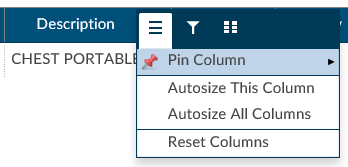
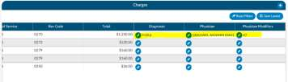

+++
title = 'Charges/Transactions Viewer'
weight = 100
+++

If an interface for account charges is set up during configuration, the Charges screen shows a listing of
charges on the account and provides activity buttons to **Save Layout** or **Expand** the Charges or transactions
pane. 

You can expand the width of the Charges or transactions pane to view more available columns by 
clicking on the in the top right corner of the pane.

This pane also provides information on **CPT Codes**, **Descriptions**, **Modifiers**, **Quantity**, 
**Service Date**, **Revenue Code**, and **Total Price**.

#### Column Settings

Each column within the Charges Grid has menu options to pin the column, Auto size, and reset columns. 
Click on the Menu icon to view the drop-down listing. 

After making your column setting selections,  click on the button to retain your column settings for 
future coding sessions.

| Icon                        | Description |
| --------------------------- | ----------- |
|       | Allows you to select the column and then pin it to the RIGHT or LEFT side of the assigned accounts grid. This function works similarly to freezing columns in Excel. |
|       | Select this option to change the column width to automatically size the width of the column for contents of the cells in this column. |
|       | To quickly Auto size all columns in the assigned accounts grid, click the **Auto size All Columns** button. |
|       | Click on this option to Reset Columns to their default column width. |

#### Adding Modifiers to Charges

Click on the ellipsis button in the Modifiers column next to the CPT Code that requires a modifier.

Click on the minus button to open the Modifiers window. Start entering the digits for the modifier to bring
up the drop-down listing of available modifiers and their descriptions to select the appropriate modifier.
After the modifier is in the window, click on the check button to save the selected modifier. Continue this
process to add all applicable modifiers to charges in the Charges pane. The user can add up to 4
modifiers unless they are using the 3M CRS encoder, then they will be able to add up to 5 modifiers.

#### Assigning diagnosis codes to Hard Charges

A user with the role of a physician coder can now add assigned diagnosis codes along withphysicians and
CPT Modifier codes to hard charges listed in the Charges viewer. When a physician coder opens the
charges viewer, new columns with edit buttons will be seen.

Clicking on the edit button for the Diagnosis column will open a code field, which, when dropped down, will
list all assigned Diagnosis codes on the account. The physician coder can then select which diagnosis code 
to attach that hard charge. The Physician column edit button will open a physician field to allow the 
selection of a physician, and the Physician Modifiers column edit button will open a modifier window allowing 
modifiers to be selected. When launching the encoder, the physician coder’s modifiers will be sent instead 
of the final modifiers on charge viewer.

> [!note] Physician Coding Module Required
You must have physician coding enabled to use this feature, if you do not have physician coding
please contact your account representative for more information.

#### Assigning a Pending Reason per Charge

Users that have a physician coder or single path coding role will have the ability to place a pending
reason per charge on the physician charges.

- If a charge is removed, then the pending reason would be removed.
- If a charge is updated, then the pending reason would not change.

## Caution Column

A Caution Column is avaialble for sites that use the TruCode Encoder to the Transactions and Charges
viewers. This column will indicate a flag if TruCode reports an edit on a charge on an outpatient
account.

