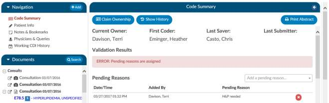
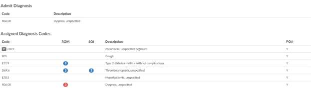
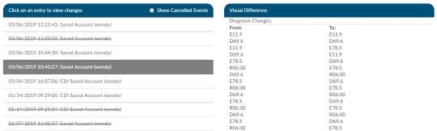
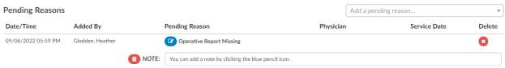

+++
title = 'Code Summary'
weight = 10
+++

The Code Summary screen shows a summary of activity on the account and provides activity buttons to
**Claim Ownership**, **Show History**, and **Print Abstract** (if a printer is configured).

This pane also provides information on **Current Owner**, **First Coder**, **Last Saver**, and **Last Submitter**.

You can expand the width of the Code Summary pane by clicking on the right-arrow in the top right of the pane.

## Review Validation Results/Errors

The Code Summary link in the Navigation Pane will be highlighted in
**RED**
when there are validation result errors for review and resolution.

Any errors preventing submission of the chart will be highlighted in the box under Validation 
Results on the Code Summary screen. **Validation Results** flag “errors” within the chart that should 
be reviewed and validated before the chart is finalized and submitted for billing. The **Submit** 
button will be grayed out until errors have been resolved, including pending reasons that have 
been assigned.

Once all validations results are resolved, the Code Summary link in the Navigation Pane will return to
black and you can hit the Submit button to complete the chart.

## Coding Summary (Abstract)

Code Summary is the last pane to be reviewed prior to chart submission. The three main sections of the
Code Summary pane for review include:

- Validation Results
- Pending Reasons
- Assigned Diagnosis Codes
- Assigned Procedure Codes

## Code Abstract

### Assigned Diagnosis Codes

Below the Pending Reasons you will find the **Assigned Diagnosis Codes** in code sequence order. The
listing includes the diagnosis code, description, and POA assignment (Y/N).

### Assigned Procedure Codes

Listed beneath Assigned Diagnosis Codes you will find the Assigned Procedure Codes in code sequence
order. The listing includes the procedure code, description, Service Date, and Physician.

### Print Abstract

If a printer is configured for your computer, click on this button to print a copy of the abstract 
for this account.

### Claim Ownership

Use the Claim Ownership feature based on your organization’s requirements and procedures. Consult 
your manager for more information on claiming ownership of a chart.

### Show History

Show History button provides a timeline view of activity on the account along with an audit trail of
account activity from point of admission to the current date. 

It includes a visual timeline and below the timeline you will see an audit trail of account activity.

### Timeline

When you open the show history button you will see the entire history from a birds-eye view. The user
has the options of using the *Zoom In* and *Zoom Out* buttons to expand or collapse the timeline.

The *Zoom Fit* will bring the visual timeline back to its original collapsed grid. Hover over any of the event
boxes and the contents will be displayed.

### Timeline Legend

The legend can be found by clicking Show Legend to let the user know what the colors represent,
without having to hover over them. When clicked it will open the Legend and the button name will
change to Hide Legend. Click again to close.

### Timeline Audit Trail

Click on an entry by date to view the changes that were made to the account on the date and time
indicated.

### Validation Results

Within Code Summary pane, you can also view error messages in Validation Results. ERROR messages
should be reviewed and cleared in order to finalize and submit an account for billing.

### Pending Reasons

A historical listing of Pending Reasons assigned to the account can be found within the Code Summary
Pane below Validation Results.

Pending reasons are used when a chart cannot be completed or routed to another Workgroup. The
number of pending reasons selected is unlimited. Pending reasons will be different for each facility
based on system configuration specifications. Please contact your system administrator for definition
and use of available pending reasons.

You can add a Pending Reason to the account by clicking on the drop-down menu and selecting the
applicable Pending Reason. If your organization has selected to allow a physician to be tied to a pending
reason, you will be prompted to assign a physician to the pending reason, and you will see an additional
physician field in the list of pending reasons, as illustrated below.

> [!info] Pending Reason Physicians
> If physicians have been turned on for pending reasons, not all pending reasons may be tied to a
> physician. This option is set within the mapping configuration.

If a pending reason is added to an account, the Submit button will be grayed out and unavailable. Click
on the Save button to save all changes and exit the chart. Charts with pending reasons will stay within
the existing Workgroup until the Pending Reason is removed. Pending Reasons can also be
deleted/removed from accounts by clicking on the next to the Pending Reason to be removed.

### Pending Reason Notes

On any account, an edit button will now appear to the left of the pending reason. Clicking that button
will drop down a note entry where the user can record a note. Pressing ENTER will record the note. Keep
in mind that a note can be deleted by clicking a trash can symbol to its left. In Account Search, the
"Pending Reasons" drill down will now include the "Note" field.

