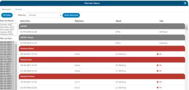

+++
title = 'Discrete Values and Flow Sheet Viewers'
weight = 90
+++

> [!note] This Viewer is Optional
This an optional feature and may not be configured for your site or supported by your EMR vendor.
The discrete values show trending data or data that has values. The most common examples of discrete
values are lab values and vital signs.

Once you have clicked on Discrete Values or the Flow Sheet Viewer from the navigation tree you will be
presented with one of the two views depending on your desired configuration during the project.

## Flow Sheet Viewer

The flowsheet viewer is the most recent style of discrete data viewer. This viewer is organized much like
a spreadsheet. Depending on your configuration, you may see major categories on the left-hand side of
the spreadsheet telling you lab power forms could be vital signs. (There are many different options as
each site is a little different.) Upon clicking on one of these items you will be presented with a grid to the
right. That grid will have multiple columns, the first column being name if you hover over the column
name you will see three little lines if you click on them, it will allow you to filter so that you can narrow
down the data. If any of those names appear in red that means that at least one of the data elements
are outside of the normal limits if there is a range.

To the right of the name you will see, if applicable, a reference column. This reference column will tell
you if the value is within normal limits. This is data that your EMR system has sent to the CAC system. If
the reference column is available, then to the right of that you will have a flag column. I A checkmark in
that field also means the value is out of the normal range to provide an additional indicator than just
the red coloring on the name. This column can also be filtered if you wish to look at everything outside
of the normal limits. Next to that field you will be presented with a date and time column, and you may
see multiple dates and times depending on how the data is organized and how frequently it is
documented.

If a discrete value on the Flowsheet viewer has a specimen, it will show as a beaker symbol in the
Results column. Hovering over the symbol will provide the name and site of the specimen.

## Collapsing/Expanding

If you right click in the Major Category column will show a menu allowing the user to expand or collapse
all categories. That configuration will be saved for all accounts that have the Flowsheet viewer, per user
role. Note that if a user collapses/uncollapses a major category in the pop out, it will not be seen on the
main page until the user moves to a different viewer and back.

## Discrete Values Viewer

An older style of discrete data can also be displayed in a discrete values viewer where you may see tab
across the top to display the categories of data. This displays each of the types of discrete data elements
your site has; however, your site might have different topics than the screenshot.

The Discrete Values viewer will display a Filter by Month box, listing the months that contain values.
Selecting a month will highlight all the corresponding dates in the Filter by Date box. The resulting
values will show in the viewing pane. The Normal and Abnormal tabs both have this functionality and
are filtered separately.

Discrete Values with a grey header are within normal limits, your organization sends what is the
reference point to determine what is normal and what is abnormal. If a header is display in red, it’s
considered abnormal by your organization. In addition to the header color, you can tell if the value is out
of normal limits as there is a flag that
indicates if the value is low vs. high.

> [!tip] Pop-Out Window
> The flow sheet or discrete data viewer can be popped out into another window by clicking on a
> little square with an arrow pointing to the right in the navigation tree next to the flowsheet or data
> viewer name.
