+++
title = 'ER E/M Viewer'
weight = 170
+++

The ER E/M Viewer is an add-on module for any chart with a “Is Emergency”
flag within the account properties. If you do not have this module, today
contact the SME Team (smeteam@dolbey.com) for more information.

If this module is turned on on any “Is Emergency” chart you find the “E/M
Coding Worksheet” in the Navigation menu.

To begin ER charging click on the “E/M Coding Worksheet” in the Navigation
menu.

There are several sections to the E/M Coding worksheet including: E/M No Charge, E/M Level, Trauma,
Critical Care, Medications, and Additional Charging.

## ER Date and Provider

The first step is filling in the ER Date and the ER Physician fields. Once these are completed, the rest of
the worksheet will populate.

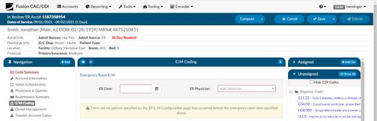

## No Charge

If a patient fits the criteria for “no charges” (for example, a registration error), all other fields in the
worksheet go away because there is nothing else to be done from an ER charging perspective. However,
other selections from the list will populate the fields accordingly.

## Critical Care

The next field to be considered is “Critical Care”. Select appropriate answers to “Is Criteria Met” and “Is
Time Determined.” To enter the duration, click on the clock icon.

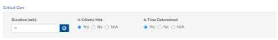

Enter start date/time and select “Update” for the minutes to display.

If there were multiple spans of time for critical care,
click on +Add and enter any additional durations of
time. The system will add up on the minutes and
display once “Update” has been selected.

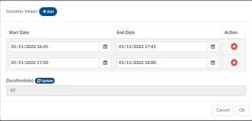

## E/M Levels Matrix

Once you select an element from one of the columns, that becomes the minimal level and all columns
before that will gray out. In this example, once “Observation” is selected, the Level 1-3 columns gray out.
As you complete the remaining sections, you may see the level advance.

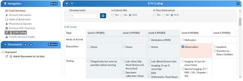

## Trauma

If the case was a trauma, make the appropriate selection from the dropdown menu (pre-hospital
notification, post-hospital notification, consult).

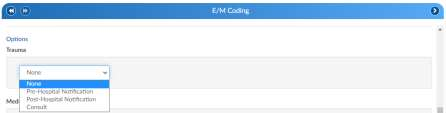

## Medication Administration Qty

Based on the selection, additional fields or boxes will populate. Complete the quantities, add modifiers,
and any notes. Modifier fields are available in the appropriate sections of the worksheet. The “Notes”
field is available for the coder to track things, like medications. The user can add up to 4 modifiers
unless they are using the 3M CRS encoder, then they will be able to add up to 5 modifiers.

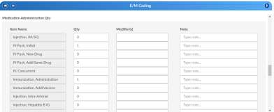

## Medication Administration Time/Modifier

Update this section with the duration, any modifier, and notes. The user can add up to 4 modifiers
unless they are using the 3M CRS encoder, then they will be able to add up to 5 modifiers.

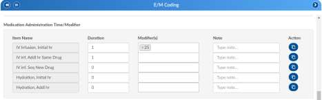

If there are multiple infusions (for example, one infusion started in left arm and one infusion stated in
the right arm), click on the Action button.

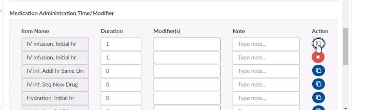

Clicking on the Action will create another row to be completed including appropriate modifier.

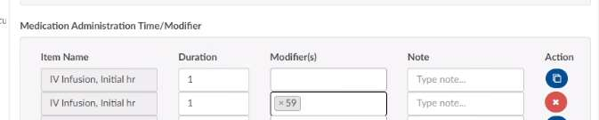

## Additional Charges

Add any additional charges

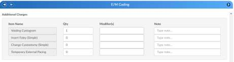

## Charges for Assigned CPT Codes

If the outpatient/inpatient coder adds a CPT code (otherwise referred to as “soft code”), the codes will
appear in this section of the E/M Coding worksheet. A determination will need to be made by the ER
charger if the procedure added by the coder occurred in the ER and should be charged. If so, the fields
should be completed. It the procedure is determined to have occurred elsewhere, leave the 0 in the
field. (Note that when there is a CPT coded added that has no CDM charge, it won’t appear in this
section; only those that have a CDM.)

## E/M Summary

Once you complete the Additional Charges, you will see the Summary which details the E/M level and
other charges with the corresponding CDM Code.

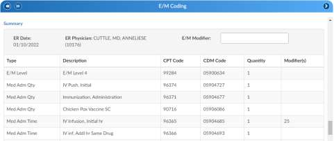

When all charging is complete and the charges are ready to be submitted, check the “Send Charges
Outbound” and select “SAVE” in the banner bar.

This action sends charges out and the account will automatically route to an outpatient/inpatient coder
worklist so the rest of the coding that is not charge-related can be completed.

If the charges can’t be completed for some reason (missing trauma documentation), the box should NOT
be checked, and instead, a pending reason should be assigned on the Code Summary. Once a pending
reason has been added, select “SAVE” in the banner bar.

If the “Send Charges Outbound” box is NOT checked, the outpatient/inpatient coder will get a warning
that ER charges are missing and not be able to submit the account upon completion of the coding. The
coder, in this case, would attach a pending reason to send the account back to the ER charger to check
box. The account then goes back to the coder to submit the account for final billing. This workflow
ensures that the outpatient/inpatient coder does not submit an account unless all ER charges have been
completed

## E/M History

This section displays the history of charges submitted.

Click to expand for details.

