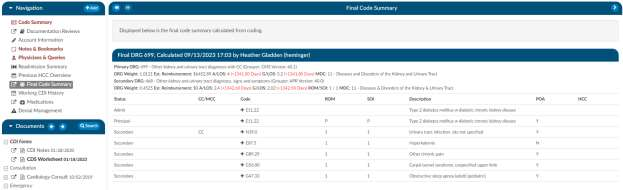

+++
title = 'Final Coding Summary'
weight = 60
+++

The code summary will display if the facility coders submit the chart. This provides transparency
between CDI and your physician coding teams if they are using Fusion CAC as to what was coded.

By clicking on the header, it will expand the selection so you can see the codes and DRG/APC if
applicable. If you see any codes with a plus (+) sign it means that you have not added this code to the
account. The plus (+) sign does not indicate that you need to add this code it just allows you to quickly
add the code if you have determined you want to use this code using your coding judgment and
supporting documentation.

